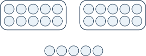
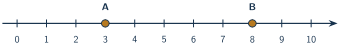
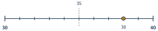

+++
order = 1
subject = "mathematics"
authoring_model = "claude-fable-5"
authoring_reasoning_effort = "high"
tags = ["quantitative-reasoning", "whole-numbers", "number-sense", "estimation"]
prerequisites = []
provides = [
  "quantity",
  "whole-number",
  "place-value",
  "whole-number-line",
  "whole-number-comparison",
  "rounding-whole-numbers",
]
+++

# Quantities and whole numbers

## Quantities, numerals, and counting

<!-- card-id: card-5b3b18cc-2823-4908-94a7-1b9d6501831b -->
<!-- card-alias: 9d27d33bd286689bf6e477561d1e1d873d9924ed39dab8a818e6f60b39e6563b -->
Q: A pantry shelf holds a row of jars, and a paper label on the shelf shows
the written symbol 6. In situations like this, the **quantity** is how many
jars are actually on the shelf, and a **numeral** — such as the 6 on the
label — is a written symbol that records a quantity. Using those two words,
what is the relationship between the numeral on the label and the jars on
the shelf?

A: The numeral records the quantity: the written symbol 6 stands for how many
jars are on the shelf. The numeral is only a mark on paper — it is not the
jars, and it is not itself the amount. If a jar were removed, the quantity
would change even though the label still showed 6.

<!-- card-id: card-5c3171b6-39b2-4575-902c-96ba63acf8ca -->
<!-- card-alias: 63f7ce52b00c4973daf70692a63f974c047dcb72b9436a0dd4c9ddbf0acd21d9 -->
Q: Painted on a storeroom wall is the symbol 9, and on the floor beside it
sits a stack of boxes. One of these is a quantity and the other is a numeral.
Which is which?

A: The painted symbol 9 is a numeral — a written symbol that records an
amount. How many boxes are actually in the stack is a quantity — the amount
itself. A numeral can be repainted or erased without a single box being
added or removed.

<!-- card-id: card-458ec663-54a3-4d40-9d9f-3b5211db5f73 -->
<!-- card-alias: c6d38e608ee6eaa7a3bc6d26745ea160abb148b5a720e57e23ed74d93d60aa3c -->
Q: Counting is the way to find a quantity exactly. It works by three rules:
say the counting words in their one fixed order — one, two, three, four,
five, and so on — point to or touch each item exactly once while saying one
word for it, and take the **last word you say** as the quantity of the whole
collection. Maya counts a row of shells by saying "one, two, three, four,"
but her finger slides past one shell in the middle without touching it. Why
can she not trust her final word to tell the quantity of shells?

A: One shell was never matched with a counting word. Counting only finds the
quantity when every item is counted exactly once — no item skipped, none
touched twice. Because an item was skipped, her final word "four" is smaller
than the true quantity.

## Zero and the whole numbers

<!-- card-id: card-74b09659-523e-49e7-ac38-9cacf5d1c22d -->
<!-- card-alias: 21f221371daa459d62058b8ee167c572dd46fca1cce397fd71fdbb3e4c2fa0ff -->
Q: The numerals 0, 1, 2, 3, 4, 5, and so on record counts of complete
items. Any number that can be the count of complete items is called a
**whole number** — and that includes a count of none: the numeral 0, read
"zero," records that there are none at all. A fruit bowl that held oranges
this morning is now empty. Which whole number records the quantity of
oranges in the bowl, and what exactly does it say?

A: 0 (zero). It records that the quantity of oranges is none. "None" is a
real, recordable quantity — reporting 0 is different from leaving the
question unanswered.

<!-- card-id: card-2088f40c-8b78-4f2d-b171-2dcf362e207c -->
<!-- card-alias: 3ac23ee5da94b5b64f0944a833f53745215df2c68a8d66f2790f76641b62979d -->
Q: What name is given to the numbers 0, 1, 2, 3, 4, and so on — all the
possible counts of complete items, including a count of none?

A: The whole numbers. Each one is a count of complete items: no item split
into parts, and 0 counting the case of none.

## Place value: writing larger quantities with digits

<!-- card-id: card-94193293-d299-4e57-84ed-41b9eca2ab35 -->
<!-- card-alias: a2f7daba15f50f03e02c3ed39e126c439c79767c9d17b890b0597cd54e657fd5 -->
Q: The ten symbols 0, 1, 2, 3, 4, 5, 6, 7, 8, 9 are called **digits**.
Larger quantities are written as numerals with more than one digit, and the
**place** each digit sits in decides what it counts: the rightmost digit is
in the **ones place** and counts single items, and the digit just to its
left is in the **tens place** and counts groups of ten items. In the figure,
every outlined loop holds exactly ten counters, and the loose counters are
single items.

Write the two-digit numeral that records the total quantity of counters,
and say what each digit counts.

A: **25**. The digit 2 sits in the tens place and counts the two loops of ten
counters; the digit 5 sits in the ones place and counts the five single
counters. Two groups of ten and five singles make 25 counters in all.

<!-- card-id: card-d6ea951e-e1d3-4018-b7d0-7f0adcb97c6b -->
<!-- card-alias: b432e8d5404e7dbcf0e88ea7ee5e3abd06a5c7cc57f856872570eb0d461dc534 -->
Q: In the numeral 73, what quantity does the digit 7 record — and why is it
not simply seven items?

A: The 7 records 70 items — seven groups of ten, and no single items beyond
the 3. It sits in the tens place, and the place a digit occupies, not the
digit alone, decides what it counts.

<!-- card-id: card-0ee3b8d2-759f-442a-b45d-f52007a9ea9d -->
<!-- card-alias: d24dae92d5cc994e519a369ae52470b2970599139597e8b8c190d1bf567ccc1f -->
Q: Reading a numeral from its right end, the first place counts ones, the
second place counts tens, and the third place counts **hundreds** — a
hundred is a group of ten tens, written 100. A digit 0 in any place records
that there are no groups of that size. In the numeral 507, what does the
digit 0 tell you, and why can it not simply be dropped?

A: The 0 records that 507 contains no tens: 5 hundreds, 0 tens, 7 ones.
Dropping it would leave 57, which shifts the 5 into the tens place and
records a completely different quantity. The zero holds the 5 in the
hundreds place.

<!-- card-id: card-ca2c0135-bae1-4cee-941d-b47be74bb2ba -->
<!-- card-alias: b2e8490234e9d60f4b3ddbe7b8989ba823afa5bbdd255d825223528e97900a2d -->
Q: A helper reads the numeral 380 and says, "The digit 3 just means 3
items." What did the helper ignore, and what quantity does the 3 actually
record?

A: The helper ignored the digit's place. In 380 the 3 sits in the hundreds
place, so it records 300 items — three groups of one hundred — not 3. The
full numeral records 3 hundreds, 8 tens, and 0 ones.

## Ordering and comparing on a number line

<!-- card-id: card-8b25e695-8e78-4d20-872a-5d86a0373447 -->
<!-- card-alias: b646bb846dcbbe5033d185b00a5b208827e98f8785177a702e85f034f62bdf05 -->
Q: A **number line** shows the whole numbers in counting order as evenly
spaced marks along a straight line, starting from 0. Moving to the right
always reaches marks that record larger quantities. A dot drawn on a mark
picks out one particular number. In the figure, every mark is labeled with
its whole number, and two dots labeled A and B each sit on a mark.

Which dot marks the larger quantity, and how does the direction of the line
tell you?

A: B marks the larger quantity. On a number line, numbers grow from left to
right, and B (on the mark at 8) sits farther right than A (on the mark
at 3) — so 8 records a larger quantity than 3.

<!-- card-id: card-e0344935-0531-4b21-85c4-6bb5ce898e93 -->
<!-- card-alias: 2ac0f7db756fce0b6ef03eb3e4e95f170d907152a07a9c0f6bc273b712509629 -->
Q: Two symbols compare quantities in writing: `<` is read "is less than,"
and `>` is read "is greater than." In both, the open, wide side faces the
larger number and the closed point aims at the smaller number. Exactly one
of these two statements is true: \(9 < 4\) or \(9 > 4\). Which one is true,
and how is it read aloud?

A: \(9 > 4\) is true, read "nine is greater than four." A count of 9 is a
larger quantity than a count of 4, so the open side faces the 9 and the
point aims at the 4.

## Exact quantities and estimates

<!-- card-id: card-0a78dab6-0270-4844-9eb0-7e1a167f0982 -->
<!-- card-alias: 01f29fe4263fdce02e356e9ca915d154671730878413fa3a42f13f1a9e1dc130 -->
Q: An **exact** quantity comes from a careful, complete count — every item
counted exactly once. An **estimate** is a value that is close to the true
quantity without claiming to be exact; reports of estimates usually signal
this with words like "about" or "roughly." A volunteer glances briefly at a
large basket of tennis balls and reports, "There are about 30." Is that
report an exact quantity or an estimate, and which clues tell you?

A: An estimate. The word "about" openly signals a close-but-not-exact value,
and a brief glance is not a complete one-by-one count, so the report cannot
claim exactness.

<!-- card-id: card-71203335-96c4-4351-a800-bc19230cd4b6 -->
<!-- card-alias: 730a03be24a7cea7d0476d4f00aedd03112c35a2ecdc7014b6f0920e6b59d18d -->
Q: You need to decide whether roughly enough chairs have been set out for a
large crowd, and the event starts in a few moments. Why is an estimate the
appropriate report here, rather than an exact count?

A: Because the decision only needs a value close to the truth, and an exact
count of every chair would take too long. An estimate is appropriate
whenever a close value settles the question and exact counting is too slow,
too costly, or impossible.

## Rounding to a nearby ten or hundred

<!-- card-id: card-7255d93a-6e3b-4648-8fa3-e42ba2fbd4dd -->
<!-- card-alias: 5e4bbc733502f729d6f2091cdd186705d1f5562fd70ffbeef4f7e8d85768cb54 -->
Q: **Rounding** replaces an exact number with a nearby number that is easier
to say, remember, and compare — the result is an estimate of the original.
To round to the **nearest ten**, replace the number with the closer of the
two numbers ending in 0 that surround it: one lower ten and one higher ten.
The value exactly halfway between them ends in 5, and in this deck a number
exactly halfway rounds to the **higher** ten. The figure shows the stretch
of the number line from 30 to 40, with the halfway value 35 labeled and a
dot on 38.

Using the figure, to which ten does 38 round, and why?

A: 38 rounds to 40. On the line, 38 is only 2 marks from 40 but 8 marks
from 30, so 40 is the closer ten — 38 lies past the halfway value 35.

<!-- card-id: card-026a62e8-657d-49ec-a8ae-9bb4fb225bc0 -->
<!-- card-alias: f05459205338bcad1cc2cc9101853a551235f1544db16d06e86486837d610294 -->
P: A community garden's volunteers picked tomatoes all morning, and a
careful complete count gives exactly 73 tomatoes. For a quick note on the
shared board, the coordinator wants that count rounded to the nearest ten.
What number should the note show?

S: The note should show 70.

IDENTIFY: This is rounding a whole number to the nearest ten — replacing the
exact count 73 with the closer of the two surrounding tens.

PLAN: Find the lower ten and the higher ten around 73, locate the halfway
value between them (it ends in 5), and keep whichever ten is closer to 73.

EXECUTE: 73 sits between the tens 70 and 80. The halfway value is 75.
Since 73 is below 75, it is closer to 70. Rounded to the nearest ten,
73 becomes 70.

EVALUATE: Check the distances directly: 73 is 3 away from 70 and 7 away
from 80, and 3 is less than 7 — so 70 really is the closer ten. The note
shows 70, and anyone reading it stays within 3 of the exact count.

<!-- card-id: card-29740bdf-c81b-4ade-929e-f515304aa3ba -->
<!-- card-alias: e88efc7d4673e77e2c451479bbc0e7d423f64ef5cbabd1dad5239c3648a7a7c2 -->
Q: A shortcut for rounding to the nearest ten: look only at the **ones
digit**. If it is 0, 1, 2, 3, or 4, round to the lower ten. If it is 5, 6,
7, 8, or 9, round to the higher ten — the ones digit 5 marks the exact
halfway value, which rounds higher in this deck. A student rounds 84 to the
nearest ten and writes 90. Using the shortcut, what went wrong, and what is
the correct result?

A: The correct result is 80. The ones digit of 84 is 4, which is in the
0–4 group, so 84 rounds to the lower ten. The student rounded in the wrong
direction: 84 is only 4 away from 80 but 6 away from 90.

<!-- card-id: card-e205f267-2751-44a5-aa3f-75472abfb113 -->
<!-- card-alias: 159f0cb3a03a5ca807ab783c41fca0ccb252f4c862eb8fe8a7319a426531a701 -->
Q: Rounding works the same way at any place. To round to the **nearest
hundred**, replace the number with the closer of the two numbers ending
in 00 that surround it; the value exactly halfway between two neighboring
hundreds ends in 50, and an exactly-halfway value rounds to the higher
hundred. The numeral 452 sits between the hundreds 400 and 500. To which
hundred does 452 round, and how does the halfway value decide it?

A: 452 rounds to 500. The halfway value between 400 and 500 is 450, and
452 lies past 450 — 452 is 48 away from 500 but 52 away from 400, so 500
is the closer hundred.

<!-- card-id: card-75ae18ba-e93a-4370-aaa4-707e320f6923 -->
<!-- card-alias: 1adfcec2cf5f5b0aa404e1400cb039f56dfe8a34a385be4eea6ea7e1f0ea5d4e -->
P: A neighborhood library kept a careful count of books checked out during
its summer program; the final count is 649 books. The closing newsletter
reports checkouts rounded to the nearest hundred. What number does the
newsletter report?

S: The newsletter reports 600.

649 sits between the hundreds 600 and 700, and the halfway value between
them is 650. Since 649 is below 650, the closer hundred is 600.

EVALUATE: Check the distances: 649 is 49 away from 600 and 51 away from
700, so 600 really is closer. A tempting slip is to see the large ones
digit 9 and round up — but for the nearest hundred, only the distance to
the neighboring hundreds matters, and 49 is less than 51.
