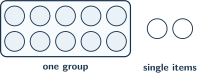
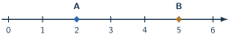
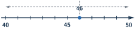

+++
order = 1
subject = "mathematics"
tags = ["quantitative-reasoning", "whole-numbers", "number-sense", "estimation"]
prerequisites = []
provides = [
  "quantity",
  "whole-number",
  "place-value",
  "whole-number-line",
  "whole-number-comparison",
  "rounding-whole-numbers",
]
+++

# Quantities and whole-number sense

<!-- card-id: 8d06f682-af71-4853-ae09-264c340c66f0 -->
Q: An **amount**, or **quantity**, answers “how many?” A **numeral** is a written mark that records an amount. A tray holds five apples and its label shows `5`. What does the numeral `5` do?
A: It represents the quantity of apples in the tray. The apples are the things counted; `5` is the written numeral that records their amount.

<!-- card-id: 7fc44957-20fc-4921-b75b-05eb69998420 -->
Q: In the phrase “12 tickets,” what is the difference between the quantity and the numeral?
A: The quantity is the amount of tickets; the numeral is the written `12` used to record that amount.

<!-- card-id: de991d7e-b490-457a-8ce8-8017bd40d0e0 -->
Q: Counting words follow a fixed order such as “one, two, three, four.” To count reliably, touch each item once while saying the next word; the final word tells how many items there are. If one item is skipped, how will the reported amount usually compare with the actual amount?
A: It will be too small. Skipping an item means that item was never included in the count.

<!-- card-id: 69557337-cac5-472f-becb-b02a05a3f04f -->
Q: **Whole numbers** record counts of complete items. Their numerals begin `0, 1, 2, 3, ...`; `0` records none. A shelf has no books. Which whole number records its quantity?
A: \(0\). Zero records a count of none.

<!-- card-id: 31f1a9e2-ad90-44b2-bf0d-6edae5a4a45e -->
Q: What kind of number records a count of complete items, including a count of none?
A: A whole number.

<!-- card-id: c0750560-45b0-41b6-a015-e710634c71ac -->
Q: A **digit** is one written mark from `0` through `9`. In a two-digit numeral, the left digit records groups of ten and the right digit records single items.

Which numeral records the pictured quantity?
A: \(12\). The left digit \(1\) records one group of ten, and the right digit \(2\) records two single items.

<!-- card-id: f89d8a43-3a23-4d6a-9626-3121c8b2493c -->
Q: In the numeral \(47\), what amount does the digit \(4\) represent?
A: Four tens, or forty. Its place determines its value.

<!-- card-id: ffa890cc-c07c-4e4f-a71b-2e9d46c99858 -->
Q: Whole-number places from right to left are ones, tens, hundreds, and then larger groups. A zero can show that a place has no groups. In \(205\), what does the middle zero show?
A: There are no tens. The zero keeps the \(2\) in the hundreds place and the \(5\) in the ones place.

<!-- card-id: 8214910a-223e-466e-b982-2b6420b9f100 -->
Q: A learner says, “In \(302\), the digit \(3\) means three.” What place-value error did the learner make?
A: The learner ignored the digit's place. The \(3\) is in the hundreds place, so it represents three hundreds, or three hundred.

<!-- card-id: 1881a16f-85c0-4f95-8f07-94501d3b5f3b -->
Q: A **whole-number line** puts whole numbers in order. Each marked spot has a number, and the numbers grow as you move right.

Which marked spot, A or B, represents the greater quantity?
A: B. It is farther right on the number line, at \(5\), while A is at \(2\).

<!-- card-id: f299ad07-f106-417b-900e-4cd1b60f827f -->
Q: The symbol \(<\) means “is less than,” and \(>\) means “is greater than.” Which comparison is true: \(8<3\) or \(8>3\)?
A: \(>\), giving \(8>3\). Eight is greater than three.

<!-- card-id: 3f0e66d1-5bc5-4d22-9efa-eb12d1ed317b -->
Q: An **exact amount** reports the precise count. An **estimate** is a nearby amount used when precision is unnecessary or unavailable. Someone looks at a jar without counting and reports “about 50 beads.” Is that report exact or estimated?
A: Estimated. “About” and the lack of counting show that \(50\) is a nearby useful amount, not a precise count.

<!-- card-id: d7059f30-99ac-4e9b-94fe-511d2acf912e -->
Q: When is an estimate more appropriate than an exact amount?
A: When a nearby amount is sufficient or the exact amount is not yet known. Use an exact amount when the precise count matters and is available.

<!-- card-id: d10bd25a-c490-4559-a534-c3efa4d1d624 -->
Q: **Rounding to the nearest ten** replaces an exact whole number with the closer number ending in zero. If the exact number is halfway, this deck chooses the higher ten.

To which ten does \(46\) round?
A: \(50\). On the number line, \(46\) is closer to \(50\) than to \(40\).

<!-- card-id: 9bd178f5-ff6b-48c9-b739-e453304bbe6a -->
P: A stockroom counted exactly \(67\) boxes. For a quick spoken estimate to the nearest ten, what amount should be reported?
S: **IDENTIFY:** This is a nearest-ten rounding problem.

**PLAN:** Compare \(67\) with the neighboring tens \(60\) and \(70\).

**EXECUTE:** The ones digit is \(7\), so \(67\) is closer to \(70\). Report **about \(70\) boxes**.

**EVALUATE:** \(67\) lies between \(60\) and \(70\) and is past the halfway amount \(65\), so choosing \(70\) is reasonable.

<!-- card-id: 69801d8a-aa2e-4e84-b787-8dff475f9e1a -->
Q: For nearest-ten rounding, a ones digit from `0` through `4` chooses the lower ten, while `5` through `9` chooses the higher ten. A learner rounds \(62\) to \(70\). Diagnose the error.
A: The learner ignored the ones digit \(2\), which calls for the lower ten. \(62\) rounds to \(60\), not \(70\).

<!-- card-id: c23d6864-54a7-4c19-9776-8d361452b6c2 -->
Q: The nearest-place idea also works for hundreds. The neighboring hundreds around \(286\) are \(200\) and \(300\), with \(250\) halfway. To which hundred does \(286\) round?
A: \(300\). Since \(286\) is past the halfway amount \(250\), it is nearer \(300\).

<!-- card-id: dd79a0fa-dfdb-480c-9dd4-af5587b929bd -->
P: A turnstile recorded exactly \(372\) visitors. A short community update reports attendance to the nearest hundred. What should it report?
S: **IDENTIFY:** Round a whole-number count to the nearest hundred.

**EXECUTE:** \(372\) is between \(300\) and \(400\) and is past the halfway amount \(350\), so it rounds to **about \(400\) visitors**.

**EVALUATE:** The estimate is one of the neighboring hundreds and lies on the same side of halfway as the exact count.
