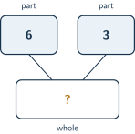
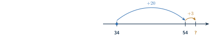

+++
order = 2
subject = "mathematics"
authoring_model = "claude-fable-5"
authoring_reasoning_effort = "high"
tags = ["quantitative-reasoning", "addition", "subtraction", "whole-numbers"]
prerequisites = ["chapter:01_quantities_and_whole_numbers"]
provides = ["whole-number-addition", "whole-number-subtraction", "inverse-operation-check", "whole-number-regrouping"]
+++

# Addition and subtraction

## Joining amounts: addition

<!-- card-id: 4fb884a8-5bc9-490f-a6bb-ffa3ab462688 -->
Q: Joining puts two amounts together into one: 5 melons in one crate joined
with 3 melons in another make one combined pile of melons. **Addition** finds
the quantity of the combined pile from the two joined amounts. It is written
with the symbol \(+\), read "plus," and the symbol \(=\), read "equals": the
statement \(5 + 3 = 8\) records that 5 joined with 3 makes 8 in all. The
result of an addition — here 8 — is called the **sum**, or the **total**.
A shelf holds 4 bowls, and 2 more bowls are placed beside them. Write the
addition statement that records this joining, and name its total.

A: \(4 + 2 = 6\). The total is 6: the quantity of bowls when the 4 already
there and the 2 new ones are counted as one combined amount.

<!-- card-id: 76250e53-63fe-4157-b2a9-661f8001af7e -->
Q: A **part–whole diagram** shows a joining at a glance. Each of the two
upper boxes holds a **part** — one of the joined amounts — and the wider
lower box holds the **whole**, the total when the parts are joined. A box
marked ? is the one whose number is not yet known.



What is the whole in this diagram, and how does the diagram tell you?

A: The whole is **9**. The upper boxes show the parts 6 and 3, and the lower
box is their total when joined: \(6 + 3 = 9\). In a part–whole diagram the
whole is always the sum of the two parts.

<!-- card-id: af2ffc94-ff1b-4db6-a0a7-c48630679fab -->
Q: An **operation** is an action carried out on numbers to produce a new
number. Addition — joining two amounts into a total — is one operation. A
meeting room already holds 12 chairs, and helpers carry in 5 more. Which
operation finds how many chairs the room now holds, and what in the
situation tells you?

A: Addition. New chairs are being joined to the chairs already there, and
addition is the operation that finds the total of joined amounts:
\(12 + 5 = 17\) chairs.

## Adding with place value

<!-- card-id: d8c5b8c0-aafe-47c1-9173-b4c2f34229a9 -->
P: One bookcase holds 32 paperback books and a second bookcase holds 45.
How many books do the two bookcases hold together?

S: 77 books.

IDENTIFY: Two amounts are joined into one total, so this is an addition:
\(32 + 45\).

PLAN: Counting 77 items one by one would be slow, so use place value. A
two-digit numeral is tens and ones, so add the tens together, add the ones
together, and then join the two results.

EXECUTE: Tens: 3 groups of ten joined with 4 groups of ten make 7 groups of
ten — \(30 + 40 = 70\). Ones: \(2 + 5 = 7\). Joining them:
\(70 + 7 = 77\), so \(32 + 45 = 77\).

EVALUATE: Estimate by rounding each count to its nearest ten: 32 rounds to
30, and 45 — exactly halfway — rounds to the higher ten, 50. The estimate
\(30 + 50 = 80\) is close to 77, so 77 is believable. It is also larger
than both 32 and 45, as a joined total must be.

<!-- card-id: 4f183af4-dc5e-46de-9ea6-a75e3c5a7356 -->
Q: The number line can picture an addition as rightward **jumps**: start at
the first amount, jump right by the tens of the second amount, then jump
right by its ones. The landing point is the sum, because moving right always
reaches larger numbers. In the figure each curved arrow is one jump, labeled
with how far it moves, and the mark labeled ? is the landing point.



Which addition does the figure carry out, and on which number does it land?

A: \(34 + 23 = 57\); the landing point is 57. The jumps add 23 in two
pieces: from 34, a jump of 20 (two tens) reaches 54, and a jump of 3 more
reaches 57.

<!-- card-id: 7430e7b3-3ca5-4ec1-b00b-b5dd886a45c3 -->
Q: Written addition can stack the two numerals so that digits line up in
vertical **columns** — a column is a stack of digits read top to bottom.
This layout stacks \(46 + 31\):

```text
  46
+ 31
```

For the layout to give the right sum, the 6 and the 1 must share the
rightmost column, and the 4 and the 3 the next column to the left. Why must
the digits line up this way?

A: Because digits in the same place count the same size of group, and only
equal places can be added directly: 6 and 1 both count single items, and 4
and 3 both count groups of ten. Shifting a digit into a different column
would change what it counts, so the layout would join the wrong quantities.

## Regrouping in addition

<!-- card-id: 6899fbee-a8ae-4d22-bd13-d7b07cc2540b -->
Q: Adding the ones of two numbers can produce ten or more ones — too many
for the single digit that the ones place can hold. **Regrouping** fixes this
with an equal-value exchange: ten single ones are exchanged for one group of
ten (or one group of ten back into ten ones) without changing the quantity.
In the figure, each outlined loop holds exactly ten counters, loose counters
are single ones, and the double-headed arrow joins two pictures of the same
quantity.


While adding, you have collected 12 single ones. After the exchange shown,
what is written in the tens place and what stays in the ones place — and why
does the exchange not change the quantity?

A: 1 goes to the tens place and 2 stays in the ones place: 12 ones is the
same quantity as 1 ten and 2 ones. Ten of the twelve counters form exactly
one group of ten and two singles remain — the same twelve counters either
way, so only the grouping changes. That is what lets 12 ones fit inside a
numeral.

<!-- card-id: c6a1c8c2-914b-4d34-a3fe-e04d2e893b5f -->
P: A garden club collected 38 seed packets in spring and 27 more in autumn.
How many packets did it collect in all? The solution is started for you:
adding the ones gives \(8 + 7 = 15\) ones — ten or more, so a regrouping
exchange is needed. Complete the addition.

S: 65 packets.

Exchange ten of the 15 ones for one ten: 15 ones becomes 1 ten and 5 ones.
Write 5 in the ones place and carry the exchanged ten to the tens. Tens:
\(3 + 2 = 5\) tens, and the exchanged ten makes 6 tens. So
\(38 + 27 = 65\).

EVALUATE: Estimate by rounding to the nearest ten: \(40 + 30 = 70\), close
to 65 — and 65 is larger than both joined amounts, as a total must be.

## Removing and comparing: subtraction

<!-- card-id: fd3fab76-9ca8-422c-8f8b-cdb2084e0b1a -->
Q: **Subtraction** finds what remains when part of an amount is removed. It
is written with the symbol \(-\), read "minus": the statement
\(7 - 2 = 5\) records that removing 2 from 7 leaves 5. The result of a
subtraction is called the **difference**. A basket holds 9 plums, and 4 of
them are eaten. Write the subtraction statement that records the removal,
and say what remains.

A: \(9 - 4 = 5\): removing 4 plums from the 9 leaves 5 plums in the basket.
The difference is 5.

<!-- card-id: 7a94c9d8-0060-4661-963a-05a512039825 -->
Q: A parking area holds 17 bicycles in the morning, and during the day 6 of
them are ridden away. Which operation — addition or subtraction — finds how
many bicycles remain, and what in the situation tells you?

A: Subtraction. Bicycles are being removed from the amount that was there,
and subtraction finds what remains after a removal: \(17 - 6 = 11\)
bicycles remain.

<!-- card-id: 2f56a072-c8e8-4cf4-81cb-33ccf16c5317 -->
Q: Subtraction has a second meaning besides removal: **comparison**. When
two separate amounts are compared, their difference tells how many more one
is than the other, found by subtracting the smaller amount from the larger.
Nothing is removed from either amount. One team collected 12 cans and
another collected 8 cans. How many more cans did the first team collect,
and which subtraction finds it?

A: 4 more cans: \(12 - 8 = 4\). The difference compares the two amounts —
both teams keep every can they collected.

<!-- card-id: 6c3bc458-4cc3-4eaf-857f-29b1ebf3c9da -->
Q: In a part–whole diagram, the whole and one part may be known while the
other part is not. Subtraction finds the missing part: removing the known
part from the whole leaves exactly the unknown part. A tray of 15 muffins
is a whole made of two parts: 9 muffins have raisins, and the rest are
plain. Which subtraction finds the number of plain muffins, and what is it?

A: \(15 - 9 = 6\): there are 6 plain muffins. The whole 15 is the two parts
joined, so removing the raisin part from the whole leaves the plain part.

## Checking with the inverse operation

<!-- card-id: f172bd4d-6167-441b-9600-9c1713837c87 -->
Q: Addition and subtraction are **inverse operations**: each undoes the
other. Joining 3 to 6 gives 9, and removing 3 from 9 returns 6 — the
removal undoes the joining. This gives a way to check an addition: remove
one part from the claimed total, and the other part must come back. Which
subtraction checks the claimed sum \(28 + 14 = 42\), and what result
confirms it?

A: \(42 - 14 = 28\) (equally, \(42 - 28 = 14\)). Removing one part from the
claimed total must return the other part; getting 28 back confirms the sum,
and any other result would show it is wrong.

<!-- card-id: 9342d310-9bf6-43b7-ae58-34cbd6c20912 -->
Q: Just as tens add with tens and ones with ones, a subtraction can remove
place by place: take the ones of the removed number from the ones of the
starting number, and its tens from the tens. Use this to find
\(68 - 25\), saying what is removed from what in each place.

A: **43**. Ones: removing 5 ones from 8 ones leaves \(8 - 5 = 3\). Tens:
removing 2 tens from 6 tens leaves 4 tens, which is 40. Together,
\(40 + 3 = 43\).

## Regrouping in subtraction

<!-- card-id: a8b241dc-487f-41e8-9911-bf5eef515002 -->
Q: Removing place by place can hit a snag. In \(52 - 28\), the ones place
asks for 8 ones to be removed, but 52 has only 2 ones — and within the
whole numbers, 8 cannot be removed from 2. The regrouping exchange also
works in the other direction: one group of ten can be exchanged for ten
single ones without changing the quantity. In the figure, each outlined
loop holds exactly ten counters, loose counters are single ones, and the
double-headed arrow joins two pictures of the same quantity.


Which exchange rewrites 52 so that the ones removal becomes possible, and
what does 52 become?

A: Exchange one of the 5 tens for ten single ones: 52 becomes 4 tens and
12 ones — the same quantity, regrouped. Now 8 ones can be removed from
12 ones, and 2 tens from 4 tens.

<!-- card-id: 086c4e5d-4acb-480a-8d13-2ebbfcf2bf76 -->
Q: The inverse relationship also checks subtraction: a removal splits a
starting amount into what was removed and what remains, so joining those
two must rebuild the start. A worker computes \(71 - 35 = 36\). Which
addition checks this difference, and what must it give?

A: \(36 + 35\), which must give back the starting amount 71. It does:
\(36 + 35 = 71\), so the subtraction checks out. If the addition rebuilt
any other number, the difference would be wrong.

<!-- card-id: bbcd0ffb-f496-4723-b9c7-92293a995f32 -->
P: A charging rack held 63 batteries this morning. During the day, 47
batteries are taken from the rack for use. How many batteries remain?
Check your result with the inverse operation.

S: 16 batteries remain.

IDENTIFY: An amount is removed from a starting quantity, so this is a
subtraction: \(63 - 47\).

PLAN: Remove place by place. The ones place asks for 7 to be removed from
3, which whole numbers cannot do, so exchange one ten for ten ones first.

EXECUTE: 63 is 6 tens and 3 ones; after the exchange it is 5 tens and
13 ones. Ones: \(13 - 7 = 6\). Tens: removing 4 tens from 5 tens leaves
1 ten. So \(63 - 47 = 16\).

EVALUATE: Inverse check — joining the removed batteries back must rebuild
the start: \(16 + 47\) gives \(6 + 7 = 13\) ones (regrouped as 1 ten and
3 ones) and \(1 + 4 + 1 = 6\) tens, which is 63. The start returns, so 16
checks out; it also lies between 0 and 63, as a remainder must.

## Diagnosing wrong answers

<!-- card-id: f90e3dec-3fbd-45c7-92b5-801e7ba4bfdd -->
Q: An estimate can expose a wrong answer before any careful re-computation.
A claimed result: \(487 + 305 = 912\). Rounding each number to its nearest
hundred gives 500 and 300. Use the estimate to judge the claim: should 912
be trusted?

A: No. The estimate is \(500 + 300 = 800\), and rounding moved each number
only slightly, so the true sum must be near 800. 912 is far from 800, so
the claim should be rejected and the addition redone. (The true sum
is 792.)

<!-- card-id: a7302adb-ecff-459c-a83a-99d390b280c6 -->
Q: When part of a starting amount is removed, what remains can never be
more than the start: the difference lies between 0 and the starting
amount. A student computes \(45 - 28\) and writes 63. Without redoing the
arithmetic, how does this bound show the answer must be wrong?

A: 63 is greater than the starting amount: \(63 > 45\). Removing 28 items
from 45 must leave fewer than 45, so a remainder of 63 is impossible.
(The correct difference is 17.)

<!-- card-id: 6f487817-21a3-4064-a516-8592704ad8d1 -->
Q: Adding \(46 + 3\) in columns, a student stacks the 3 underneath the 4
and gets 76:

```text
  46
+ 3
----
  76
```

The sum 76 is wrong. What did the misplaced column do, and what is the
correct sum?

A: Stacking the 3 under the 4 put it in the tens column, so it was added
as 3 tens — computing \(46 + 30 = 76\). The 3 counts single items, so it
belongs under the 6 in the ones column: \(46 + 3 = 49\).

<!-- card-id: 03f8ffe4-a788-429e-a1a2-f8e4b344b388 -->
Q: Computing \(74 - 38\) place by place, a student writes 44, reasoning:
"tens: \(7 - 3 = 4\); ones: take the smaller digit from the larger,
\(8 - 4 = 4\)." What is wrong with the ones step, and what is the correct
difference?

A: The correct difference is 36. The subtraction asks for 8 ones to be
removed *from* 4 ones; flipping it to \(8 - 4\) computes a different
removal, so the order cannot be swapped for convenience. Because 8 cannot
be removed from 4 within whole numbers, one ten must be exchanged: 74
becomes 6 tens and 14 ones, so the ones give \(14 - 8 = 6\), the tens give
\(6 - 3 = 3\), and \(74 - 38 = 36\).

## Flexible addition and mixed practice

<!-- card-id: d860f755-a044-40d6-8bb9-e192ca7f727a -->
Q: **Compensation** makes an addition easier without changing its total:
move some amount from one joined part to the other, and the combined pile
still holds exactly the same items. For example, moving 1 from the 15 in
\(29 + 15\) to the 29 turns it into \(30 + 14\) — the same total, with
easier tens. Which easier sum, with a first part ending in 0, does
compensation turn \(48 + 26\) into, and why is the total unchanged?

A: \(50 + 24\). Moving 2 from the 26 to the 48 makes the parts 50 and 24.
The items are only shifted between the two joined parts — none added, none
removed — so the total, 74, is unchanged.

<!-- card-id: 83ab255e-6d0d-483d-a41f-b4c06173e4ae -->
P: A hall is set up with 94 chairs. Before an event, 38 chairs are carried
out to another room; later, 25 chairs are brought back in. Decide which
operation each change needs, then find how many chairs the hall holds at
the end. Check your result with an estimate.

S: 81 chairs.

IDENTIFY: Two changes in time order: first chairs are removed (a
subtraction), then chairs are joined back in (an addition).

EXECUTE: Removal: \(94 - 38\). Exchange one ten: 94 becomes 8 tens and
14 ones; ones \(14 - 8 = 6\), tens \(8 - 3 = 5\), so 56 chairs remain.
Joining: \(56 + 25\). Ones \(6 + 5 = 11\), regrouped as 1 ten and 1 one;
tens \(5 + 2 + 1 = 8\). So the hall ends with \(56 + 25 = 81\) chairs.

EVALUATE: Estimate each step with nearest tens: \(90 - 40 = 50\), then
\(50 + 30 = 80\) — close to 81. The end count is also below the starting
94, which fits: more chairs were carried out (38) than brought back (25).
