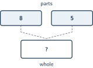
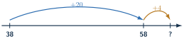
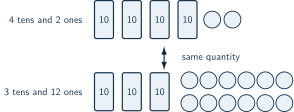

+++
order = 2
subject = "mathematics"
tags = ["quantitative-reasoning", "addition", "subtraction", "whole-numbers"]
prerequisites = ["chapter:01_quantities_and_whole_numbers"]
provides = ["whole-number-addition", "whole-number-subtraction", "inverse-operation-check", "whole-number-regrouping"]
+++

# Addition and subtraction

<!-- card-id: 4fb884a8-5bc9-490f-a6bb-ffa3ab462688 -->
Q: **Addition** joins amounts to find a total. The symbol \(+\) means “add,” the symbol \(=\) means “has the same value as,” and the result is called the **sum**. If six counters are joined with four counters, complete \(6+4={?}\).
A: \(6+4=10\). The sum \(10\) is the total after the two amounts are joined.

<!-- card-id: 76250e53-63fe-4157-b2a9-661f8001af7e -->
Q: A **part–whole diagram** puts amounts being joined in the two upper boxes and their total in the lower box.

What sum belongs in the lower box?
A: \(13\), because \(8+5=13\). The two parts join to make the whole.

<!-- card-id: af2ffc94-ff1b-4db6-a0a7-c48630679fab -->
Q: An **operation** is a mathematical action on amounts. One rack holds \(24\) badges and another holds \(13\). Both racks are emptied into the same bin. Which operation finds how many badges are in the bin now? Do not calculate.
A: Addition. The two amounts are being joined to find one total.

<!-- card-id: d8c5b8c0-aafe-47c1-9173-b4c2f34229a9 -->
P: A cabinet has \(32\) blue folders and \(25\) gray folders. To find the total, join tens with tens and ones with ones. How many folders are there?
S: **IDENTIFY:** The two counted amounts are joined, so use addition.

**PLAN:** Use place value: \(32\) is \(3\) tens and \(2\) ones; \(25\) is \(2\) tens and \(5\) ones.

**EXECUTE:** Join the tens: \(3\) tens plus \(2\) tens is \(5\) tens. Join the ones: \(2+5=7\) ones. Therefore, \(32+25=\mathbf{57}\) folders.

**EVALUATE:** A joined total cannot be smaller than either part. \(57\) is greater than both \(32\) and \(25\).

<!-- card-id: 4f183af4-dc5e-46de-9ea6-a75e3c5a7356 -->
Q: On this whole-number line, start at \(38\). A rightward jump labeled \(+20\) joins two tens, and the next jump labeled \(+4\) joins four ones.

What endpoint replaces the question mark, and which sum does the line show?
A: The endpoint is \(62\), so the line shows \(38+24=62\). Splitting \(24\) into \(20\) and \(4\) keeps tens and ones visible.

<!-- card-id: 7430e7b3-3ca5-4ec1-b00b-b5dd886a45c3 -->
Q: In a vertical whole-number calculation, a **column** is a straight up-and-down line of places. Digits with the same place value are written in the same column.

\[
\begin{array}{r}
  42\\
+ 17\\
\hline
\end{array}
\]

Why is the \(7\) written under the \(2\), rather than under the \(4\)?
A: The \(7\) and \(2\) are both ones. Aligning them lets ones be joined with ones; the \(1\) and \(4\) are both tens.

<!-- card-id: 6899fbee-a8ae-4d22-bd13-d7b07cc2540b -->
Q: **Regrouping** exchanges equal place-value amounts without changing the quantity. Ten ones can be exchanged for one ten, and one ten can be exchanged for ten ones.

In \(27+15\), the ones make \(7+5=12\). How should those \(12\) ones be recorded in the sum?
A: Record \(2\) in the ones place and regroup \(10\) ones as \(1\) ten. The exchange changes the grouping, not the quantity.

<!-- card-id: c6a1c8c2-914b-4d34-a3fe-e04d2e893b5f -->
P: Complete \(48+37\). The ones make \(8+7=15\), so write \(5\) ones and regroup \(1\) ten. What sum results?
S: **IDENTIFY:** This is addition with regrouping.

**PLAN:** Add ones first, record the regrouped ten, and then add all the tens.

**EXECUTE:** The ones give \(15\): write \(5\) ones and regroup \(1\) ten. The tens give \(1+4+3=8\) tens. Thus \(48+37=\mathbf{85}\).

**EVALUATE:** Rounding gives \(50+40\), about \(90\). The exact sum \(85\) is reasonably close.

<!-- card-id: fd3fab76-9ca8-422c-8f8b-cdb2084e0b1a -->
Q: **Subtraction** can remove one amount from another to find what remains. The symbol \(-\) means “subtract,” and the result is called the **difference**. If nine counters are present and four are removed, complete \(9-4={?}\).
A: \(9-4=5\). The difference \(5\) is the amount remaining.

<!-- card-id: 7a94c9d8-0060-4661-963a-05a512039825 -->
Q: A bin held \(31\) cards. After \(12\) cards were taken out, a learner wants to find how many remain. Which operation should the learner choose? Do not calculate.
A: Subtraction. An amount is removed from the starting amount, and the question asks what remains.

<!-- card-id: 2f56a072-c8e8-4cf4-81cb-33ccf16c5317 -->
Q: Subtraction can also **compare** two amounts by finding how much greater one is than the other. One counted row has \(17\) counters and another has \(12\). What subtraction finds how many more counters are in the longer row, and what is the difference?
A: \(17-12=5\). The difference \(5\) is the extra amount in the longer row.

<!-- card-id: 6c3bc458-4cc3-4eaf-857f-29b1ebf3c9da -->
Q: A whole has \(13\) counters. One known part has \(5\) counters. Which calculation finds the unknown part, and what is it?
A: \(13-5=8\). Subtract the known part from the whole to find the missing part.

<!-- card-id: f172bd4d-6167-441b-9600-9c1713837c87 -->
Q: **Inverse operations** undo one another. Addition joins parts; subtraction can remove one part from the total. A correct sum is \(8+5=13\). Which subtraction removes the second part, \(5\), to check the sum?
A: \(13-5=8\). Returning to the first part confirms the addition.

<!-- card-id: 9342d310-9bf6-43b7-ae58-34cbd6c20912 -->
Q: For vertical subtraction, align equal place values. Compute

\[
\begin{array}{r}
  64\\
- 21\\
\hline
\end{array}
\]

by subtracting ones from ones and tens from tens.
A: \(43\). The ones give \(4-1=3\), and the tens give \(6-2=4\) tens.

<!-- card-id: a8b241dc-487f-41e8-9911-bf5eef515002 -->
Q: In \(42-18\), there are only \(2\) ones, but \(8\) ones must be removed. The regrouping diagram shows two equal ways to represent \(42\).

Which representation lets the ones subtraction begin, and why?
A: Use \(3\) tens and \(12\) ones. Exchanging one ten for ten ones gives enough ones to subtract \(8\), while the total remains \(42\).

<!-- card-id: bbcd0ffb-f496-4723-b9c7-92293a995f32 -->
P: A shelf held \(52\) binders, and \(27\) were removed. How many binders remain?
S: **IDENTIFY:** An amount is removed, so use subtraction.

**PLAN:** Compute \(52-27\), regrouping one ten because \(2\) ones are not enough to remove \(7\) ones.

**EXECUTE:** Regroup \(52\) as \(4\) tens and \(12\) ones. Then \(12-7=5\) ones and \(4-2=2\) tens, so \(\mathbf{25}\) binders remain.

**EVALUATE:** Add the difference and the removed amount: \(25+27=52\), the starting amount.

<!-- card-id: 086c4e5d-4acb-480a-8d13-2ebbfcf2bf76 -->
Q: A learner computes \(71-26=45\). Which addition checks this difference, and does the check pass?
A: Check \(45+26=71\). It equals the starting amount, so the subtraction passes the inverse-operation check.

<!-- card-id: f90e3dec-3fbd-45c7-92b5-801e7ba4bfdd -->
Q: A learner reports \(623-198=25\). To check the size, round to the nearest hundred: \(623\) is about \(600\), and \(198\) is about \(200\). Does the estimated difference support \(25\)?
A: No. \(600-200\) is about \(400\), so an exact difference of \(25\) is far too small. An estimate can expose an unreasonable result even before the exact calculation is redone.

<!-- card-id: a7302adb-ecff-459c-a83a-99d390b280c6 -->
Q: When a whole amount no greater than the starting amount is subtracted, the difference must be between \(0\) and the starting amount. Diagnose the claim \(34-12=46\).
A: It is impossible: removing \(12\) from \(34\) cannot produce \(46\), which is greater than the starting amount. The result violates the subtraction size bound.

<!-- card-id: 6f487817-21a3-4064-a516-8592704ad8d1 -->
Q: A learner tries to add \(73+8\) but writes the \(8\) under the \(7\), treating it as eight tens. What place-value correction is needed?
A: Write the \(8\) under the \(3\), in the ones column. The corrected sum is \(73+8=81\); placing \(8\) under the tens changes it to \(80\).

<!-- card-id: 03f8ffe4-a788-429e-a1a2-f8e4b344b388 -->
Q: A learner computes \(52-27=35\) by subtracting the smaller digit from the larger digit in each column. Diagnose the error.
A: The learner ignored place-value regrouping. In the ones column, \(2\) ones are not enough to remove \(7\) ones; regroup \(52\) as \(4\) tens and \(12\) ones, giving the correct difference \(25\).

<!-- card-id: d860f755-a044-40d6-8bb9-e192ca7f727a -->
Q: **Compensation** makes an addition easier by moving the same amount from one joined part to the other, so the total stays unchanged. For \(49+36\), which has the same sum: \(50+35\) or \(50+36\)? Why?
A: \(50+35\). Moving \(1\) from \(36\) to \(49\) increases one part by \(1\) and decreases the other by \(1\), leaving the total unchanged.

<!-- card-id: 83ab255e-6d0d-483d-a41f-b4c06173e4ae -->
P: A cabinet held \(86\) folders. Then \(29\) folders were removed, and afterward \(14\) new folders were placed inside. How many folders are in the cabinet now?
S: **IDENTIFY:** The situation first removes an amount and then joins a new amount, so use subtraction followed by addition.

**PLAN:** Compute \(86-29\), then add \(14\) to the remaining amount.

**EXECUTE:** Regroup to subtract: \(86-29=57\). Then \(57+14=\mathbf{71}\). The cabinet now holds \(71\) folders.

**EVALUATE:** With rounded amounts, \(90-30=60\), then \(60+10=70\). The exact result \(71\) is reasonable, and \(71-14=57\) reverses the final addition.
