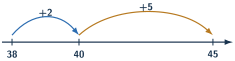

+++
order = 2
subject = "mathematics"
tags = ["quantitative-reasoning", "addition", "subtraction", "whole-numbers"]
prerequisites = ["chapter:01_quantities_and_whole_numbers"]
provides = ["whole-number-addition", "whole-number-subtraction", "inverse-operation-check", "whole-number-regrouping"]
+++

# Addition and subtraction

<!-- card-id: 02000000-0000-4000-8000-000000000001 -->
Q: **Addition** joins quantities. The symbol \(+\) means “plus,” the result is the **sum**, and \(=\) means the quantities on both sides are equal. A box has \(4\) red counters and \(3\) blue counters. Which addition statement records the total?
A: \(4+3=7\). The two quantities join to make the sum \(7\).

<!-- card-id: 02000000-0000-4000-8000-000000000002 -->
Q: Why do \(4+3\) and \(3+4\) have the same sum?
A: They join the same two quantities; only their order changes. Either way, the total is \(7\).

<!-- card-id: 02000000-0000-4000-8000-000000000003 -->
Q: What happens to a whole number when \(0\) is added to it?
A: It stays the same. Adding zero joins no additional items, so \(8+0=8\).

<!-- card-id: 02000000-0000-4000-8000-000000000004 -->
Q: The bar shows a whole split into two parts.

Which addition finds the unlabeled part?
A: (5+square=9), so the missing part is \(4\). The two parts must join to make the whole.

<!-- card-id: 02000000-0000-4000-8000-000000000005 -->
Q: **Subtraction** can record taking a quantity away. The symbol \(-\) means “minus,” and the result is the **difference**. Nine counters are present and \(4\) are removed. Which subtraction records how many remain?
A: \(9-4=5\). Start with \(9\) and remove \(4\), leaving the difference \(5\).

<!-- card-id: 02000000-0000-4000-8000-000000000006 -->
Q: Subtraction can also compare quantities. One stack has \(11\) counters and another has \(7\). Which calculation finds how many more are in the first stack?
A: \(11-7=4\). The difference \(4\) is the gap between the two quantities.

<!-- card-id: 02000000-0000-4000-8000-000000000007 -->
Q: How can addition check the subtraction \(13-5=8\)?
A: Add the difference and the removed amount: \(8+5=13\). Returning to the starting quantity supports the subtraction.

<!-- card-id: 02000000-0000-4000-8000-000000000008 -->
Q: A shelf had \(18\) folders and now has \(25\). Should you add or subtract to find how many folders were added?
A: Subtract: \(25-18\). The unknown is the change between the earlier and later quantities.

<!-- card-id: 02000000-0000-4000-8000-000000000009 -->
Q: Ten ones can be exchanged for one ten without changing the quantity. In \(28+7\), why can \(8\) ones plus \(7\) ones be written as \(1\) ten and \(5\) ones?
A: Because \(8+7=15\) ones, and \(15\) ones are \(1\) ten plus \(5\) ones. This exchange is **regrouping**.

<!-- card-id: 02000000-0000-4000-8000-000000000010 -->
Q: The open number line shows a jump from \(38\) to \(40\), then from \(40\) to \(45\).

How does it compute \(38+7\)?
A: Split \(7\) into \(2+5\): \(38+2=40\), then \(40+5=45\). The jumps total \(7\).

<!-- card-id: 02000000-0000-4000-8000-000000000011 -->
Q: A learner aligns \(47+8\) as though \(8\) were a tens digit. What place-value mistake does this make?
A: It aligns unlike places. The \(8\) must be under the ones digit \(7\), not under the tens digit \(4\).

<!-- card-id: 02000000-0000-4000-8000-000000000012 -->
Q: In \(52-27\), why is one ten exchanged before subtracting the ones?
A: Two ones are not enough to remove \(7\) ones. Exchanging one ten makes \(52\) into \(4\) tens and \(12\) ones, the same quantity in a usable form.

<!-- card-id: 02000000-0000-4000-8000-000000000013 -->
Q: Which inverse calculation checks \(304-178=126\)?
A: \(126+178=304\). The difference plus the subtracted quantity should recover the starting quantity.

<!-- card-id: 02000000-0000-4000-8000-000000000014 -->
Q: Estimate \(398+205\) by rounding each addend to the nearest hundred. What does the estimate help you check?
A: \(400+200=600\). It helps check that an exact sum near \(600\) is reasonable; it does not replace the exact calculation when precision matters.

<!-- card-id: 02000000-0000-4000-8000-000000000015 -->
Q: Addition can change order without changing the sum. Why can subtraction not usually change order?
A: Subtraction starts with one quantity and removes or compares another. For example, \(9-4=5\), while \(4-9\) is not the same whole-number calculation.

<!-- card-id: 02000000-0000-4000-8000-000000000016 -->
P: Compute \(47+38\) and verify the result.
S: **IDENTIFY:** Add two whole numbers.

**PLAN:** Add aligned ones, regroup, then add tens.

**EXECUTE:** \(7+8=15\) ones, or \(1\) ten and \(5\) ones. Then \(4+3+1=8\) tens, so \(47+38=85\).

**EVALUATE:** Subtract one addend: \(85-38=47\), so the sum is consistent.

<!-- card-id: 02000000-0000-4000-8000-000000000017 -->
P: Complete \(72-46\). State the regrouping that makes the ones step possible.
S: Exchange one ten: \(72\) becomes \(6\) tens and \(12\) ones. Then \(12-6=6\) ones and \(6-4=2\) tens, so \(72-46=26\). Check: \(26+46=72\).

<!-- card-id: 02000000-0000-4000-8000-000000000018 -->
P: A container holds \(90\) cards after \(34\) cards were added. How many cards were there before the addition?
S: **IDENTIFY:** The starting part is unknown.

**EXECUTE:** \(90-34=56\), so there were **56 cards**.

**EVALUATE:** \(56+34=90\), which returns the stated final amount.

<!-- card-id: 02000000-0000-4000-8000-000000000019 -->
P: A cabinet has \(126\) envelopes. Another cabinet has \(89\). How many more envelopes are in the first cabinet, and is an answer of \(215\) reasonable?
S: Subtract to compare: \(126-89=37\), so the first cabinet has **37 more envelopes**. \(215\) is the sum, not the difference; a difference must be smaller than \(126\), so \(215\) fails a size check.
