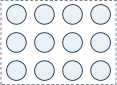
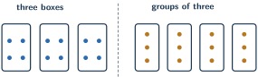

+++
order = 3
subject = "mathematics"
tags = ["quantitative-reasoning", "multiplication", "division", "whole-numbers"]
prerequisites = ["chapter:02_addition_and_subtraction"]
provides = ["whole-number-multiplication", "whole-number-division", "division-remainder", "array-representation"]
+++

# Multiplication and division

<!-- card-id: 03000000-0000-4000-8000-000000000001 -->
Q: **Multiplication** combines equal groups. The symbol × means “times.” There are \(3\) equal groups with \(4\) counters in each group. Which multiplication gives the total?
A: (3×4=12). It means \(3\) groups of \(4\), which is \(4+4+4\).

<!-- card-id: 03000000-0000-4000-8000-000000000002 -->
Q: In (3×4=12), the multiplied numbers are **factors** and the result is the **product**. Which number is the product?
A: \(12\). The factors \(3\) and \(4\) combine to make the product.

<!-- card-id: 03000000-0000-4000-8000-000000000003 -->
Q: The array has equal rows and equal columns.

Give two multiplications that describe it.
A: (3×4=12) and (4×3=12). Counting by rows or by columns gives the same total.

<!-- card-id: 03000000-0000-4000-8000-000000000004 -->
Q: Why does changing the order of whole-number factors not change the product?
A: The same rectangular array can be counted by rows or columns. For example, (3×4) and (4×3) count the same \(12\) positions.

<!-- card-id: 03000000-0000-4000-8000-000000000005 -->
Q: What happens when a whole number is multiplied by \(1\), and why?
A: It stays the same. One group of (n) items contains (n) items, so (1×n=n).

<!-- card-id: 03000000-0000-4000-8000-000000000006 -->
Q: What happens when a whole number is multiplied by \(0\), and why?
A: The product is \(0\). Zero equal groups contain no items.

<!-- card-id: 03000000-0000-4000-8000-000000000007 -->
Q: How can (7×6) be computed from the easier product (5×6)?
A: Add two more groups of \(6\): (5×6+2×6=30+12=42).

<!-- card-id: 03000000-0000-4000-8000-000000000008 -->
Q: **Division** can share a quantity equally. The symbol ÷ means “divided by.” If \(12\) counters are shared equally among \(3\) groups, which division finds the number in each group?
A: (12÷3=4). The result, \(4\), is the **quotient**.

<!-- card-id: 03000000-0000-4000-8000-000000000009 -->
Q: Division can instead ask how many equal groups fit. If \(12\) counters are placed in groups of \(3\), which division finds the number of groups?
A: (12÷3=4). Here the quotient means \(4\) groups, rather than \(4\) counters per group.

<!-- card-id: 03000000-0000-4000-8000-000000000010 -->
Q: The two panels show equal sharing and equal grouping.

What stays the same, and what question changes?
A: The calculation (12÷3=4) stays the same. Sharing asks how many are in each of \(3\) groups; grouping asks how many groups of \(3\) fit in \(12\).

<!-- card-id: 03000000-0000-4000-8000-000000000011 -->
Q: How does multiplication check (35÷5=7)?
A: Multiply quotient by divisor: (7×5=35). It rebuilds the starting quantity.

<!-- card-id: 03000000-0000-4000-8000-000000000012 -->
Q: When equal groups do not use the entire quantity, the amount left is the **remainder**. What are the quotient and remainder in (14÷3)?
A: Quotient \(4\), remainder \(2\), because (14=4×3+2).

<!-- card-id: 03000000-0000-4000-8000-000000000013 -->
Q: The diagram places \(17\) counters into groups of \(5\).

What quotient and remainder does it show?
A: (17÷5=3) remainder \(2\). There are three complete groups and two counters left.

<!-- card-id: 03000000-0000-4000-8000-000000000014 -->
Q: Five-seat carts must carry \(17\) people. Why are \(4\) carts needed even though (17÷5) has quotient \(3\) remainder \(2\)?
A: Three carts hold only \(15\) people; the two remaining people need another cart. The context requires rounding the number of groups up to \(4\).

<!-- card-id: 03000000-0000-4000-8000-000000000015 -->
Q: Seventeen tokens are packed only into complete bags of \(5\), and leftovers are kept loose. How many complete bags are made?
A: \(3\) complete bags, with \(2\) loose tokens. This context uses the whole-number quotient without adding a bag.

<!-- card-id: 03000000-0000-4000-8000-000000000016 -->
Q: To compute (23×14), why is (23×\(10+4\)) useful even without formal algebra?
A: It splits \(14\) into easier place-value parts: (23×10+23×4=230+92=322).

<!-- card-id: 03000000-0000-4000-8000-000000000017 -->
Q: A learner claims (156÷12=23). Give a quick check that exposes the error.
A: Multiply: (23×12=276), not \(156\). The inverse check fails.

<!-- card-id: 03000000-0000-4000-8000-000000000018 -->
P: An array has \(6\) rows with \(8\) counters in each row. Find the total and check it by a second grouping.
S: **IDENTIFY:** Equal groups call for multiplication.

**EXECUTE:** (6×8=48).

**EVALUATE:** Reverse the row and column count: (8×6=48), so both views give the same total.

<!-- card-id: 03000000-0000-4000-8000-000000000019 -->
P: Compute (125÷8) as a whole-number quotient with remainder, and verify it.
S: (8×15=120), leaving \(125-120=5\). Thus the result is **15 remainder 5**. Check: (15×8+5=125), and the remainder \(5\) is smaller than the group size \(8\).

<!-- card-id: 03000000-0000-4000-8000-000000000020 -->
P: A display uses \(9\) counters per row. How many complete rows can be made from \(76\) counters, and how many counters remain?
S: (9×8=72), so **8 complete rows** can be made and **4 counters remain**. Check: \(72+4=76\).

<!-- card-id: 03000000-0000-4000-8000-000000000021 -->
P: Six boxes each contain \(24\) clips, and then \(17\) loose clips are added. How many clips are there altogether?
S: **IDENTIFY:** Equal boxes require multiplication; loose clips then require addition.

**EXECUTE:** (6×24=144), then \(144+17=161\).

**EVALUATE:** (6×24) is near (6×25=150); adding \(17\) makes a total near \(167\), so \(161\) is reasonable.
