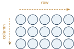
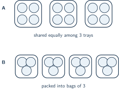

+++
order = 3
subject = "mathematics"
authoring_model = "claude-fable-5"
tags = ["quantitative-reasoning", "multiplication", "division", "whole-numbers"]
prerequisites = ["chapter:02_addition_and_subtraction"]
provides = ["whole-number-multiplication", "whole-number-division", "division-remainder", "array-representation"]
+++

# Multiplication and division

## Equal groups and multiplication

<!-- card-id: 26849ea4-7b53-4c05-b1dd-e3e445f9ffe9 -->
Q: Some collections come in **equal groups** — separate groups that each hold
exactly the same quantity, like 4 boxes with exactly 6 candles in every box.
**Multiplication** is the operation that finds the total of equal groups from
two numbers: how many groups there are, and how many each group holds. It is
written with the symbol \(\times\), read "times": the statement
\(4 \times 6 = 24\) records that 4 groups of 6 make 24 in all. In this deck
the first number counts the groups and the second tells how many each group
holds. The two numbers multiplied — here 4 and 6 — are called the
**factors**, and the result — here 24 — is the **product**. A loading dock
holds 3 vans, every van carries exactly 8 crates, and counting confirms
24 crates in all. Write the multiplication statement that records this, and
name its factors and its product.

A: \(3 \times 8 = 24\): 3 equal groups (the vans) of 8 crates each make
24 crates in all. The factors are 3 and 8, and the product is 24.

<!-- card-id: efc9d0ac-32b3-4dd9-86f9-61a34e405284 -->
Q: A product can always be computed with addition you already know:
3 groups of 7 hold \(7 + 7 + 7\) items — the group size added once for every
group — so \(3 \times 7 = 21\). Which repeated addition finds the product
\(4 \times 6\), and what is the product?

A: \(6 + 6 + 6 + 6 = 24\), the group size 6 added once for each of the
4 groups: \(6 + 6 = 12\), \(12 + 6 = 18\), \(18 + 6 = 24\). The product
is 24.

## Arrays: rows and columns

<!-- card-id: 03000000-0000-4000-8000-000000000003 -->
Q: An **array** arranges objects in a rectangle of **rows** and **columns**:
a row runs left to right, and a column runs top to bottom — the same word
used for the vertical stacks of digits in written addition. Every row of an
array holds the same quantity, so each row is one equal group. In the
figure, the arrows mark one row and one column.

Taking each row as one group, write the multiplication statement this array
shows, and give its product.

A: \(3 \times 5 = 15\). The array has 3 rows — 3 equal groups — with 5
counters in each row, and \(5 + 5 + 5 = 15\), so the product is 15.

<!-- card-id: 03000000-0000-4000-8000-000000000004 -->
Q: Turn that 3-rows-of-5 array a quarter turn on its side and it becomes an
array of 5 rows with 3 counters in each row — yet not a single counter was
added or removed. What does the turned array show about the two products
\(3 \times 5\) and \(5 \times 3\), and about swapping the factors of any
multiplication?

A: They are equal: \(3 \times 5 = 5 \times 3 = 15\). Both count exactly the
same counters, just read in rows two different ways. Swapping the order of
the factors never changes the product.

<!-- card-id: 51facdbd-58b8-433b-97f8-17a1f8f3c28b -->
Q: The equal-groups meaning — first factor counts the groups, second tells
how many each holds — decides even the extreme cases. Using that meaning,
what are the products \(6 \times 1\) and \(6 \times 0\), and why?

A: \(6 \times 1 = 6\): six groups each holding a single item hold 6 items in
all. \(6 \times 0 = 0\): six groups each holding none hold none at all —
the quantity is zero no matter how many empty groups there are.

## Multiplying with place value

<!-- card-id: 20ed464e-228c-4e89-b2a4-9e8d87c1a37f -->
Q: The statement \(7 \times 10\) records 7 groups of ten. Using place value,
what is the product, and why can it be written down without any adding?

A: 70. Seven groups of ten is exactly what a numeral's tens place records:
7 tens and 0 ones is the numeral 70. Any whole number of groups of ten can
be written straight into the tens place.

<!-- card-id: 061e65cb-bcae-4c0e-a560-0167cb2d23ea -->
Q: A product with a two-digit factor can be found in pieces. In
\(3 \times 24\), each group of 24 is 2 tens and 4 ones, so 3 groups of 24
hold the same items as 3 groups of 20 together with 3 groups of 4. Find each
of those two partial products, then join them with addition. What is
\(3 \times 24\)?

A: 72. The pieces: \(3 \times 20 = 60\) (3 groups of 2 tens is 6 tens) and
\(3 \times 4 = 12\). Joining them: \(60 + 12 = 72\).

<!-- card-id: 7477de56-affd-4fea-a08c-31877315585c -->
Q: A student finds \(4 \times 27\) by splitting: "27 is 20 and 7.
\(4 \times 20 = 80\), then join the 7: \(80 + 7 = 87\)." The answer 87 is
wrong. What did the student forget, and what is the correct product?

A: 108. Every one of the 4 groups holds 20 *and* 7, so the ones must be
multiplied too: \(4 \times 7 = 28\), not 7. Joining the partial products:
\(80 + 28 = 108\). The student joined the ones of only a single group.

<!-- card-id: edf1fac2-f094-4d0c-90af-607e26ec0b82 -->
P: A hall is set up with 6 rows of chairs, and every row holds exactly
14 chairs. How many chairs are set out in all?

S: 84 chairs.

IDENTIFY: The rows are equal groups — 6 groups of 14 — so this is a
multiplication: \(6 \times 14\).

PLAN: Adding 14 six times would work but is slow. Split the group size 14
into its tens and ones (1 ten and 4 ones), multiply each part, and join the
partial products.

EXECUTE: \(6 \times 10 = 60\) and \(6 \times 4 = 24\). Joining them:
\(60 + 24 = 84\), so \(6 \times 14 = 84\).

EVALUATE: Repeated addition agrees: \(14 + 14 = 28\), \(28 + 14 = 42\),
\(42 + 14 = 56\), \(56 + 14 = 70\), \(70 + 14 = 84\). The product is also
larger than \(6 \times 10 = 60\), as 6 groups of more than ten must be:
\(84 > 60\).

## Division: sharing and grouping

<!-- card-id: 03000000-0000-4000-8000-000000000008 -->
Q: **Division** is the operation that undoes equal grouping: it starts from
a total and finds the missing part of the equal-groups picture. Its first
meaning is **sharing**: 12 crackers shared equally among 3 plates can be
dealt out one at a time, and division finds how many each plate ends up
with. It is written with the symbol \(\div\), read "divided by": the
statement \(12 \div 3 = 4\) records that 12 shared equally into 3 groups
puts 4 in each group. The result of a division is called the **quotient**.
A basket of 15 tangerines is shared equally among 5 hikers. Write the
division statement, and say what its quotient tells.

A: \(15 \div 5 = 3\). The quotient 3 tells how many tangerines each hiker
gets. It fits the equal-groups picture: 5 groups of 3 make
\(5 \times 3 = 15\).

<!-- card-id: 03000000-0000-4000-8000-000000000010 -->
Q: Division has a second meaning: **grouping**. Instead of sharing among a
known number of groups, grouping starts from a known group *size* and asks
how many full groups can be made. In the figure, each outlined loop marks
one group, and both panels arrange the same 12 counters.

Both panels are recorded by \(12 \div 3 = 4\). What different question does
each panel answer with that quotient 4?

A: Panel A is sharing: "12 shared equally among 3 trays — how many in
*each* group?" There, 4 counts the counters per tray. Panel B is grouping:
"12 packed into bags of 3 — how many *groups*?" There, 4 counts the bags.
In sharing the 3 is the number of groups; in grouping the 3 is the size of
each group.

<!-- card-id: 4efea616-5e1b-478e-a3b6-9a2eb45ed9d4 -->
Q: Two situations: (a) 20 stickers are shared equally among 5 albums.
(b) 20 stickers are put into packets of 5. Both are recorded by
\(20 \div 5 = 4\). For each situation, say what the quotient 4 counts.

A: In (a), sharing — the 4 counts stickers in *each* album, since the 5 is
the number of groups. In (b), grouping — the 4 counts the *packets*, since
the 5 is the size of each group.

## Division and multiplication undo each other

<!-- card-id: 03000000-0000-4000-8000-000000000011 -->
Q: Just as subtraction undoes addition, division and multiplication are
**inverse operations**: division splits a total into equal groups, and
multiplication rebuilds the total from them. So the quotient of
\(42 \div 6\) is exactly the number of groups of 6 that multiply back to 42.
Which multiplication statement finds that quotient, and what is it?

A: The quotient is 7, because \(7 \times 6 = 42\): 7 groups of 6 rebuild
exactly 42. Any claimed quotient can be checked the same way — multiply it
by the group size and the original total must return.

<!-- card-id: 7f32d491-f9c7-4db1-88fd-ba1900af5f24 -->
Q: By the inverse relationship, the quotient of \(8 \div 0\) would have to
be a number of groups of 0 that rebuild 8. Why does no whole number work —
and what is \(0 \div 8\), which does have an answer?

A: Groups of 0 hold nothing: any number of them multiplies to 0, never
to 8, so \(8 \div 0\) has no answer — it is left **undefined**. But
\(0 \div 8 = 0\): sharing none among 8 gives each share none, and the
rebuild check works, since \(8 \times 0 = 0\).

## Remainders

<!-- card-id: 03000000-0000-4000-8000-000000000013 -->
Q: Grouping does not always come out even. Packing 7 items into groups of 2
gives 3 full groups with 1 item left that cannot fill another group; the
leftover quantity is called the **remainder**, and the division is written
\(7 \div 2 = 3\) remainder \(1\). The figure shows counters packed into
groups; each outlined loop marks one full group.

Write the division statement, with its remainder, that the figure shows.

A: \(14 \div 4 = 3\) remainder \(2\): the 14 counters make 3 full groups
of 4, with 2 counters left over. The parts rebuild the total —
\(3 \times 4 = 12\), and \(12 + 2 = 14\).

<!-- card-id: 43c6a273-de61-4e2c-b570-3b91829c6c5f -->
Q: Grouping division packs as many full groups as possible. A student
writes \(17 \div 5 = 2\) remainder \(7\) and checks it: \(2 \times 5 = 10\),
and \(10 + 7 = 17\) — the total rebuilds. Why is the answer still wrong,
and what is the correct quotient and remainder?

A: A remainder of 7 still contains a full group of 5, so the packing was
stopped too early — the remainder must always be smaller than the group
size. Correct: \(17 \div 5 = 3\) remainder \(2\), since \(3 \times 5 = 15\),
\(15 + 2 = 17\), and \(2 < 5\). A full check needs both parts: the total
rebuilds *and* the remainder is smaller than the group size.

<!-- card-id: 03000000-0000-4000-8000-000000000014 -->
Q: A club of 26 hikers crosses a lake in rowboats that each carry exactly
4 people. Working from \(26 \div 4 = 6\) remainder \(2\), the trip planner
books 6 boats. What did the planner misread, and how many boats does the
club actually need?

A: 7 boats. The quotient 6 counts only the *full* boats — \(6 \times 4 = 24\)
hikers — and the remainder 2 is people, not spare items to drop: the 2
remaining hikers still need a boat, even though it will not be full. When
the leftover must also be handled, the answer is one more group than the
quotient.

<!-- card-id: 03000000-0000-4000-8000-000000000015 -->
P: A workshop has 53 markers to pack into boxes that each hold exactly 8.
The packing is started for you: 6 full boxes hold \(6 \times 8 = 48\)
markers. Complete the division: find the remainder, decide whether a 7th
box can be filled, and write the full division statement.

S: \(53 \div 8 = 6\) remainder \(5\): 6 full boxes, with 5 markers left
over.

After 6 full boxes, \(53 - 48 = 5\) markers remain. Five markers cannot
fill a box of 8, so no 7th full box is possible and the packing stops.

EVALUATE: Both parts of the remainder check hold: \(48 + 5 = 53\) rebuilds
the total, and \(5 < 8\), so 5 really is a remainder rather than another
box.

<!-- card-id: f0eb7176-e901-4d7e-8869-d2db5721129d -->
P: A bakery has 72 rolls to arrange on trays, and every tray holds exactly
6 rolls. How many trays does the bakery fill?

S: 12 trays.

IDENTIFY: The group size is known (6 per tray) and the question asks how
many groups — a grouping division: \(72 \div 6\).

PLAN: Build up groups of 6 with multiplication until 72 is reached,
starting from an easy ten groups.

EXECUTE: Ten trays hold \(10 \times 6 = 60\) rolls, leaving
\(72 - 60 = 12\). Since \(2 \times 6 = 12\), the leftover fills exactly
2 more trays. In all, \(10 + 2 = 12\) trays: \(72 \div 6 = 12\), with
nothing left over.

EVALUATE: Inverse check: \(12 \times 6\) must rebuild 72, and it does —
\(10 \times 6 = 60\), \(2 \times 6 = 12\), \(60 + 12 = 72\). A remainder
of 0 fits the story: every tray is completely full.

## Choosing the operation

<!-- card-id: 3f42757d-4c0b-49b8-bcd8-7f066d8a7980 -->
Q: Two situations use the same two numbers: (a) a rack holds 18 spice jars,
and 3 more jars are added to it; (b) a cupboard has 3 racks, and every rack
holds exactly 18 jars. Which operation finds each total, and what wording
signals the difference?

A: (a) Addition: one amount is joined once, so \(18 + 3 = 21\) jars.
(b) Multiplication: "every rack holds exactly 18" signals equal groups, so
\(3 \times 18 = 54\) jars (\(3 \times 10 = 30\), \(3 \times 8 = 24\),
\(30 + 24 = 54\)). The cue is *each/every group the same* for
multiplication versus *joined once* for addition.

<!-- card-id: d1ff0a6c-ab30-44a8-966a-4ded01fe2237 -->
P: A florist must display 90 tulips. Each vase holds exactly 12 tulips, and
7 vases are on hand. Are 7 vases enough — and if not, how many vases are
needed?

S: No: 8 vases are needed.

IDENTIFY: Two questions. "Are 7 vases enough?" compares the capacity of
7 equal groups with 90 — a multiplication then a comparison. "How many
vases?" asks how many groups of 12 handle all 90 tulips — a grouping
division whose remainder must be interpreted.

EXECUTE: Capacity of 7 vases: \(7 \times 12 = 84\), since
\(7 \times 10 = 70\), \(7 \times 2 = 14\), and \(70 + 14 = 84\). Because
\(84 < 90\), 7 vases are not enough. Dividing: 7 full vases use 84 tulips,
leaving \(90 - 84 = 6\), and \(6 < 12\), so \(90 \div 12 = 7\)
remainder \(6\). The 6 leftover tulips still need a vase, so the florist
needs \(7 + 1 = 8\) vases.

EVALUATE: 8 vases hold \(8 \times 12 = 96\) tulips
(\(8 \times 10 = 80\), \(8 \times 2 = 16\), \(80 + 16 = 96\)), and
\(96 > 90\), so 8 vases suffice — while 7 hold only 84, which falls short.
So 8 is the smallest count that works.
