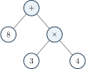
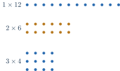

+++
order = 4
subject = "mathematics"
tags = ["quantitative-reasoning", "operation-order", "factors", "powers"]
prerequisites = ["chapter:03_multiplication_and_division"]
provides = ["arithmetic-expression", "operation-order", "factor-and-multiple", "prime-and-composite", "whole-number-power"]
+++

# Operation structure and factors

<!-- card-id: 04000000-0000-4000-8000-000000000001 -->
Q: An **arithmetic expression** is a written combination of numbers and operation symbols that represents a quantity. Which is an expression: (8+3×4) or (8+3×4=20)?
A: (8+3×4) is the expression. The second statement includes an equals sign and makes a claim about its value.

<!-- card-id: 04000000-0000-4000-8000-000000000002 -->
Q: **Grouping marks**, such as parentheses, tell which part to evaluate first. How does (\(8+3\)×4) differ from (8+(3×4))?
A: The first groups \(8+3\), giving (11×4=44). The second groups (3×4), giving \(8+12=20\).

<!-- card-id: 04000000-0000-4000-8000-000000000003 -->
Q: When an expression has multiplication and addition but no grouping marks, which operation is evaluated first?
A: Multiplication. Thus (8+3×4=8+12=20).

<!-- card-id: 04000000-0000-4000-8000-000000000004 -->
Q: Multiplication and division have equal priority, so they are evaluated from left to right. What is (24÷6×2)?
A: \(8\). Work left to right: (24÷6=4), then (4×2=8).

<!-- card-id: 04000000-0000-4000-8000-000000000005 -->
Q: Addition and subtraction have equal priority, so they are evaluated from left to right. What is \(15-6+2\)?
A: \(11\). Work left to right: \(15-6=9\), then \(9+2=11\).

<!-- card-id: 04000000-0000-4000-8000-000000000006 -->
Q: A **power** records repeated multiplication. In \(4^3\), \(4\) is the base and \(3\) is the exponent. What does \(4^3\) mean?
A: (4×4×4=64). The exponent says to use three factors of \(4\), not to multiply (4×3).

<!-- card-id: 04000000-0000-4000-8000-000000000007 -->
Q: Powers are evaluated before multiplication, division, addition, and subtraction unless grouping marks change the order. What is (2+3^2×4)?
A: \(38\). First \(3^2=9\), then (9×4=36), then \(2+36=38\).

<!-- card-id: 04000000-0000-4000-8000-000000000008 -->
Q: The tree shows how an expression is grouped.

Which operation is completed last?
A: Addition. The multiplication (3×4) forms one branch and is completed before it is added to \(8\).

<!-- card-id: 04000000-0000-4000-8000-000000000009 -->
Q: A whole number is a **factor** of another when it divides that number with no remainder. Is \(6\) a factor of \(42\)?
A: Yes. (42÷6=7) with no remainder, equivalently (6×7=42).

<!-- card-id: 04000000-0000-4000-8000-000000000010 -->
Q: A **multiple** of \(6\) is a product of \(6\) and a whole number. Is \(42\) a factor or a multiple of \(6\)?
A: A multiple of \(6\), because (42=6×7). In the same relationship, \(6\) is a factor of \(42\).

<!-- card-id: 04000000-0000-4000-8000-000000000011 -->
Q: The arrays show all rectangular factor pairs for \(12\).

What factor pairs do they establish?
A: (1×12), (2×6), and (3×4). Reversing each order gives no new factors.

<!-- card-id: 04000000-0000-4000-8000-000000000012 -->
Q: Which final digit shows immediately that a whole number is divisible by \(2\)?
A: A final digit of (0,2,4,6,) or \(8\). Such a number can be split into equal pairs with no remainder.

<!-- card-id: 04000000-0000-4000-8000-000000000013 -->
Q: Which final digits show divisibility by \(5\) and by \(10\)?
A: A final \(0\) or \(5\) shows divisibility by \(5\); a final \(0\) shows divisibility by \(10\).

<!-- card-id: 04000000-0000-4000-8000-000000000014 -->
Q: A whole number is divisible by \(3\) when its digits have a sum divisible by \(3\). Is \(258\) divisible by \(3\)?
A: Yes. \(2+5+8=15\), and \(15\) is divisible by \(3\).

<!-- card-id: 04000000-0000-4000-8000-000000000015 -->
Q: A whole number greater than \(1\) is **prime** if its only factors are \(1\) and itself; it is **composite** if it has another factor. Is \(13\) prime or composite?
A: Prime. Its only whole-number factor pair is (1×13).

<!-- card-id: 04000000-0000-4000-8000-000000000016 -->
Q: Why are \(0\) and \(1\) neither prime nor composite under this deck's convention?
A: The definitions apply to whole numbers greater than \(1\). In particular, \(1\) does not have two distinct factors, and \(0\) has every nonzero whole number as a factor.

<!-- card-id: 04000000-0000-4000-8000-000000000017 -->
P: Evaluate (18-2×\(3+4\)) and check that the order was followed.
S: **IDENTIFY:** This is an operation-order problem.

**EXECUTE:** Parentheses first: \(3+4=7\). Then (2×7=14). Finally \(18-14=4\).

**EVALUATE:** The intermediate product \(14\) is less than \(18\), so the whole-number difference \(4\) is possible; subtracting before multiplying would ignore the grouping structure.

<!-- card-id: 04000000-0000-4000-8000-000000000018 -->
P: List every factor of \(36\) using factor pairs.
S: The pairs are (1×36), (2×18), (3×12), (4×9), and (6×6). Therefore the factors are (1,2,3,4,6,9,12,18,36). Each listed factor divides \(36\) with no remainder.

<!-- card-id: 04000000-0000-4000-8000-000000000019 -->
P: Decide whether \(91\) is prime or composite and justify the decision.
S: \(91\) is **composite** because (91=7×13). One nontrivial factor pair is enough to disprove primality.

<!-- card-id: 04000000-0000-4000-8000-000000000020 -->
P: A learner evaluates (20-8÷4×2) as (20-8÷8=19). Diagnose the error and find the value.
S: Multiplication and division must be handled left to right; they cannot be rearranged into (8÷8). Compute (8÷4=2), then (2×2=4), then \(20-4=16\).
