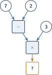
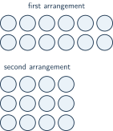

+++
order = 4
subject = "mathematics"
authoring_model = "claude-fable-5"
tags = ["quantitative-reasoning", "operation-order", "factors", "powers"]
prerequisites = ["chapter:03_multiplication_and_division"]
provides = ["arithmetic-expression", "operation-order", "factor-and-multiple", "prime-and-composite", "whole-number-power"]
+++

# Operation structure and factors

## Expressions and grouping marks

<!-- card-id: cc3d1361-c971-4147-8818-b781ab17ee7f -->
Q: So far every calculation has been written as its own statement, one
operation at a time. A string that combines numbers with more than one
operation sign — like \(5 + 3 \times 2\) — is called an **arithmetic
expression**. One student reads it by doing the operations in the order they
appear: \(5 + 3 = 8\), then \(8 \times 2 = 16\). Another multiplies before
adding: \(3 \times 2 = 6\), then \(5 + 6 = 11\). Both did every single
operation correctly. What problem does this reveal, and what must readers of
expressions therefore share?

A: The same expression gave two different values, 16 and 11 — so by itself it
does not name one definite quantity. Readers must share one agreed reading
order, so that an expression means exactly the same value for everyone.

<!-- card-id: 04000000-0000-4000-8000-000000000002 -->
Q: One way to fix an expression's reading is to mark it. **Grouping marks** —
the parentheses \((\;)\) — fence off part of an expression: whatever is
inside the marks is computed first, and its result is then used like a single
number. Evaluate both of these fully marked expressions:
\((9 - 4) \times 2\) and \(9 - (4 \times 2)\).

A: 10 and 1. In \((9-4) \times 2\), inside first: \(9-4=5\), then
\(5 \times 2 = 10\). In \(9-(4 \times 2)\), inside first: \(4 \times 2 = 8\),
then \(9 - 8 = 1\). Same numbers, same signs — the marks alone decide which
operation happens first, and the values differ.

## The order of operations

<!-- card-id: 04000000-0000-4000-8000-000000000003 -->
Q: When an expression has **no** grouping marks, a shared convention decides
the reading: **multiplication and division are done before addition and
subtraction**. So \(5 + 3 \times 2\) has only one correct value — the product
is found first, \(3 \times 2 = 6\), then \(5 + 6 = 11\). Using the
convention, evaluate \(20 - 2 \times 7\).

A: 6. Multiply first: \(2 \times 7 = 14\); then subtract: \(20 - 14 = 6\).
(Subtracting first would compute \(20 - 2 = 18\) and then \(18 \times 7\) —
a different structure the convention rules out.)

<!-- card-id: 9e541a38-757b-4951-b51b-8cac8444b811 -->
Q: The convention ranks multiplication and division above addition and
subtraction, but it says nothing yet about two operations of the **same**
rank. The rule for ties: operations of equal rank are done **left to right**.
Grouping marks still override everything. Evaluate \(10 - 4 - 3\), and
explain why \(10 - (4 - 3)\) has a different value.

A: 3. Equal rank, left to right: \(10 - 4 = 6\), then \(6 - 3 = 3\). The
marked version computes inside first — \(4 - 3 = 1\), then \(10 - 1 = 9\) —
because grouping marks override the left-to-right reading.

<!-- card-id: 04000000-0000-4000-8000-000000000020 -->
Q: A student evaluates \(8 + 6 \div 2\) strictly in the order the signs
appear: "\(8 + 6 = 14\), then \(14 \div 2 = 7\)." The answer 7 is wrong.
Which rule did the student misapply, and what is the correct value?

A: 11. Division outranks addition, so the quotient is found first:
\(6 \div 2 = 3\), then \(8 + 3 = 11\). Left to right only breaks ties
between operations of the **same** rank — it never lets an addition jump
ahead of a division.

<!-- card-id: 04000000-0000-4000-8000-000000000008 -->
Q: An expression's structure can be drawn the way a part–whole diagram draws
a sum. In the diagram below, each circle holds a number, each box holds an
operation, and each arrow feeds a result into the next step; the bottom box
holds the final result, marked \(?\) because it is the unknown.

Write the single marked expression this diagram shows, then evaluate it.

A: \((7 - 2) \times 3 = 15\). The subtraction happens first —
\(7 - 2 = 5\) — and its result feeds the multiplication:
\(5 \times 3 = 15\). The grouping marks are required: unmarked,
\(7 - 2 \times 3\) would put the product first (\(2 \times 3 = 6\), then
\(7 - 6 = 1\)) — a different structure than the diagram shows.

## Powers

<!-- card-id: 04000000-0000-4000-8000-000000000006 -->
Q: Repeated addition of the same number earned its own notation —
multiplication. Repeated **multiplication** of the same number does too. The
expression \(3^4\), read "3 to the fourth **power**", means
\(3 \times 3 \times 3 \times 3\): the **base** 3 used as a factor 4 times.
The small raised number, the **exponent**, counts how many times the base is
used as a factor. Multiplying step by step: \(3 \times 3 = 9\),
\(9 \times 3 = 27\), \(27 \times 3 = 81\), so \(3^4 = 81\). Write
\(2 \times 2 \times 2\) as a power, and give its value.

A: \(2^3 = 8\). The base is 2, used as a factor 3 times, so the exponent
is 3: \(2 \times 2 = 4\), then \(4 \times 2 = 8\).

<!-- card-id: 9058d2ea-bc29-4d44-9958-3544179fcd2f -->
Q: A student writes \(2^5 = 10\), reasoning "2 times 5 is 10." What did the
student mistake the exponent for, and what is the correct value of \(2^5\)?

A: 32. The student treated the exponent as a factor to multiply by. The
exponent is a **count** — it says how many times the base appears as a
factor: \(2^5 = 2 \times 2 \times 2 \times 2 \times 2\), and step by step
\(2 \times 2 = 4\), \(4 \times 2 = 8\), \(8 \times 2 = 16\),
\(16 \times 2 = 32\).

<!-- card-id: 04000000-0000-4000-8000-000000000007 -->
Q: Powers take their place in the reading order just below grouping marks.
The complete order: first, inside grouping marks; second, powers; third,
multiplication and division, left to right; last, addition and subtraction,
left to right. Evaluate \(2 \times 3^2\), and explain why 36 is not its
value.

A: 18. The power is evaluated before the multiplication:
\(3^2 = 3 \times 3 = 9\), then \(2 \times 9 = 18\). The value 36 would come
from multiplying first (\(2 \times 3 = 6\)) and using that product as the
base — but the exponent belongs to 3 alone.

<!-- card-id: 04000000-0000-4000-8000-000000000017 -->
P: Evaluate the expression \(50 - 4 \times 3^2\).

S: 14.

IDENTIFY: One expression with three operations — a subtraction, a
multiplication, and a power — and no grouping marks, so the shared order
decides the structure.

PLAN: Apply the complete order: the power first, then the multiplication,
then the subtraction.

EXECUTE: \(3^2 = 3 \times 3 = 9\). Then \(4 \times 9 = 36\). Then
\(50 - 36 = 14\).

EVALUATE: Inverse check on the final subtraction: \(14 + 36 = 50\). ✓ And
the size is sensible: 36 is below 50, so a small whole-number difference is
expected.

<!-- card-id: c8315878-98ae-4585-b758-99009dc51370 -->
P: Three boxes each hold 4 red pens and 2 blue pens. Two expressions are
proposed for the total number of pens: \(3 \times (4 + 2)\) and
\(3 \times 4 + 2\). Which expression matches the situation, and how many
pens are there in all?

S: \(3 \times (4 + 2) = 18\) pens.

IDENTIFY: There are 3 equal groups (the boxes), and each group's size is
itself a sum: \(4 + 2\) pens per box.

PLAN: The group size must be computed before multiplying, so the sum needs
grouping marks. Evaluate the marked expression, then evaluate the unmarked
one to see what it would count instead.

EXECUTE: \(3 \times (4+2)\): inside first, \(4 + 2 = 6\); then
\(3 \times 6 = 18\). The unmarked \(3 \times 4 + 2\) puts the product first:
\(3 \times 4 = 12\), then \(12 + 2 = 14\) — that counts only the red pens in
all three boxes, plus a single 2.

EVALUATE: Repeated-addition check on 3 groups of 6: \(6 + 6 + 6 = 18\). ✓

## Factors and multiples

<!-- card-id: 04000000-0000-4000-8000-000000000009 -->
Q: In the statement \(3 \times 8 = 24\), the numbers 3 and 8 are the factors
*of that statement*. The word also names a relationship to a number itself:
a whole number is a **factor of** a number when division by it comes out
exact — remainder 0 — so the number splits into equal groups of that size
with nothing left over. Use division to decide: is 4 a factor of 12? Is 5?

A: 4 is a factor of 12: \(12 \div 4 = 3\) with remainder 0 (rebuild check:
\(4 \times 3 = 12\)). 5 is not: \(12 \div 5 = 2\) r 2 — two groups of 5 use
10 and leave 2 over, so the split is not exact.

<!-- card-id: 04000000-0000-4000-8000-000000000011 -->
Q: Factors of a number come in **factor pairs** — two factors that multiply
to exactly that number — and every number has 1 and itself as one such pair.
An array displays a factor pair directly: its number of rows and its row
size multiply to the total. The figure shows the same 12 counters arranged
into two different rectangular arrays.

Read a factor pair from each array, then combine them with the
1-and-itself pair to list every factor of 12.

A: The arrays show the pairs 2 and 6 (2 rows of 6) and 3 and 4 (3 rows
of 4). With the pair 1 and 12, the factors of 12 are **1, 2, 3, 4, 6, 12**.
No others exist: 5 fails (\(12 \div 5 = 2\) r 2), and any new factor above
6 other than 12 would need a partner between 1 and 2 — the pairs would only
repeat turned around.

<!-- card-id: d5b0904f-ef54-442a-a698-af8a3ce9e4a5 -->
Q: The **multiples** of a number are its products with the counting numbers
1, 2, 3, … — the multiples of 3 begin \(3, 6, 9, \ldots\) (that is,
\(3 \times 1\), \(3 \times 2\), \(3 \times 3\)) and continue without end.
List the first five multiples of 4.

A: 4, 8, 12, 16, 20 — the products \(4 \times 1\) through \(4 \times 5\).
The list never ends: every counting number gives one more multiple.

<!-- card-id: 04000000-0000-4000-8000-000000000010 -->
Q: A student says: "12 is a factor of 3." The two words *factor* and
*multiple* point in opposite directions, and this statement points the wrong
way. Correct it twice — once using *factor*, once using *multiple* — and
state the cue that decides the direction.

A: 3 is a **factor** of 12 (\(12 \div 3 = 4\), remainder 0), and 12 is a
**multiple** of 3 (\(3 \times 4 = 12\)). The cue: the factor is the number
that *divides* exactly; the multiple is the larger-or-equal number that is
*built* by multiplying.

## Divisibility

<!-- card-id: aef1d17a-00af-4432-a94e-f083fce7ae5f -->
Q: A number is **divisible by** another when dividing leaves remainder 0 —
the same exact-split test that makes the divider a factor. Divisibility
by 2 has everyday names: a whole number is **even** when it is divisible
by 2 and **odd** when it is not. Use division to classify 9 as even or odd.

A: Odd. \(9 \div 2 = 4\) r 1 — the remainder is not 0, so 9 is not
divisible by 2. An even count splits into twos with none left over; 9
always leaves one.

<!-- card-id: cced5563-3492-4870-83ac-61b224615fb6 -->
Q: Divisibility by 2, 5, and 10 can be read from the **ones digit** alone.
The reason is place value: every ten splits exactly into twos (five of
them), into fives (two of them), and into tens (one), so all the tens of a
number pass those splits automatically — only the ones digit is left to
check. The rules: divisible by 2 when the ones digit is 0, 2, 4, 6, or 8;
by 5 when it is 0 or 5; by 10 when it is 0. Which of 2, 5, and 10 divide 85
exactly?

A: Only 5. The ones digit is 5: it is not one of 0, 2, 4, 6, 8, so 85 is
not divisible by 2; it is 5, so 85 is divisible by 5 (\(85 \div 5 = 17\);
rebuild: \(5 \times 17 = 85\)); it is not 0, so 85 is not divisible by 10.

## Prime and composite numbers

<!-- card-id: 04000000-0000-4000-8000-000000000015 -->
Q: Whole numbers greater than 1 are classified by counting their factors. A
**prime** number has exactly two factors — 1 and itself. 5 is prime: 2, 3,
and 4 all leave remainders, so only the pair 1 and 5 works. A **composite**
number has more than two factors. Classify 9 by listing its factors.

A: Composite. The factors of 9 are 1, 3, and 9 (\(3 \times 3 = 9\), while
\(9 \div 2 = 4\) r 1 rules out 2). Three factors is more than two, so 9 is
composite.

<!-- card-id: 02fb6334-a7e7-4e0b-94aa-272556671f25 -->
Q: The prime/composite classification is declared only for whole numbers
**greater than 1**. Why does the number 1 itself fit neither definition?

A: 1 has exactly **one** factor — 1 alone. Its "1 and itself" pair is the
same number twice, so the count of factors is one: not the exactly-two of a
prime, and not the more-than-two of a composite. The classification
therefore starts above 1.

<!-- card-id: 4548500e-e045-4cac-8d2d-47adee8368a6 -->
Q: A student claims: "Every even number splits into twos, so no even number
can be prime." The claim is wrong about exactly one number. Which even
number is prime, and why is every even number greater than it composite?

A: 2 is prime: its factors are exactly 1 and 2 — precisely two. Every even
number greater than 2 is composite, because 2 divides it exactly, so it has
at least the three factors 1, 2, and itself. 2 is the only even prime.

<!-- card-id: 04000000-0000-4000-8000-000000000018 -->
P: List every factor of 36.

S: 1, 2, 3, 4, 6, 9, 12, 18, 36.

IDENTIFY: All factors of 36 are wanted — every whole number that divides 36
with remainder 0 — and they come in factor pairs.

PLAN: Test candidates in order starting from 1, recording each factor pair.
Stop once the candidates meet in the middle: any factor beyond that point
belongs to a pair already recorded, just turned around.

EXECUTE: \(1 \times 36 = 36\). The ones digit of 36 is 6, so 36 is
divisible by 2: \(2 \times 18 = 36\). Then \(3 \times 12 = 36\)
(\(3 \times 10 = 30\), \(3 \times 2 = 6\), \(30 + 6 = 36\)). Then
\(4 \times 9 = 36\). The ones digit 6 is not 0 or 5, so 5 fails. Then
\(6 \times 6 = 36\) — the candidate has met its own partner, so the search
stops: any factor above 6 would pair with one below 6, and every number
below 6 has been tested.

EVALUATE: Rebuild each pair: \(1 \times 36\), \(2 \times 18\),
\(3 \times 12\), \(4 \times 9\), \(6 \times 6\) — all equal 36. ✓ Nine
factors in all: 1, 2, 3, 4, 6, 9, 12, 18, 36.

<!-- card-id: 04000000-0000-4000-8000-000000000019 -->
P: A coach wants to split players into equal teams, with more than one team
and more than one player on each team. Is such a split possible with
27 players? With 23 players?

S: With 27, yes; with 23, no.

IDENTIFY: An equal split into teams is a factor pair of the player count —
team count times team size. Requiring both to be greater than 1 asks for a
factor pair other than 1-and-itself: exactly what a composite number has
and a prime number lacks.

PLAN: Classify each count. Search for a factor greater than 1, testing
candidates in order; stop when a candidate times itself passes the count,
because beyond that point any factor would pair with a smaller candidate
already tested.

EXECUTE: 27: the ones digit 7 rules out 2, 5, and 10, but
\(3 \times 9 = 27\) — a factor pair with both numbers greater than 1 — so
27 is composite, and 3 teams of 9 (or 9 teams of 3) works. 23: the ones
digit 3 rules out 2, 5, and 10. Test 3: \(23 \div 3 = 7\) r 2. Test 4:
\(23 \div 4 = 5\) r 3. The next candidate is 5, and \(5 \times 5 = 25\)
passes 23, so the search stops: 23 is prime. Its only split is
\(1 \times 23\) — one team, or teams of one — which the coach ruled out.

EVALUATE: Rebuild the successful pair: \(3 \times 9 = 27\). ✓ Rebuild the
failed trials for 23: \(3 \times 7 = 21\), \(21 + 2 = 23\);
\(4 \times 5 = 20\), \(20 + 3 = 23\). ✓ Both remainders are nonzero, and
no larger candidate needed testing.
