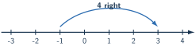
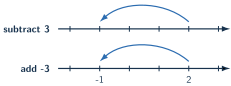

+++
order = 5
subject = "mathematics"
tags = ["quantitative-reasoning", "signed-numbers", "number-line", "integer-arithmetic"]
prerequisites = ["chapter:04_operation_structure_and_factors"]
provides = ["signed-number", "signed-number-line", "opposite-number", "absolute-distance", "signed-addition", "signed-subtraction"]
+++

# Signed quantities

<!-- card-id: 05000000-0000-4000-8000-000000000001 -->
Q: A **signed number** uses \(+\) or \(-\) to show position relative to \(0\). Positive numbers lie to the right of \(0\); negative numbers lie to the left.

Which point represents a negative number?
A: Point P, at \(-3\). It lies to the left of \(0\).

<!-- card-id: 05000000-0000-4000-8000-000000000002 -->
Q: In the signed number \(-7\), what does the sign tell you?
A: The number is on the negative side of \(0\). The sign is part of the number, not a subtraction instruction by itself.

<!-- card-id: 05000000-0000-4000-8000-000000000003 -->
Q: Which is greater, \(-2\) or \(-6\), and how does the number line decide?
A: \(-2\) is greater because it lies farther right. Although \(6\) is a larger whole-number distance, \(-6\) is farther left.

<!-- card-id: 05000000-0000-4000-8000-000000000004 -->
Q: Two numbers are **opposites** when they are the same distance from \(0\) on opposite sides. What is the opposite of \(-5\)?
A: \(5\). Both are \(5\) units from \(0\), on opposite sides.

<!-- card-id: 05000000-0000-4000-8000-000000000005 -->
Q: What is the opposite of \(0\)?
A: \(0\). Zero is neither positive nor negative and is already at the center.

<!-- card-id: 05000000-0000-4000-8000-000000000006 -->
Q: **Absolute value** is distance from \(0\), written with bars. What is \(|-8|\)?
A: \(8\). Distance is nonnegative, so \(-8\) is \(8\) units from \(0\).

<!-- card-id: 05000000-0000-4000-8000-000000000007 -->
Q: A game score of \(+4\) means four points above the starting score, while \(-4\) means four below it. What feature is the same for both scores?
A: Their distance from the starting score is \(4\). They have equal absolute value but opposite direction.

<!-- card-id: 05000000-0000-4000-8000-000000000008 -->
Q: A plus sign in \(3+(-2)\) names the addition operation, while the minus sign belongs to the signed number \(-2\). What different jobs do the two signs perform?
A: The first sign says to add; the second says the added number is negative. Operation sign and number sign are distinct roles.

<!-- card-id: 05000000-0000-4000-8000-000000000009 -->
Q: To add a signed number on a number line, move right for a positive addend and left for a negative addend.

What addition does the movement show?
A: \(-1+4=3\). Starting at \(-1\), a positive move of \(4\) ends at \(3\).

<!-- card-id: 05000000-0000-4000-8000-000000000010 -->
Q: What is \(5+(-8)\), interpreted as movement?
A: \(-3\). Start at \(5\) and move \(8\) units left.

<!-- card-id: 05000000-0000-4000-8000-000000000011 -->
Q: When adding numbers with the same sign, why can you add their distances and keep the sign?
A: Both movements go in the same direction. For example, \(-3+(-4)\) moves \(3\) left and then \(4\) more left, ending at \(-7\).

<!-- card-id: 05000000-0000-4000-8000-000000000012 -->
Q: When adding numbers with different signs, what determines the sign of the result?
A: The direction with the greater distance from \(0\). Subtract the smaller distance from the larger; keep the sign of the farther movement.

<!-- card-id: 05000000-0000-4000-8000-000000000013 -->
Q: Subtracting a signed number has the same effect as adding its opposite. What is \(4-(-3)\)?
A: \(7\), because \(4-(-3)=4+3\). Removing a negative movement reverses it to a positive movement.

<!-- card-id: 05000000-0000-4000-8000-000000000014 -->
Q: The diagram compares subtracting \(3\) with adding \(-3\).

What relationship does it show?
A: \(2-3=2+(-3)=-1\). Subtracting a positive number matches adding its negative opposite.

<!-- card-id: 05000000-0000-4000-8000-000000000015 -->
Q: A learner says \(-6+2=-8\) because “a negative sign makes the answer more negative.” Diagnose the error.
A: Adding \(+2\) moves right, not left. From \(-6\), move \(2\) right to get \(-4\).

<!-- card-id: 05000000-0000-4000-8000-000000000016 -->
P: Start at \(-3\), move \(7\) units right, then \(5\) units left. Where do you end?
S: **IDENTIFY:** Combine signed movements.

**EXECUTE:** \(-3+7=4\), then \(4+(-5)=-1\).

**EVALUATE:** The net movement is \(2\) units right; moving from \(-3\) to \(-1\) is exactly \(2\) units right.

<!-- card-id: 05000000-0000-4000-8000-000000000017 -->
P: A score starts at \(6\) points, changes by \(-11\) points, then changes by \(+3\) points. Find the final score.
S: \(6+(-11)+3=-5+3=-2\). Check by combining the changes first: \(-11+3=-8\), and \(6+(-8)=-2\).

<!-- card-id: 05000000-0000-4000-8000-000000000018 -->
P: Compute \(-4-(-9)\) and explain the direction of change.
S: \(-4-(-9)=-4+9=5\). Subtracting \(-9\) means adding its opposite \(+9\), a move \(9\) units right. The distance from \(-4\) to \(5\) is \(9\).

<!-- card-id: 05000000-0000-4000-8000-000000000019 -->
P: Which is greater: \(-3+(-5)\) or \(-3-(-5)\)? Compute both and diagnose why treating both minus signs alike fails.
S: \(-3+(-5)=-8\), while \(-3-(-5)=-3+5=2\), so the second expression is greater. One minus sign belongs to an added negative number; the other subtraction reverses a negative number to its positive opposite.
