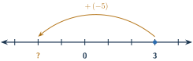

+++
order = 5
subject = "mathematics"
authoring_model = "claude-fable-5"
authoring_reasoning_effort = "high"
tags = ["quantitative-reasoning", "signed-numbers", "number-line", "integer-arithmetic"]
prerequisites = ["chapter:04_operation_structure_and_factors"]
provides = ["signed-number", "signed-number-line", "opposite-number", "absolute-distance", "signed-addition", "signed-subtraction"]
+++

# Signed quantities

## Above and below zero: signed numbers

<!-- card-id: 05000000-0000-4000-8000-000000000001 -->
Q: Whole numbers count amounts, but some quantities also have a direction
away from a zero point. A parking garage numbers its floors from street
level: street level is 0, floors above it are counted up, and floors below
it are counted down. A **signed number** records both how far and which
side of zero. Its **sign** is the side: a **positive** number, written
\(+3\) or plainly 3, lies on the above-zero side; a **negative** number,
written \(-3\) and read "negative three," lies on the below-zero side.
Zero itself is neither positive nor negative. Which signed number records
the level two floors below street level?

A: \(-2\). Two floors below the zero point is on the below-zero side, so
the number is negative: negative two. Two floors above street level would
be \(+2\), or plainly 2.

<!-- card-id: a837481d-e2b6-45ec-a8d6-fe266da41e81 -->
Q: The number line you know starts at 0 and grows rightward — but the line
does not have to stop at 0. Marks continue leftward past 0 with the same
equal spacing, and those marks carry the negative numbers: the first mark
left of 0 is \(-1\), the next is \(-2\), then \(-3\), and so on. Numbers
still grow toward the right everywhere on the line. In the figure, only 0
and the numbers to its right are labeled.

Which signed number does the dot mark?

A: \(-4\). Counting leftward from 0, the marks are \(-1\), \(-2\),
\(-3\), \(-4\), and the dot sits on the fourth mark left of 0. Equal
spacing continues past zero, so each leftward step is one more below zero.

<!-- card-id: 05000000-0000-4000-8000-000000000008 -->
Q: The same dash-shaped symbol plays two different roles. Written between
two numbers, it is the subtraction operation: \(12 - 8\) means 8 removed
from 12. Written directly in front of a single numeral, it is a negative
sign, part of the number itself: \(-8\) names a position below zero, and
no removing happens. A scoreboard shows the single entry \(-8\), and a
worksheet shows \(12 - 8\). What does the dash mean in each, and how can
you tell?

A: On the scoreboard the dash is a negative sign — it sits directly in
front of one numeral, so \(-8\) is a single signed number, eight below
zero. On the worksheet the dash sits between two numbers, so it is the
subtraction operation. The same test works for \(+\): between two numbers
it is addition, but in front of a single numeral, as in \(+3\), it only
marks the positive side.

## Comparing signed numbers

<!-- card-id: 05000000-0000-4000-8000-000000000003 -->
Q: On the number line, the number farther to the right is always the
greater one — and that rule does not change left of zero. Every negative
number lies left of 0, and every positive number lies right of 0, so any
positive number is greater than any negative number, and numbers farther
below zero are smaller. Exactly one of these statements is true:
\(-5 < -2\) or \(-5 > -2\). Which one, and why?

A: \(-5 < -2\), read "negative five is less than negative two."
Counting leftward from 0, \(-5\) is five marks left and \(-2\) is only
two marks left, so \(-5\) lies farther left — and farther left is
smaller.

<!-- card-id: b087e446-88f2-454a-b0a3-c7e145f7dda8 -->
Q: A student claims \(-7 > -1\) "because 7 is greater than 1." The claim
is wrong. What did the student ignore, and what is the correct comparison?

A: The student ignored the signs — the side of zero. The digits alone
compare the positive numbers 7 and 1, but \(-7\) and \(-1\) both lie left
of zero, where more marks leftward means smaller: \(-7\) is seven marks
below zero and \(-1\) only one, so \(-7\) lies farther left and
\(-7 < -1\).

## Distance from zero and opposites

<!-- card-id: 25f035dd-5694-409c-a836-cc3c56efc662 -->
Q: A signed number answers two separate questions: which side of zero,
and how far from zero. The **distance from zero** of a signed number is
how many marks separate it from 0 on the number line, in whichever
direction — a count of steps, so it is never negative. What is the
distance from zero of \(-9\), and of 9?

A: Both distances are 9. The numbers lie on opposite sides of zero, but
each sits nine marks away from 0. Distance ignores the side; only the
sign records the side.

<!-- card-id: 05000000-0000-4000-8000-000000000004 -->
Q: Two signed numbers are **opposites** when they have the same distance
from zero but lie on opposite sides of it: 6 and \(-6\) are opposites.
Zero is its own opposite, since it is zero marks from itself. What is the
opposite of \(-8\), and what changes and what stays the same when you
form it?

A: 8. The distance from zero stays the same — eight marks — while the
side flips from below zero to above zero. Forming an opposite only
switches the sign.

<!-- card-id: 05000000-0000-4000-8000-000000000007 -->
Q: "Greater" and "farther from zero" are different questions with
different answers. Of the two numbers \(-7\) and 4: which is greater, and
which is farther from zero?

A: 4 is greater, but \(-7\) is farther from zero. Greater means farther
right, and 4 lies right of \(-7\) — a positive beats any negative. But
distance from zero ignores side: \(-7\) is seven marks from 0 while 4 is
only four marks from 0.

## Adding signed numbers: jumps in both directions

<!-- card-id: 05000000-0000-4000-8000-000000000009 -->
Q: Adding a positive number jumps rightward on the number line — that is
the addition you know. A negative number can record a change: losing 5
points is a change of \(-5\), and joining that change to a score moves
the score down. On the line, adding a negative number jumps **leftward**,
because a loss makes the result smaller and smaller is leftward. In
writing, a negative number inside an expression is wrapped in grouping
marks so its sign does not collide with the operation symbol:
\(3 + (-5)\). There is nothing to compute inside the marks; they only
package the signed number. In the figure the dot starts at 3 and the
curved arrow makes the jump for adding \(-5\).

On which number does the jump land, and what addition statement does the
figure record?

A: \(3 + (-5) = -2\). From 3, a jump of five marks leftward passes 2, 1,
0, \(-1\) and lands on \(-2\). Three marks bring the dot to 0, and the
remaining two marks continue below zero.

<!-- card-id: 05000000-0000-4000-8000-000000000011 -->
Q: When both addends are negative, both jumps move leftward, so the sum
lies even farther below zero: \((-3) + (-4)\) starts at \(-3\) and jumps
four more marks leftward to \(-7\), so \((-3) + (-4) = -7\). Compute
\((-2) + (-6)\).

A: \(-8\). Start at \(-2\), already two marks below zero, and jump six
more marks leftward: the two leftward moves pile up, landing eight marks
below zero.

<!-- card-id: 95e4a9a7-09f8-451d-b6cc-2a99193d5df5 -->
Q: Adding a number to its opposite always lands exactly on zero:
\(5 + (-5) = 0\), because from 5 the leftward jump of five marks is
precisely the distance back to 0. Compute \((-8) + 8\), and explain why
no counting is needed.

A: 0. Adding the positive number 8 jumps rightward from \(-8\), and
eight marks is exactly the distance from \(-8\) to zero — opposites have
the same distance from zero on opposite sides, so joining them always
cancels to 0.

<!-- card-id: 05000000-0000-4000-8000-000000000012 -->
Q: When two addends have different signs, they pull in opposite
directions, so part of each cancels. The sum lands on the side of the
addend with the **larger distance from zero**, and the leftover distance
tells how far: \((-9) + 4\) pits nine marks leftward against four marks
rightward, leaving five marks leftward, so \((-9) + 4 = -5\). Compute
\(7 + (-10)\) the same way.

A: \(-3\). The distances from zero are 7 and 10; the negative addend has
the larger distance, so the sum is negative, and the leftover distance is
the difference \(10 - 7 = 3\). On the line: from 7, ten marks leftward
uses seven marks to reach 0 and three more to reach \(-3\).

<!-- card-id: 05000000-0000-4000-8000-000000000010 -->
P: A trivia team's score stands at \(-4\) points. On the next question
the team gains 9 points. What is the team's new score?

S: 5 points.

IDENTIFY: A gain of 9 is joined to the current score, so this is an
addition of signed numbers: \((-4) + 9\).

PLAN: The addends have different signs — four marks leftward against
nine rightward — so find which distance from zero is larger and take the
leftover distance on that side.

EXECUTE: The distances are 4 and 9. The positive addend has the larger
distance, so the sum is positive, and the leftover is \(9 - 4 = 5\):
\((-4) + 9 = 5\).

EVALUATE: Undo the move: from 5, a jump of nine marks leftward uses five
marks to reach 0 and four more to reach \(-4\), the starting score. The
sign is sensible too — a 9-point gain outweighs a 4-point deficit, so
the team should end above zero.

<!-- card-id: 05000000-0000-4000-8000-000000000017 -->
P: A quiz team starts at 0 points and its score changes by \(-3\), then
\(+8\), then \(-6\) over three rounds. The running score has been started:
after round one, \(0 + (-3) = -3\); after round two, \((-3) + 8 = 5\).
Complete the final round and state the finishing score, then check the
result against the total gains and losses.

S: \(-1\). Final round: \(5 + (-6) = -1\) — the distances 6 and 5 pull
in opposite directions, the negative change has the larger distance, and
the leftover is \(6 - 5 = 1\) on the negative side.

Check: the gains total 8 and the losses total \(3 + 6 = 9\). Losses
outweigh gains by 1, so a team that started at 0 should finish one mark
below zero — and \(-1\) is exactly that.

## Subtracting signed numbers

<!-- card-id: 96b04d6c-5654-4120-bced-5aad94a217cc -->
Q: With whole numbers you could never remove more than was there — but a
number line that continues past 0 removes that wall. Subtracting a
positive number still jumps leftward, because removal makes the result
smaller, and the jump may now pass right through zero. A team's score is
2 points, and the team is handed a 6-point penalty — a penalty removes
points. Compute \(2 - 6\).

A: \(-4\). From 2, a jump of six marks leftward uses two marks to reach
0 and four more to continue below it. Removing more than is there lands
on the negative side, four below zero.

<!-- card-id: 05000000-0000-4000-8000-000000000014 -->
Q: Two different-looking statements can command the exact same movement.
In the figure, the top line carries out \(3 - 5\) and the bottom line
carries out \(3 + (-5)\); each trace starts its dot at 3 and jumps five
marks leftward to the mark labeled ?.

Where does each trace land, and what general rule about subtraction do
the matching traces show?

A: Both land on \(-2\). Subtracting 5 and adding \(-5\) command the same
five-mark leftward jump, so \(3 - 5 = 3 + (-5) = -2\). In general,
subtracting a number gives the same result as **adding its opposite** —
and this holds for every signed number, so any subtraction can be
rewritten as an addition.

<!-- card-id: 05000000-0000-4000-8000-000000000013 -->
Q: Subtracting a negative number removes a loss — and removing a loss
raises the result. A scorekeeper discovers a 3-point penalty was recorded
by mistake and removes the \(-3\) entry from a team's total of 4; the
correction is \(4 - (-3)\). Rewriting as adding the opposite:
\(4 - (-3) = 4 + 3 = 7\), a rightward jump. Compute \(2 - (-7)\), and
check the result with an inverse operation.

A: 9. Subtracting \(-7\) is adding its opposite: \(2 - (-7) = 2 + 7 = 9\).
Inverse check: adding \(-7\) back should undo the removal, and
\(9 + (-7) = 2\), the starting number.

## Mixed practice

<!-- card-id: 05000000-0000-4000-8000-000000000016 -->
P: A service elevator sits at level 3 of a building that numbers its
levels from street level: street level is 0, and the levels below it are
\(-1\), \(-2\), and so on. The elevator travels down 8 floors. At which
level does it stop?

S: Level \(-5\).

IDENTIFY: Traveling down 8 floors lowers the level by 8, so this is a
subtraction: \(3 - 8\).

PLAN: Subtracting the positive number 8 jumps eight marks leftward from
3, and the jump may cross zero.

EXECUTE: From 3, three marks leftward reach 0, and the remaining five
marks continue below zero: \(3 - 8 = -5\).

EVALUATE: Ride back up: from \(-5\), eight floors up uses five to reach
street level and three more to reach level 3, the start. And since the
elevator dropped more floors than it stood above street level
(\(8 > 3\)), it must end below street level — a negative level is
exactly what the answer shows.

<!-- card-id: 05000000-0000-4000-8000-000000000019 -->
P: Exactly one of these two computations is wrong:

(a) \(4 + (-9) = -5\)
(b) \(4 - (-9) = -5\)

Which one is wrong, what error produced it, and what is the correct
result?

S: (b) is wrong; \(4 - (-9) = 13\).

Adding \(-9\) and subtracting \(-9\) move in opposite directions, so
they cannot both give \(-5\). (a) is correct: distances 9 against 4,
leftover 5 on the negative side. In (b) the error treated removing
\(-9\) as joining \(-9\); subtracting \(-9\) is adding its opposite,
\(4 + 9 = 13\).

Check: \(13 + (-9) = 4\) restores the start, so 13 is right; the claimed
\(-5\) fails the same check, since \((-5) + (-9) = -14\), not 4.
