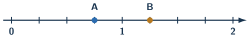
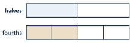

+++
order = 6
subject = "mathematics"
tags = ["quantitative-reasoning", "fractions", "rational-numbers", "fraction-operations"]
prerequisites = ["chapter:05_signed_quantities"]
provides = ["fraction", "fraction-number-line", "equivalent-fraction", "mixed-number", "fraction-operations", "fraction-of-quantity"]
+++

# Fractions

<!-- card-id: 06000000-0000-4000-8000-000000000001 -->
Q: A **fraction** can describe equal parts of one whole. The rectangle is split into \(4\) equal parts, and \(3\) are shaded.

What fraction is shaded?
A: \(\frac34\). The denominator \(4\) counts equal parts in the whole; the numerator \(3\) counts selected parts.

<!-- card-id: 06000000-0000-4000-8000-000000000002 -->
Q: Why must the parts be equal when a fraction describes part of one whole?
A: The denominator names equal-sized shares. If the pieces differ in size, counting pieces alone does not determine a fraction of the whole.

<!-- card-id: 06000000-0000-4000-8000-000000000003 -->
Q: In \(\frac{5}{8}\), what do the numerator and denominator each tell you?
A: The denominator \(8\) names the size of each equal part; the numerator \(5\) counts how many of those parts are taken.

<!-- card-id: 06000000-0000-4000-8000-000000000004 -->
Q: A **unit fraction** has numerator \(1\). Which is smaller, \(\frac14\) or \(\frac18\), when the whole is the same?
A: \(\frac18\). Splitting the same whole into more equal parts makes each part smaller.

<!-- card-id: 06000000-0000-4000-8000-000000000005 -->
Q: Fractions are numbers and can be located on a number line.

What fractions are at A and B?
A: A is \(\frac34\); B is \(\frac54\). Each tick advances by one fourth.

<!-- card-id: 06000000-0000-4000-8000-000000000006 -->
Q: What does the fraction \(\frac{7}{3}\) mean as division?
A: \(7\div3\). It is the quantity obtained when \(7\) wholes are shared equally among \(3\), or when the number \(7\) is divided by \(3\).

<!-- card-id: 06000000-0000-4000-8000-000000000007 -->
Q: A fraction greater than \(1\) can be written as a **mixed number**, a whole number plus a fraction. Write \(\frac74\) as a mixed number.
A: \(1\frac34\). Four fourths make one whole, leaving three fourths.

<!-- card-id: 06000000-0000-4000-8000-000000000008 -->
Q: Multiplying numerator and denominator by the same nonzero whole number makes an **equivalent fraction**. Why is \(\frac12=\frac24\)?
A: Each half is split into two equal smaller pieces, doubling both the selected pieces and total pieces without changing the amount.

<!-- card-id: 06000000-0000-4000-8000-000000000009 -->
Q: The strips show the same length divided in two ways.

Which equivalence do they show?
A: \(\frac12=\frac24\). Both shaded lengths reach the same point.

<!-- card-id: 06000000-0000-4000-8000-000000000010 -->
Q: To simplify \(\frac{18}{24}\), divide numerator and denominator by a common factor. What is the simplest equivalent fraction?
A: \(\frac34\). Dividing both by \(6\) gives \(18\div6=3\) and \(24\div6=4\).

<!-- card-id: 06000000-0000-4000-8000-000000000011 -->
Q: When two positive fractions have the same denominator, how do you compare them?
A: Compare numerators. The part size is the same, so more parts make a greater quantity; \(\frac58>\frac38\).

<!-- card-id: 06000000-0000-4000-8000-000000000012 -->
Q: When two positive fractions have the same numerator, how do you compare them?
A: The fraction with the smaller denominator is greater because its equal parts are larger; \(\frac35>\frac37\).

<!-- card-id: 06000000-0000-4000-8000-000000000013 -->
Q: Compare \(\frac23\) and \(\frac34\) by using a common denominator.
A: \(\frac23=\frac8{12}\) and \(\frac34=\frac9{12}\), so \(\frac23<\frac34\).

<!-- card-id: 06000000-0000-4000-8000-000000000014 -->
Q: Why can fractions with the same denominator be added by adding numerators while keeping the denominator?
A: The denominator fixes the part size. Combining \(2\) fourths and \(1\) fourth gives \(3\) fourths: \(\frac24+\frac14=\frac34\).

<!-- card-id: 06000000-0000-4000-8000-000000000015 -->
Q: Why is \(\frac12+\frac13\ne\frac25\)?
A: Halves and thirds are different-sized parts, so their counts cannot be combined directly. Use sixths: \(\frac36+\frac26=\frac56\).

<!-- card-id: 06000000-0000-4000-8000-000000000016 -->
Q: Compute \(2\frac14-1\frac34\) by rewriting both mixed numbers as fractions.
A: \(\frac94-\frac74=\frac24=\frac12\).

<!-- card-id: 06000000-0000-4000-8000-000000000017 -->
Q: In fraction problems, “\(\frac34\) of \(20\)” means multiply \(20\) by \(\frac34\). What quantity results?
A: \(15\). Divide \(20\) into \(4\) equal groups to get \(5\), then take \(3\) groups: \(3\times5=15\).

<!-- card-id: 06000000-0000-4000-8000-000000000018 -->
Q: The set model has \(12\) counters with \(8\) selected.

What fraction of the set is selected, in simplest form?
A: \(\frac{8}{12}=\frac23\). Divide numerator and denominator by \(4\).

<!-- card-id: 06000000-0000-4000-8000-000000000019 -->
Q: Why does \(\frac23\times\frac45=\frac8{15}\)?
A: Multiplying selects two thirds of four fifths. The numerator counts \(2\times4\) selected small parts, while the denominator counts \(3\times5\) equal small parts.

<!-- card-id: 06000000-0000-4000-8000-000000000020 -->
Q: A **reciprocal** swaps numerator and denominator. Why is the reciprocal of \(\frac35\) equal to \(\frac53\)?
A: Their product is \(1\): \(\frac35\times\frac53=\frac{15}{15}=1\). A nonzero number times its reciprocal equals one.

<!-- card-id: 06000000-0000-4000-8000-000000000021 -->
Q: The diagram asks how many groups of \(\frac14\) fit in \(1\frac12\).

What division does it show?
A: \(1\frac12\div\frac14=6\). Six groups of one fourth fill one and one half.

<!-- card-id: 06000000-0000-4000-8000-000000000022 -->
Q: Why does dividing by a nonzero fraction equal multiplying by its reciprocal?
A: The reciprocal changes “how many groups of this size?” into multiplication by the number of such groups per whole. For example, dividing by \(\frac14\) counts \(4\) quarter-groups per whole, so it multiplies by \(4\).

<!-- card-id: 06000000-0000-4000-8000-000000000023 -->
Q: A learner says \(\frac35>\frac34\) because \(5>4\). Diagnose the error.
A: The denominators create different part sizes. With the same numerator \(3\), fourths are larger than fifths, so \(\frac34>\frac35\).

<!-- card-id: 06000000-0000-4000-8000-000000000024 -->
Q: Which is a better estimate for \(\frac78+\frac{11}{12}\): about \(1\) or about \(2\)?
A: About \(2\). Both fractions are close to \(1\), so their sum is close to \(2\).

<!-- card-id: 06000000-0000-4000-8000-000000000025 -->
P: A strip has \(12\) equal sections and \(9\) are marked. Name the fraction and simplify it.
S: The fraction is \(\frac9{12}\). Divide numerator and denominator by \(3\): \(\frac9{12}=\frac34\). The simplified fraction selects the same proportion of the strip.

<!-- card-id: 06000000-0000-4000-8000-000000000026 -->
P: Compute \(\frac56+\frac34\), and check whether the answer's size is reasonable.
S: Use twelfths: \(\frac56=\frac{10}{12}\) and \(\frac34=\frac9{12}\). The sum is \(\frac{19}{12}=1\frac7{12}\). Each addend is less than \(1\), so a sum between \(1\) and \(2\) is reasonable.

<!-- card-id: 06000000-0000-4000-8000-000000000027 -->
P: Find \(\frac58\) of \(32\).
S: Divide \(32\) into \(8\) equal groups: \(32\div8=4\). Take \(5\) groups: \(5\times4=20\). Check: \(\frac12\) of \(32\) is \(16\), so \(\frac58\) should be slightly larger; \(20\) is.

<!-- card-id: 06000000-0000-4000-8000-000000000028 -->
P: Compute \(\frac23\times\frac94\) and simplify.
S: \(\frac23\times\frac94=\frac{18}{12}=\frac32=1\frac12\). Check by simplifying before multiplying: \(9\div3=3\), giving \(\frac{2\times3}{4}=\frac64=\frac32\).

<!-- card-id: 06000000-0000-4000-8000-000000000029 -->
P: Compute \(\frac56\div\frac23\), and verify by multiplication.
S: Multiply by the reciprocal: \(\frac56\times\frac32=\frac{15}{12}=\frac54\). Check: \(\frac54\times\frac23=\frac{10}{12}=\frac56\), recovering the starting fraction.

<!-- card-id: 06000000-0000-4000-8000-000000000030 -->
P: Which is greater, \(\frac7{10}\) or \(\frac23\)? Use a common denominator and give a quick magnitude check.
S: \(\frac7{10}=\frac{21}{30}\) and \(\frac23=\frac{20}{30}\), so \(\frac7{10}\) is greater. Both are between \(\frac12\) and \(1\), and their closeness is consistent with a difference of only \(\frac1{30}\).
