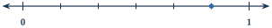

+++
order = 6
subject = "mathematics"
authoring_model = "claude-fable-5"
authoring_reasoning_effort = "high"
tags = ["quantitative-reasoning", "fractions", "rational-numbers", "fraction-operations"]
prerequisites = ["chapter:05_signed_quantities"]
provides = ["fraction", "fraction-number-line", "equivalent-fraction", "mixed-number", "fraction-operations", "fraction-of-quantity"]
+++

# Fractions

## Equal parts and fraction notation

<!-- card-id: 90022a5e-0e78-4daf-9494-745293cf74e8 -->
Q: Sharing and splitting often need amounts between whole numbers. When a
whole is cut into **equal parts**, the parts take their name from the
count: 2 equal parts are halves, 3 are thirds, 4 are fourths, 5 are
fifths, and so on. A **fraction** records equal parts with two stacked
numbers: in \(\frac{3}{4}\), read "three fourths," the bottom number —
the **denominator** — tells how many equal parts the whole is cut into,
and the top number — the **numerator** — tells how many of those parts
are taken. A fraction that takes exactly one part, such as
\(\frac{1}{4}\), is a **unit fraction**. In the figure, a strip is cut
into equal parts and some parts are shaded.

Which fraction of the strip is shaded?

A: \(\frac{3}{5}\), three fifths. The strip is cut into 5 equal parts,
so the denominator is 5; 3 of those parts are shaded, so the numerator
is 3.

<!-- card-id: dce758b3-f51f-4d30-b3ec-72654617e534 -->
Q: A rectangular banner is cut into 4 pieces, but one piece is much
larger than the rest. A student points at the largest piece and calls it
\(\frac{1}{4}\) of the banner. Why is the name wrong?

A: Fourths must be 4 **equal** parts, and these pieces are not equal.
The denominator of a fraction counts equal parts of the whole; cutting
into 4 pieces is not enough. The largest piece is a bigger share of the
banner than one of four equal parts would be, so \(\frac{1}{4}\)
misnames it.

<!-- card-id: 48f7bca5-3b82-4961-ba41-ec2239c79738 -->
Q: A window is made of 9 equal panes, and 4 of them are open. Write the
open share of the window as a fraction, and state what each of its two
numbers counts.

A: \(\frac{4}{9}\). The denominator 9 counts the equal parts the whole
window is split into — the panes. The numerator 4 counts the parts
taken — here, the open panes.

<!-- card-id: 6519f99b-12b2-483c-9eaa-00f497c67363 -->
Q: Two posters are the same size. One is cut into 3 equal parts, the
other into 8 equal parts. Which single part is larger — \(\frac{1}{3}\)
of the first poster or \(\frac{1}{8}\) of the second — and why?

A: \(\frac{1}{3}\) is larger. Cutting the same whole into more parts
makes each part smaller, so eighths are smaller than thirds. On unit
fractions a larger denominator means a smaller piece — comparing the
digits 3 and 8 alone points the wrong way.

## Fractions on the number line

<!-- card-id: 3686fb1a-4bcf-49c4-aba0-2b72b16e8b16 -->
Q: Fractions are numbers, so they take positions on the number line. To
place fourths, cut the space between 0 and 1 into 4 equal steps: the
marks after each step are \(\frac{1}{4}\), \(\frac{2}{4}\),
\(\frac{3}{4}\), and the fourth step lands exactly on 1. The same recipe
works with any number of steps. In the figure, the space between 0 and 1
is cut into equal steps and a dot sits on one of the marks.

Which fraction does the dot mark?

A: \(\frac{5}{6}\). The space from 0 to 1 is cut into 6 equal steps, so
each step is one sixth, and the dot sits 5 steps from 0.

<!-- card-id: 4d006ae6-130a-41d0-8a83-7a4ae70b999e -->
Q: Placing fourths on the number line, the fourth step lands exactly on
1. What does \(\frac{5}{5}\) equal, and why does the same answer come
out for \(\frac{2}{2}\), \(\frac{3}{3}\), and every fraction whose
numerator equals its denominator?

A: 1. Taking all 5 of the 5 equal parts reassembles the whole exactly.
Whenever the numerator equals the denominator, every part is taken, so
the fraction names one whole — the number 1.

<!-- card-id: 9bde0e18-c8d0-442c-af54-2a9d22cd1da5 -->
Q: Signed numbers gave every number an opposite: the same distance from
zero on the opposite side. Fractions are numbers, so they have opposites
too. What is the opposite of \(\frac{3}{4}\), and between which two
marks of the signed number line does it lie?

A: \(-\frac{3}{4}\). It lies between \(-1\) and 0, three fourths of the
way from 0 toward \(-1\) — the same distance from zero as
\(\frac{3}{4}\), but on the below-zero side.

## A fraction is a division

<!-- card-id: 962280fa-a09f-41be-8cf1-490d2634d9b8 -->
P: Three same-size fruit bars are shared equally among 4 friends, with
nothing left over. What fraction of one bar does each friend receive?

S: \(\frac{3}{4}\) of a bar.

IDENTIFY: Equal sharing of 3 among 4 — the division \(3 \div 4\). With
whole numbers this division stalls at remainder 3, but cutting lets the
sharing finish: this is a fraction-of-a-whole problem.

PLAN: Cut each bar into 4 equal parts — fourths — so every bar gives
one part to each friend.

EXECUTE: From each of the 3 bars a friend receives one fourth, so each
friend collects 3 fourths: \(\frac{3}{4}\) of a bar. The sharing shows
\(3 \div 4 = \frac{3}{4}\).

EVALUATE: The 4 shares together hold \(4 \times 3 = 12\) fourths, and
every 4 fourths remake one whole bar, so \(12 \div 4 = 3\) bars — all
three bars are handed out with nothing left over.

<!-- card-id: 1877cb5c-0830-4aa4-ac91-ba69c4e29216 -->
Q: Sharing showed that \(3 \div 4 = \frac{3}{4}\): the fraction bar is
a division sign in disguise, and every fraction equals its numerator
divided by its denominator. Use the relationship in both directions:
write \(5 \div 8\) as a single fraction, and rewrite \(\frac{20}{5}\)
as a whole number.

A: \(5 \div 8 = \frac{5}{8}\), and \(\frac{20}{5} = 20 \div 5 = 4\).
One relationship read both ways: a division can be recorded as a
fraction, and a fraction whose division comes out even is a whole
number.

## Improper fractions and mixed numbers

<!-- card-id: 799bb7b9-7fa0-4947-8955-58148ae328fd -->
Q: A fraction can count more parts than one whole holds. Seven fourths,
\(\frac{7}{4}\), is seven quarter-size parts: four of them remake one
whole, and three remain, so \(\frac{7}{4} = 1 + \frac{3}{4}\), written
as the **mixed number** \(1\frac{3}{4}\) — a whole-number part and a
fraction part side by side. A fraction whose numerator is at least its
denominator is called **improper**, and division with remainder converts
it: \(7 \div 4 = 1\) remainder 3 gives 1 whole and 3 fourths. Convert
\(\frac{11}{4}\) to a mixed number.

A: \(2\frac{3}{4}\). \(11 \div 4 = 2\) remainder 3, so eleven fourths
make 2 wholes with 3 fourths left over. Check: \(2 \times 4 + 3 = 11\)
fourths.

<!-- card-id: b4755d4c-1e76-4d81-9c36-183faa39e383 -->
Q: A mixed number can be rewritten as a single fraction by counting all
its parts: in \(2\frac{2}{3}\), each whole is 3 thirds, so the 2 wholes
are 6 thirds, and with the extra 2 thirds the total is \(\frac{8}{3}\).
Rewrite \(3\frac{1}{5}\) as a single fraction.

A: \(\frac{16}{5}\). The 3 wholes are \(3 \times 5 = 15\) fifths, and
one more fifth makes 16 fifths. Check by converting back:
\(16 \div 5 = 3\) remainder 1.

## Equivalent fractions

<!-- card-id: 8b7efff2-4808-482e-8209-1d93ebeaaa71 -->
Q: Different fraction names can mark the exact same amount; such
fractions are called **equivalent**. The figure stacks three strips of
identical length: the top strip is cut into halves with the left half
shaded, the middle strip into fourths, and the bottom strip into sixths.
A dashed line drops from the right edge of the shaded half through all
three strips.

Which fraction of the sixths strip is equivalent to \(\frac{1}{2}\)?

A: \(\frac{3}{6}\). The dashed line meets the sixths strip exactly at
its third mark: 3 of 6 equal parts fill the same length as 1 of 2. On
the fourths strip it lands at \(\frac{2}{4}\) — another name for the
same amount.

<!-- card-id: 93b80866-e412-4d14-8a8d-2c20ba910969 -->
Q: Cutting every part of a fraction picture into 3 equal slivers turns
\(\frac{1}{2}\) into \(\frac{3}{6}\): three times as many parts taken,
out of three times as many parts in the whole, while the amount never
changes. So multiplying the numerator and the denominator by the same
number produces an equivalent fraction. Which fraction with denominator
20 is equivalent to \(\frac{2}{5}\)?

A: \(\frac{8}{20}\). Turning the denominator 5 into 20 multiplies it by
4, so the numerator must be multiplied by the same 4:
\(2 \times 4 = 8\).

<!-- card-id: 551d3f52-9d99-438a-8719-48eab142a4e4 -->
Q: Equivalence also runs in reverse: dividing the numerator and the
denominator by a **common factor** — a number that is a factor of both —
merges slivers into larger parts without changing the amount. A fraction is in **simplest form**
when its numerator and denominator share no factor greater than 1.
Write \(\frac{12}{18}\) in simplest form.

A: \(\frac{2}{3}\). 6 is a common factor of 12 and 18, and
\(12 \div 6 = 2\), \(18 \div 6 = 3\). Since 2 and 3 share no factor
above 1, \(\frac{2}{3}\) is simplest. Dividing by 2 and then by 3
reaches the same place in two steps.

<!-- card-id: c94fd789-c9c1-4bba-83ff-1402309269ff -->
P: Complete the renaming: \(\frac{3}{4} = \frac{?}{12}\). The plan is
already set up: since \(12 = 4 \times 3\), the denominator was
multiplied by 3. Finish the renaming and check the result.

S: \(\frac{9}{12}\).

EXECUTE: Multiply the numerator by the same 3 that scaled the
denominator: \(3 \times 3 = 9\), so \(\frac{3}{4} = \frac{9}{12}\).

EVALUATE: Run the change backward: dividing both numbers of
\(\frac{9}{12}\) by their common factor 3 returns \(\frac{3}{4}\), the
fraction we started with.

## Comparing fractions

<!-- card-id: 5af6859b-2bec-46af-810e-8e71d26dac8b -->
Q: When two fractions share a denominator, their parts are the same
size, so the larger numerator simply counts more of them. Which is
greater, \(\frac{3}{8}\) or \(\frac{5}{8}\), and where do the two sit
relative to each other on the number line?

A: \(\frac{5}{8} > \frac{3}{8}\): five eighths is more of the same-size
parts than three. On the number line both sit between 0 and 1 on the
eighths marks, with \(\frac{5}{8}\) two marks farther right.

<!-- card-id: c57514e8-73d1-4a83-944c-46744bc2c86d -->
Q: Which is greater, \(\frac{3}{5}\) or \(\frac{3}{8}\)? Both take
three parts.

A: \(\frac{3}{5}\). The counts match, so compare the part sizes: fifths
are larger than eighths because the same whole is cut into fewer parts.
Three larger parts beat three smaller ones. Note the trap: here the
**larger** denominator belongs to the **smaller** fraction.

<!-- card-id: c03617bf-e8a0-4543-8a24-f5c76a6d5ad8 -->
Q: When neither the numerators nor the denominators match, rename both
fractions with a **common denominator** — a shared part size. Any
number that is a multiple of both denominators — a **common multiple** —
works. For \(\frac{2}{3}\) and
\(\frac{3}{5}\), the denominators 3 and 5 have the common multiple 15.
Rename both fractions with denominator 15 and decide which is greater.

A: \(\frac{2}{3} > \frac{3}{5}\). Renaming: \(\frac{2}{3} =
\frac{10}{15}\) and \(\frac{3}{5} = \frac{9}{15}\), and ten fifteenths
beats nine fifteenths.

<!-- card-id: 3567a01e-dc09-4941-8c7c-0f36554860c2 -->
Q: Renaming is not always the fastest tool. A **benchmark** — a
familiar landmark value such as \(\frac{1}{2}\) — settles a comparison
at a glance when one fraction sits below it and the other above.
Compare \(\frac{3}{8}\) and \(\frac{5}{6}\) using the benchmark
\(\frac{1}{2}\).

A: \(\frac{5}{6} > \frac{3}{8}\). Since \(\frac{1}{2} = \frac{4}{8}\),
the fraction \(\frac{3}{8}\) falls below one half; since
\(\frac{1}{2} = \frac{3}{6}\), the fraction \(\frac{5}{6}\) rises above
it. No common denominator for 8 and 6 is needed.

<!-- card-id: 7197c164-1692-4aa6-97f4-d8294aa742db -->
Q: Hoping to rename \(\frac{2}{5}\), a student adds 1 to the top and
the bottom and offers \(\frac{3}{6}\) as an equivalent fraction. Is
\(\frac{3}{6}\) equivalent to \(\frac{2}{5}\)? Diagnose the shortcut.

A: No. With the common denominator 30, \(\frac{2}{5} = \frac{12}{30}\)
but \(\frac{3}{6} = \frac{15}{30}\) — the value grew. Equivalence comes
only from multiplying or dividing both numbers by the same amount,
which recuts the same amount into different-size parts. Adding the same
number to both is a different change; in fact
\(\frac{3}{6} = \frac{1}{2} > \frac{2}{5}\).

## Adding and subtracting fractions

<!-- card-id: 7d8fa5b7-499f-41cc-9706-3c0173c0f738 -->
Q: Fractions with the same denominator add and subtract by counting
parts: 3 eighths plus 2 eighths is 5 eighths, so
\(\frac{3}{8} + \frac{2}{8} = \frac{5}{8}\). The denominator does not
change, because the part size stays the same — only the count of parts
changes. Compute \(\frac{7}{10} - \frac{3}{10}\), giving the answer in
simplest form.

A: \(\frac{2}{5}\). Seven tenths minus three tenths is four tenths,
\(\frac{4}{10}\), and dividing both numbers by their common factor 2
gives \(\frac{2}{5}\).

<!-- card-id: e4ca0e54-5535-4574-9f2d-538f4618c716 -->
Q: A student computes \(\frac{1}{2} + \frac{1}{3} = \frac{2}{5}\) by
adding the tops and adding the bottoms. Use a reasonableness check to
show the answer must be wrong, and name the real error.

A: \(\frac{2}{5} = \frac{4}{10}\) is **less** than
\(\frac{1}{2} = \frac{5}{10}\), yet adding a positive amount to one
half must give more than one half — so \(\frac{2}{5}\) is impossible.
The error: counting parts only works when the parts are the same size,
and halves and thirds are different sizes. Denominators name the part
size; they are not amounts to be added.

<!-- card-id: 1bd33322-e00a-4f36-867e-8815fde6ec4b -->
Q: To add fractions with different denominators, first rename them to a
common denominator so the parts match. For
\(\frac{1}{2} + \frac{1}{3}\): 6 is a common multiple of 2 and 3, so
\(\frac{1}{2} = \frac{3}{6}\) and \(\frac{1}{3} = \frac{2}{6}\).
Complete the addition.

A: \(\frac{5}{6}\). Three sixths plus two sixths is five sixths. The
result sensibly lands above \(\frac{1}{2}\) and below 1 — one half
plus something smaller than a half.

<!-- card-id: b662d00a-9b7d-49c9-8708-3c2f21f18934 -->
P: Compute \(\frac{5}{6} - \frac{1}{4}\).

S: \(\frac{7}{12}\).

IDENTIFY: A subtraction of fractions with different denominators, so
the parts must be renamed to a common size first.

PLAN: Use the common denominator 12, a common multiple of 6 and 4.

EXECUTE: \(\frac{5}{6} = \frac{10}{12}\) and
\(\frac{1}{4} = \frac{3}{12}\), so
\(\frac{10}{12} - \frac{3}{12} = \frac{7}{12}\).

EVALUATE: Add back what was removed:
\(\frac{7}{12} + \frac{3}{12} = \frac{10}{12} = \frac{5}{6}\), the
starting amount — the subtraction checks out.

## A fraction of a quantity

<!-- card-id: eb45a9d7-79f2-489b-8dbe-43c8c91a4a2c -->
Q: A fraction can act on a collection of things, not just on one cut-up
whole. To find \(\frac{3}{4}\) of 12 game pieces, split the 12 into 4
equal groups — the denominator says how many groups — and take 3 of the
groups — the numerator says how many to take. The figure shows the 12
pieces already grouped.

Use the figure's groups to find \(\frac{3}{4}\) of 12.

A: 9. Each group holds \(12 \div 4 = 3\) pieces, and three groups hold
\(3 \times 3 = 9\). Check: the one group not taken holds 3, and
\(9 + 3 = 12\), the whole collection.

<!-- card-id: 984cb2ba-0306-4467-94bd-85fa04b9e2f9 -->
Q: In arithmetic, taking a fraction **of** an amount is written as
multiplication: \(\frac{3}{4} \times 20\) means \(\frac{3}{4}\) of 20,
computed as \(20 \div 4 = 5\) in each of the 4 equal groups, then
\(5 \times 3 = 15\) in the 3 groups taken. Compute
\(\frac{2}{5} \times 30\).

A: 12. Divide by the denominator: \(30 \div 5 = 6\); multiply by the
numerator: \(6 \times 2 = 12\). So \(\frac{2}{5} \times 30 = 12\).

<!-- card-id: 0e3a0d8a-1b6d-479f-b435-21ce590ed019 -->
P: A team plays 24 games in a season and wins \(\frac{2}{3}\) of them.
How many games does the team win?

S: 16 games.

IDENTIFY: A fraction of a quantity: \(\frac{2}{3}\) of 24, the
multiplication \(\frac{2}{3} \times 24\).

PLAN: Divide by the denominator to size one group, then multiply by the
numerator.

EXECUTE: \(24 \div 3 = 8\) games in each third; \(8 \times 2 = 16\)
games won.

EVALUATE: The games not won number \(24 - 16 = 8\) — exactly the
remaining \(\frac{1}{3}\) of 24. And 16 is more than half of 24, as it
should be, since \(\frac{2}{3} > \frac{1}{2}\).

## Multiplying fractions

<!-- card-id: d333be5b-1548-4c6d-8ce9-52801ba83976 -->
Q: A fraction of a fraction multiplies the same way. One half of
\(\frac{1}{3}\): cutting each third in half makes \(3 \times 2 = 6\)
equal pieces of the whole, and taking one of them gives \(\frac{1}{6}\),
so \(\frac{1}{2} \times \frac{1}{3} = \frac{1}{6}\). In general,
multiply the numerators and multiply the denominators. Compute
\(\frac{2}{3} \times \frac{4}{5}\).

A: \(\frac{8}{15}\). Numerators: \(2 \times 4 = 8\); denominators:
\(3 \times 5 = 15\). Sensibly, the result is a bit more than half of
\(\frac{4}{5}\), since \(\frac{2}{3}\) is a bit more than
\(\frac{1}{2}\).

<!-- card-id: 3235005d-ded4-4444-85bb-80ce6b46001f -->
Q: A student computes \(\frac{1}{2} \times 8\) and refuses to accept
the result, insisting that multiplying always makes numbers bigger.
What is \(\frac{1}{2} \times 8\), and what is wrong with the student's
rule?

A: 4. \(\frac{1}{2} \times 8\) means one half of 8, and half of 8 is 4.
The habit "multiplication makes bigger" comes from whole numbers
greater than 1; multiplying by a number **less than 1** takes only part
of the amount, so the result shrinks.

## Dividing with fractions

<!-- card-id: 1eb83fe1-7998-4cb7-9f15-670c4fb69124 -->
Q: Division can ask how many groups of a given size fit — and the group
size may be a fraction. In the figure, three same-size wholes are each
cut into fourths.

How many \(\frac{1}{4}\)-size pieces fit in the 3 wholes, and what
division statement does the count record?

A: 12, recording \(3 \div \frac{1}{4} = 12\). Each whole holds 4
quarters, so 3 wholes hold \(3 \times 4 = 12\). Dividing by a fraction
smaller than 1 gives a result **larger** than the starting number,
because many small groups fit.

<!-- card-id: 23f97059-3a9c-42f4-bcbe-c758f7071543 -->
Q: Dividing by a fraction can always be traded for a multiplication.
The **reciprocal** of a fraction swaps its numerator and denominator —
the reciprocal of \(\frac{2}{3}\) is \(\frac{3}{2}\) — and dividing by
a fraction equals multiplying by its reciprocal. Why it works for
\(4 \div \frac{2}{3}\): the 4 wholes hold \(4 \times 3 = 12\) thirds,
and the thirds bundle into groups of 2, giving \(12 \div 2 = 6\) —
exactly \(4 \times \frac{3}{2}\). Compute \(9 \div \frac{3}{4}\) with
the rule, and check by multiplying back.

A: 12. \(9 \div \frac{3}{4} = 9 \times \frac{4}{3} = \frac{36}{3} =
12\). Check: \(12 \times \frac{3}{4} = \frac{36}{4} = 9\), the starting
number, so 12 groups of \(\frac{3}{4}\) fill 9 exactly.

<!-- card-id: 7d405836-5f20-4863-a4be-2a681c7af795 -->
P: Each guest at a party is served \(\frac{2}{3}\) of a pizza. How many
guests can 6 pizzas serve?

S: 9 guests.

IDENTIFY: How many groups of size \(\frac{2}{3}\) fit in 6 — the
division \(6 \div \frac{2}{3}\).

PLAN: Trade the division for multiplication by the reciprocal,
\(\frac{3}{2}\).

EXECUTE: \(6 \times \frac{3}{2} = \frac{18}{2} = 9\).

EVALUATE: Multiply back: \(9 \times \frac{2}{3} = \frac{18}{3} = 6\)
pizzas, all used. An answer larger than 6 is sensible, because each
serving is less than one whole pizza.

## Estimation and mixed comparison

<!-- card-id: fc9ff430-4ea0-435f-bf9b-8dec1776ef61 -->
Q: Without computing exactly, decide which whole number
\(\frac{7}{8} + \frac{11}{12}\) is closest to, and say how you know.

A: 2. Each addend is one small part short of a whole —
\(\frac{7}{8}\) misses 1 by only \(\frac{1}{8}\), and
\(\frac{11}{12}\) misses it by \(\frac{1}{12}\) — so the sum falls just
short of \(1 + 1 = 2\). Benchmarks settle the estimate with no common
denominator at all.

<!-- card-id: a2ffc7e9-137e-41e7-800f-278cb1fcce5b -->
P: Which is greater, \(\frac{5}{8}\) or \(\frac{2}{3}\)? Choose an
efficient comparison method, justify the choice, and decide.

S: \(\frac{2}{3}\) is greater.

IDENTIFY: A comparison with different numerators and different
denominators, so no same-part-size or same-count shortcut applies.

PLAN: Try the benchmark \(\frac{1}{2}\) first:
\(\frac{5}{8} > \frac{4}{8} = \frac{1}{2}\) and
\(\frac{2}{3} > \frac{3}{6} = \frac{1}{2}\) — both sit above one half,
so the benchmark cannot separate them. Fall back to a common
denominator: 24 is a common multiple of 8 and 3.

EXECUTE: \(\frac{5}{8} = \frac{15}{24}\) and
\(\frac{2}{3} = \frac{16}{24}\), so \(\frac{2}{3} > \frac{5}{8}\).

EVALUATE: The gap is \(\frac{16}{24} - \frac{15}{24} = \frac{1}{24}\),
a tiny margin — consistent with the benchmark test finding both
fractions on the same side of one half.
