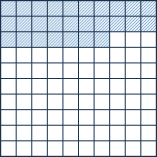
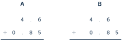

+++
order = 7
subject = "mathematics"
authoring_model = "claude-fable-5"
authoring_reasoning_effort = "high"
tags = ["quantitative-reasoning", "decimals", "place-value", "decimal-operations"]
prerequisites = ["chapter:06_fractions"]
provides = ["decimal-number", "decimal-place-value", "fraction-decimal-equivalence", "decimal-operations", "decimal-rounding"]
+++

# Decimals

## From fractions to decimal places

<!-- card-id: fdefe6bb-0fc1-45ee-9391-d7b48fc4a725 -->
Q: In whole-number place value, each place is worth ten times the place
to its right — and read the other way, each place is worth one tenth of
the place to its left. That pattern can continue past the ones place. A
**decimal point** written after the ones digit marks where the whole
part ends, and the first place to its right counts **tenths** — parts of
size \(\frac{1}{10}\). A number written this way is a **decimal**: 3.4,
read "three point four," means \(3 + \frac{4}{10}\). What amount does
2.7 name, written as a whole number plus a fraction?

A: \(2 + \frac{7}{10}\) — 2 wholes and 7 tenths. The 7 sits one place
right of the decimal point, so it counts parts of size \(\frac{1}{10}\),
not 7 ones.

<!-- card-id: e6945501-de05-40b0-8635-2fbfecd2313e -->
Q: The place pattern keeps going: cutting a tenth into 10 equal parts
gives **hundredths**, since \(\frac{1}{10}\) of \(\frac{1}{10}\) is
\(\frac{1}{10} \times \frac{1}{10} = \frac{1}{100}\). The second place
right of the decimal point counts hundredths: 0.35 is 3 tenths and 5
hundredths, and since \(\frac{3}{10} = \frac{30}{100}\), that is
\(\frac{35}{100}\) in all. How many hundredths in all is 0.62?

A: 62 hundredths — \(\frac{62}{100}\). The 6 tenths are 60 hundredths,
and 2 more hundredths make 62.

<!-- card-id: 64fd2d62-0dc0-42e8-8d26-2ccb99487311 -->
P: The figure shows a square cut into 100 equal small squares — ten
rows of ten — with part of it shaded. Write the shaded amount as a
fraction of the square and as a decimal.

S: \(\frac{27}{100} = 0.27\).

IDENTIFY: A part-of-whole amount where the whole is cut into 100 equal
parts, so each small square is one hundredth.

PLAN: Count the shaded squares using the rows of ten, write the count
over 100, then place the digits in the tenths and hundredths places.

EXECUTE: Two full rows hold \(2 \times 10 = 20\) squares, plus 7 more
is 27. The shaded amount is \(\frac{27}{100}\): 2 tenths (the full
rows) and 7 hundredths, the decimal 0.27.

EVALUATE: \(\frac{27}{100}\) is less than \(\frac{50}{100} =
\frac{1}{2}\), and the shading does cover clearly less than half the
grid.

<!-- card-id: 1ea2d651-72d7-47a0-85d8-aa00a53eb657 -->
Q: A third cut continues the pattern: one tenth of a hundredth is a
**thousandth**, \(\frac{1}{1000}\), counted by the third place right of
the decimal point. In the decimal 0.256 — 256 thousandths — what does
the digit 5 stand for?

A: 5 hundredths, \(\frac{5}{100}\). Position sets a digit's value,
exactly as in whole numbers: the 5 sits in the second place right of
the point, the hundredths place.

<!-- card-id: f900fd2d-54ea-4c21-a173-ef3012cb6246 -->
Q: A decimal's last-used place names its denominator: 0.7 ends in the
tenths place, so \(0.7 = \frac{7}{10}\); 0.43 ends in hundredths, so
\(0.43 = \frac{43}{100}\). Write 0.209 as a single fraction.

A: \(\frac{209}{1000}\). The last digit sits in the thousandths place:
2 tenths are 200 thousandths, the hundredths place holds 0, and 9
thousandths complete 209.

## Zeros and the number line

<!-- card-id: 4b44305b-219b-44eb-8cd6-411a24a8fd30 -->
Q: Which is larger, 0.7 or 0.07 — and what job does the 0 right after
the decimal point in 0.07 do?

A: 0.7 is larger — ten times larger. The 0 holds the tenths place so
that the 7 lands in the hundredths place: \(0.07 = \frac{7}{100}\),
while \(0.7 = \frac{7}{10} = \frac{70}{100}\). Same digit, different
place, different value.

<!-- card-id: 59ab4a66-4dd7-4e67-838b-dc18a77ee592 -->
Q: Is 0.50 the same number as 0.5? Explain using fractions.

A: Yes. \(0.50 = \frac{50}{100}\) and \(0.5 = \frac{5}{10}\), and
multiplying top and bottom of \(\frac{5}{10}\) by 10 gives
\(\frac{50}{100}\) — equivalent fractions, one amount. A zero added on
the **end** of a decimal changes nothing; a zero **between** the point
and a digit does: \(0.05 = \frac{5}{100}\) is a different, smaller
number.

<!-- card-id: 34dc4437-6efa-4cd6-bbcb-cda5e4023504 -->
Q: Decimals take positions on the number line just as fractions do:
cutting the space between neighboring whole numbers into 10 equal steps
puts a tenths mark at each step. In the figure, the space between 3 and
4 is cut into equal steps and a dot sits on one of the marks.

Which decimal does the dot mark?

A: 3.7. The space from 3 to 4 is cut into 10 equal steps, so each step
is one tenth, and the dot sits 7 steps past 3: \(3 + \frac{7}{10}\).

<!-- card-id: c03bf132-2db3-4c36-8eb3-21902d714d41 -->
Q: The tenths marks 0.7 and 0.8 sit next to each other on the number
line, but they are not next-door neighbors with nothing between. Name
one two-place decimal that lies between 0.7 and 0.8, and show that it
fits.

A: 0.75, for example — any of 0.71 through 0.79 works. Renaming with
trailing zeros shows the fit: \(0.70 < 0.75 < 0.80\), since 70, 75, and
80 hundredths sit in that order. Hundredths live between the tenths
marks.

## Comparing and converting

<!-- card-id: 667cb201-cb4d-4ab8-b199-b8fd7bb00b15 -->
Q: A student claims that \(0.48 > 0.6\) because 48 is greater than 6.
Which decimal is actually greater, and what went wrong?

A: \(0.6 > 0.48\). Rename to the same place count: \(0.6 = 0.60\), and
60 hundredths beats 48 hundredths. The student read the digits after
the point as a whole number, but decimal size is decided place by place
from the left — 6 tenths beats 4 tenths before any later digit matters.
More digits does not mean a bigger number.

<!-- card-id: 585240c9-5b26-4172-9174-86efe33edd06 -->
Q: A fraction becomes a decimal through an equivalent fraction whose
denominator is 10, 100, or 1000: for example
\(\frac{1}{2} = \frac{5}{10} = 0.5\). Write \(\frac{3}{4}\) as a
decimal.

A: 0.75. Multiplying top and bottom by 25 gives
\(\frac{3}{4} = \frac{75}{100}\), which is 7 tenths and 5 hundredths.

<!-- card-id: b252f0e2-c66c-404e-9a55-5acc60ef727e -->
Q: A student writes \(\frac{1}{3} = 0.33\) exactly. Is that right?
Diagnose the claim.

A: No — 0.33 is close but not equal. \(0.33 = \frac{33}{100} =
\frac{99}{300}\), while \(\frac{1}{3} = \frac{100}{300}\): the decimal
falls short by \(\frac{1}{300}\). No decimal that ends can equal
\(\frac{1}{3}\), because that would need an equivalent fraction with
denominator 10, 100, 1000, and so on — and dividing any of those by 3
always leaves remainder 1, so 3 is a factor of none of them.

## Money notation

<!-- card-id: 21bbb638-7e99-40ea-a2a2-e8daecfa7444 -->
Q: Money runs on decimals: one dollar is 100 cents, so one cent is
\(\frac{1}{100}\) of a dollar, and amounts are written in dollars with
two decimal places — 3 dollars and 45 cents is written \(\$3.45\).
Write 7 dollars and 8 cents in this notation.

A: \(\$7.08\). The 8 cents are 8 hundredths of a dollar, so the 8 must
sit in the hundredths place, with a placeholder 0 in the tenths place.
Writing \(\$7.8\) would name 7 dollars and 80 cents.

<!-- card-id: 0b4d0cc1-4a41-4a79-ac61-8f2b8b6bc437 -->
Q: Asked to add \(\$0.25\) and \(\$0.25\), a calculator displays 0.5,
and a student reads the total as 5 cents. What amount does 0.5 dollars
actually name, and why do many calculators show it this way?

A: 50 cents: \(0.5 = 0.50\), since \(\frac{5}{10} = \frac{50}{100}\).
Calculators drop ending zeros because they do not change the value —
but the money meaning needs the hundredths reading. An amount of 5
cents would be \(\$0.05\), with the zero holding the tenths place.

## Adding and subtracting decimals

<!-- card-id: cf24de38-d486-4758-a410-651fb6c4c8d1 -->
Q: The figure shows the same addition, \(4.6 + 0.85\), set up in two
column layouts. In layout A the digits are pushed to the right edge; in
layout B the decimal points sit in one vertical line.

Which layout is set up correctly, and why?

A: Layout B. Column addition only works when equal places share a
column, and lining up the decimal points puts tenths over tenths and
hundredths over hundredths. Layout A stacks the 6 (tenths) over the 5
(hundredths) — adding different-size parts as if they matched, the same
mistake as adding fractions with different denominators without
renaming.

<!-- card-id: 7fcc23df-afe9-444e-9a61-c6660fb2f9e1 -->
P: Complete the addition \(2.7 + 0.46\). The setup is already done:
the decimal points are aligned, and 2.7 is written as 2.70 so both
numbers reach the hundredths place. Finish the computation and check
the result.

S: 3.16.

EXECUTE: Hundredths: \(0 + 6 = 6\). Tenths: \(7 + 4 = 11\) tenths —
write 1 tenth and regroup 10 tenths as 1 one. Ones: \(2 + 0 + 1 = 3\).
Result: 3.16.

EVALUATE: Estimate first: \(0.46\) is close to \(0.5\), and
\(2.7 + 0.5 = 3.2\), so 3.16 is right where the answer should be.

<!-- card-id: 4c0bc978-9ada-4fe9-8ec4-e85195edbd00 -->
Q: Whole numbers can take decimal places too: \(5 = 5.0 = 5.00\),
since trailing zeros change nothing. Compute \(5 - 1.36\).

A: 3.64. Write 5 as 5.00 and align the points; regrouping turns 5.00
into 4 ones, 9 tenths, 10 hundredths, so hundredths give
\(10 - 6 = 4\), tenths \(9 - 3 = 6\), ones \(4 - 1 = 3\). Check by
adding back: \(3.64 + 1.36 = 5.00\).

## Multiplying decimals

<!-- card-id: e674c05e-772a-4cc1-acdc-6bdba436d20f -->
Q: Multiplying by 10 makes every digit worth ten times more, so each
digit moves one place larger: \(10 \times 0.46 = 4.6\), the 4 tenths
becoming 4 ones and the 6 hundredths becoming 6 tenths. Multiplying by
100 shifts two places. Compute \(100 \times 0.35\).

A: 35. Two shifts: \(0.35 \to 3.5 \to 35\). As a fraction check,
\(0.35 = \frac{35}{100}\), and 100 of those hundredths make exactly 35.

<!-- card-id: a74f7946-b5b9-48b2-b917-13cc7128e9ea -->
Q: Decimal multiplication follows from fraction multiplication:
\(0.3 \times 0.2 = \frac{3}{10} \times \frac{2}{10} = \frac{6}{100} =
0.06\) — a tenth of a tenth is a hundredth, so tenths times tenths
lands in hundredths. In short: multiply the digits as whole numbers,
then give the product as many decimal places as the two factors have
together. Compute \(0.6 \times 0.2\).

A: 0.12. \(6 \times 2 = 12\), and tenths times tenths makes
hundredths: \(\frac{12}{100} = 0.12\) — not 1.2, which would be twelve
tenths.

<!-- card-id: cf88202c-589a-47c8-ba12-cfac4eeebd66 -->
P: Compute \(1.5 \times 2.4\).

S: 3.6.

IDENTIFY: A product of two decimals, each with one decimal place.

PLAN: Multiply the whole-number digits, then place the result: tenths
times tenths gives hundredths, so the product has two decimal places.

EXECUTE: \(15 \times 24 = 360\), so the product is 360 hundredths:
\(3.60 = 3.6\).

EVALUATE: \(1.5 \times 2.4\) must land between \(1.5 \times 2 = 3\)
and \(1.5 \times 3 = 4.5\), and 3.6 does. The ending zero of 3.60 can
be dropped without changing the value.

## Dividing decimals

<!-- card-id: ff013b3f-386c-4197-af14-e0ca10c9e0a8 -->
Q: To divide a decimal by a whole number, read the decimal as a count
of tenths: \(3.6 \div 3\) is 36 tenths shared into 3 equal groups, 12
tenths each, so \(3.6 \div 3 = 1.2\). Compute \(6.4 \div 4\).

A: 1.6. 64 tenths shared into 4 groups is 16 tenths. Check:
\(1.6 \times 4 = 6.4\).

<!-- card-id: d7c1c378-43dd-4e11-98b0-c453407b612e -->
Q: When the divisor itself is a decimal, rewrite the division as a
fraction and scale: \(1.2 \div 0.4 = \frac{1.2}{0.4}\), and
multiplying top and bottom by 10 — an equivalent fraction — gives
\(\frac{12}{4} = 3\). The value never changes; the divisor just
becomes a whole number. Compute \(2.4 \div 0.6\).

A: 4. Scaling both numbers by 10 turns the division into
\(24 \div 6 = 4\). Check: \(4 \times 0.6 = 2.4\).

<!-- card-id: 04bca0d7-ee91-4f26-9181-53b416a89915 -->
P: Compute \(4.5 \div 0.9\).

S: 5.

IDENTIFY: A division whose divisor is a decimal.

PLAN: Scale both numbers by 10 so the divisor becomes whole; the
quotient is unchanged, exactly as with equivalent fractions.

EXECUTE: \(4.5 \div 0.9 = 45 \div 9 = 5\).

EVALUATE: Multiply back: \(5 \times 0.9 = 4.5\). And the answer being
larger than 4.5 is sensible: dividing by a number smaller than 1 asks
how many small groups fit, and many do.

## Rounding decimals

<!-- card-id: 938c1358-c527-42c9-9605-942af8a24628 -->
Q: Rounding a decimal works exactly like rounding a whole number: find
the two nearest values at the target place and keep the closer one;
when the number is exactly halfway, this deck rounds to the higher
value. Round 6.48 to the nearest whole number.

A: 6. The candidates are 6 and 7, and 6.48 is only 0.48 above 6 —
less than the halfway value 6.50 — so 6 is closer. The two digits 4
and 8 together say 48 hundredths, under half.

<!-- card-id: 159a587c-a553-4eda-a7f0-1b18ae4c959c -->
Q: To round to the nearest tenth, the candidates are the two
neighboring tenths marks. Round 3.276 to the nearest tenth.

A: 3.3. The neighbors are 3.2 and 3.3, and 3.276 sits 0.076 above 3.2
but only 0.024 below 3.3. The digit after the tenths place, 7, is at
least 5 hundredths — more than half a tenth — so the tenths digit goes
up.

<!-- card-id: 281b3db3-5eaa-468f-a102-da921936e275 -->
Q: Rounding 2.348 to the nearest tenth, a student first rounds it to
the nearest hundredth, getting 2.35, and then rounds that to 2.4. What
is the correct answer, and what went wrong?

A: 2.3. The halfway value between 2.3 and 2.4 is 2.35, and
\(2.348 < 2.35\), so 2.3 is closer (0.048 away versus 0.052). Rounding
in stages first pushed the number up onto the halfway boundary and then
over it. Always round from the original number in one step.

## Mixed application

<!-- card-id: 07137d38-8f32-47a3-9575-980ea8ebb027 -->
P: At a shop you buy two items priced \(\$4.68\) and \(\$2.79\), and
you pay with a \(\$10\) bill. How much change should you receive, and
how can you check the amount quickly?

S: \(\$2.53\).

IDENTIFY: Two steps: join the two prices into a total, then take the
total away from 10 — an addition followed by a subtraction, all in
hundredths of a dollar.

PLAN: Add with decimal points aligned; subtract from 10.00; check
against an estimate built from rounded prices.

EXECUTE: \(4.68 + 2.79 = 7.47\) (hundredths \(8 + 9 = 17\), regroup;
tenths \(6 + 7 + 1 = 14\), regroup; ones \(4 + 2 + 1 = 7\)). Then
\(10.00 - 7.47 = 2.53\).

EVALUATE: Rounding each price to the nearest tenth of a dollar gives
\(4.7 + 2.8 = 7.5\), and \(10 - 7.5 = 2.5\) — the exact change
\(\$2.53\) sits right beside the estimate. Inverse check:
\(2.53 + 7.47 = 10.00\).
