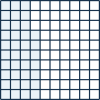
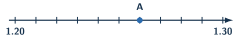
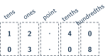

+++
order = 7
subject = "mathematics"
tags = ["quantitative-reasoning", "decimals", "place-value", "decimal-operations"]
prerequisites = ["chapter:06_fractions"]
provides = ["decimal-number", "decimal-place-value", "fraction-decimal-equivalence", "decimal-operations", "decimal-rounding"]
+++

# Decimals

<!-- card-id: 07000000-0000-4000-8000-000000000001 -->
Q: A **decimal point** separates whole-number places on its left from fractional places on its right. In \(3.47\), what do the digits \(4\) and \(7\) represent?
A: \(4\) tenths and \(7\) hundredths. Thus \(3.47=3+\frac4{10}+\frac7{100}\).

<!-- card-id: 07000000-0000-4000-8000-000000000002 -->
Q: The grid has \(100\) equal squares, with \(37\) shaded.

Write the shaded amount as a fraction and a decimal.
A: \(\frac{37}{100}=0.37\). Each small square is one hundredth.

<!-- card-id: 07000000-0000-4000-8000-000000000003 -->
Q: Write \(\frac7{10}\) and \(\frac7{100}\) as decimals. Why are they different?
A: \(\frac7{10}=0.7\) and \(\frac7{100}=0.07\). The \(7\) occupies different place-value positions.

<!-- card-id: 07000000-0000-4000-8000-000000000004 -->
Q: Why do \(0.5\), \(0.50\), and \(0.500\) represent the same quantity?
A: Trailing zeros to the right do not change the place-value sum. They are all equal to \(\frac12\).

<!-- card-id: 07000000-0000-4000-8000-000000000005 -->
Q: Compare \(0.62\) and \(0.7\) by writing the same number of decimal places.
A: \(0.62<0.70\). They have the same whole and tenths comparison reaches \(6<7\).

<!-- card-id: 07000000-0000-4000-8000-000000000006 -->
Q: The number line runs from \(1.2\) to \(1.3\) in hundredths.

Which decimal is at A?
A: \(1.26\). Starting at \(1.20\), A is six hundredth-steps to the right.

<!-- card-id: 07000000-0000-4000-8000-000000000007 -->
Q: To round \(4.376\) to the nearest hundredth, which digit decides the direction?
A: The thousandths digit \(6\). It makes the hundredths digit \(7\) round up, so the result is \(4.38\).

<!-- card-id: 07000000-0000-4000-8000-000000000008 -->
Q: Why must decimal points be aligned when adding or subtracting decimals?
A: Alignment puts like place values together: ones with ones, tenths with tenths, and so on. Aligning only the visible final digits can mix unlike places.

<!-- card-id: 07000000-0000-4000-8000-000000000009 -->
Q: The columns align \(12.4\) and \(3.08\) by place value.

Why is a zero written after the \(4\)?
A: It makes the hundredths place visible without changing \(12.4\). Then \(0\) hundredths aligns with \(8\) hundredths.

<!-- card-id: 07000000-0000-4000-8000-000000000010 -->
Q: Compute \(12.4+3.08\).
A: \(15.48\). Write \(12.40+3.08\) and add like places.

<!-- card-id: 07000000-0000-4000-8000-000000000011 -->
Q: A learner writes \(5.2-0.37=4.95\). Diagnose the subtraction.
A: The correct alignment is \(5.20-0.37=4.83\). The learner did not consistently subtract hundredths and tenths with regrouping.

<!-- card-id: 07000000-0000-4000-8000-000000000012 -->
Q: Why does multiplying \(0.4\times0.3\) give \(0.12\), not \(1.2\)?
A: \(\frac4{10}\times\frac3{10}=\frac{12}{100}=0.12\). Tenths times tenths produce hundredths.

<!-- card-id: 07000000-0000-4000-8000-000000000013 -->
Q: Compute \(2.5\times1.4\) using whole-number multiplication and place value.
A: \(3.5\). Since \(25\times14=350\) and the factors contain two decimal places in total, write \(3.50\).

<!-- card-id: 07000000-0000-4000-8000-000000000014 -->
Q: Why can \(4.2\div0.6\) be rewritten as \(42\div6\)?
A: Multiplying both quantities by \(10\) makes an equivalent division problem. Both the starting quantity and group size scale together, so the quotient remains \(7\).

<!-- card-id: 07000000-0000-4000-8000-000000000015 -->
Q: In a currency system where \(100\) cents equal \(1\) dollar, what does \(\$6.25\) mean?
A: \(6\) dollars and \(25\) cents. The decimal digits record hundredths of a dollar.

<!-- card-id: 07000000-0000-4000-8000-000000000016 -->
Q: A display removes trailing zeros and shows \(2.5\) instead of \(2.500\). Has the value changed?
A: No. The displayed precision may look different, but the decimal quantity is unchanged.

<!-- card-id: 07000000-0000-4000-8000-000000000017 -->
Q: Which is greater, \(-0.4\) or \(-0.35\)?
A: \(-0.35\). It lies closer to zero and therefore farther right on the signed number line.

<!-- card-id: 07000000-0000-4000-8000-000000000018 -->
Q: Estimate \(19.8\times3.1\) using nearby whole numbers.
A: About \(20\times3=60\). The estimate is a reasonableness check for the exact product.

<!-- card-id: 07000000-0000-4000-8000-000000000019 -->
P: Compute \(8.75+2.6\), showing the place-value alignment.
S: Write \(2.6\) as \(2.60\). Then \(8.75+2.60=11.35\). Check by subtraction: \(11.35-2.60=8.75\).

<!-- card-id: 07000000-0000-4000-8000-000000000020 -->
P: Compute \(10-3.476\).
S: Write \(10\) as \(10.000\). Then \(10.000-3.476=6.524\). Check: \(6.524+3.476=10.000\).

<!-- card-id: 07000000-0000-4000-8000-000000000021 -->
P: Compute \(3.2\times0.45\), and use an estimate to check the decimal position.
S: \(32\times45=1440\). The factors have three decimal places in total, so the product is \(1.440=1.44\). Since \(3.2\times0.5=1.6\), a result slightly below \(1.6\) is reasonable.

<!-- card-id: 07000000-0000-4000-8000-000000000022 -->
P: Compute \(7.56\div0.3\), and verify by multiplication.
S: Rewrite as \(75.6\div3=25.2\). Check: \(25.2\times0.3=7.56\).

<!-- card-id: 07000000-0000-4000-8000-000000000023 -->
P: An item costs \(\$12.80\) and another costs \(\$3.75\). A buyer pays with \(\$20.00\). Find the change and check it.
S: Total cost: \(12.80+3.75=16.55\). Change: \(20.00-16.55=\$3.45\). Check: \(16.55+3.45=20.00\).
