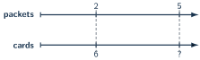
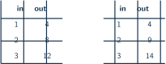

+++
order = 8
subject = "mathematics"
tags = ["quantitative-reasoning", "ratios", "rates", "proportions"]
prerequisites = ["chapter:07_decimals"]
provides = ["ratio", "equivalent-ratio", "rate", "unit-rate", "proportional-relationship"]
+++

# Ratios, rates, and proportions

<!-- card-id: 08000000-0000-4000-8000-000000000001 -->
Q: A **ratio** compares quantities by multiplication. The collection has \(2\) circles for every \(3\) squares.

What is the ratio of circles to squares?
A: \(2:3\), read “two to three.” Order matters: the first number counts circles and the second counts squares.

<!-- card-id: 08000000-0000-4000-8000-000000000002 -->
Q: In a group with \(2\) circles and \(3\) squares, distinguish the part-to-part ratio from the circle-to-total ratio.
A: Circles to squares is \(2:3\). Circles to all shapes is \(2:5\), because there are \(5\) shapes total.

<!-- card-id: 08000000-0000-4000-8000-000000000003 -->
Q: Why are \(2:3\) and \(4:6\) **equivalent ratios**?
A: Both quantities were multiplied by the same factor \(2\). The multiplicative comparison did not change.

<!-- card-id: 08000000-0000-4000-8000-000000000004 -->
Q: A learner changes \(5:8\) to \(7:10\) by adding \(2\) to both numbers. Why does this not generally preserve the ratio?
A: Equal addition does not preserve multiplicative comparison. \(\frac58\ne\frac7{10}\).

<!-- card-id: 08000000-0000-4000-8000-000000000005 -->
Q: A **rate** compares quantities measured or counted in different kinds of units. A printer makes \(120\) pages in \(3\) minutes. What rate is given?
A: \(120\) pages per \(3\) minutes. “Per” signals the comparison between pages and time.

<!-- card-id: 08000000-0000-4000-8000-000000000006 -->
Q: A **unit rate** gives the amount for \(1\) unit of the second quantity. What is the unit rate for \(120\) pages in \(3\) minutes?
A: \(40\) pages per minute, because \(120\div3=40\).

<!-- card-id: 08000000-0000-4000-8000-000000000007 -->
Q: Which is the better value: \(6\) identical notebooks for \(\$15\) or \(10\) for \(\$24\)?
A: The \(10\)-notebook offer. The unit prices are \(\$15\div6=\$2.50\) and \(\$24\div10=\$2.40\) per notebook; lower cost per identical notebook is better.

<!-- card-id: 08000000-0000-4000-8000-000000000008 -->
Q: A **scale factor** is the number that multiplies every quantity in a ratio. What scale factor changes \(3:5\) into \(12:20\)?
A: \(4\). Both \(3\) and \(5\) are multiplied by \(4\).

<!-- card-id: 08000000-0000-4000-8000-000000000009 -->
Q: The double number line aligns \(2\) packets with \(6\) cards and \(5\) packets with an unknown number of cards.

How many cards align with \(5\) packets?
A: \(15\) cards. The unit rate is \(6\div2=3\) cards per packet, so \(5\times3=15\).

<!-- card-id: 08000000-0000-4000-8000-000000000010 -->
Q: What makes a table **proportional**?
A: Every row has the same multiplicative relationship between the two quantities. Equivalently, the unit rate stays constant.

<!-- card-id: 08000000-0000-4000-8000-000000000011 -->
Q: One table pairs \(1,2,3\) packs with \(4,8,12\) items. Another pairs them with \(4,9,14\).

Which table is proportional?
A: The \(4,8,12\) table. Each output is \(4\) times the pack count; the second table has no constant multiplier.

<!-- card-id: 08000000-0000-4000-8000-000000000012 -->
Q: How can equivalent fractions test whether \(a:b\) and \(c:d\) are equivalent ratios?
A: Compare \(\frac ab\) and \(\frac cd\). If they are equal, the ratios are equivalent, provided the second quantities are nonzero.

<!-- card-id: 08000000-0000-4000-8000-000000000013 -->
Q: A recipe uses \(3\) scoops of grain for \(2\) scoops of seed. How much grain keeps the ratio when seed increases to \(6\) scoops?
A: \(9\) scoops. The seed amount scales by \(3\), so the grain amount must also scale by \(3\).

<!-- card-id: 08000000-0000-4000-8000-000000000014 -->
Q: Distinguish “\(8\) more than” from “\(3\) times as many.”
A: “\(8\) more” is additive comparison: subtract to find a difference of \(8\). “\(3\) times as many” is multiplicative comparison: divide to find a ratio of \(3\).

<!-- card-id: 08000000-0000-4000-8000-000000000015 -->
Q: A tank is filled at a steady \(7\) liters per minute, where a liter is a unit of liquid amount. Why is the amount after \(4\) minutes proportional to time if the tank starts empty?
A: Each minute adds the same \(7\) liters, and zero minutes corresponds to zero added liters. The amount is \(4\times7=28\) liters.

<!-- card-id: 08000000-0000-4000-8000-000000000016 -->
P: Four identical bundles contain \(28\) cards. At the same rate, how many cards are in \(9\) bundles?
S: **IDENTIFY:** This is a proportional equal-bundle problem.

**PLAN:** Find the unit rate, then scale.

**EXECUTE:** \(28\div4=7\) cards per bundle; \(9\times7=63\) cards.

**EVALUATE:** Nine bundles are a little more than twice four bundles, and \(63\) is a little more than twice \(28\).

<!-- card-id: 08000000-0000-4000-8000-000000000017 -->
P: A \(12\)-ounce package costs \(\$4.80\), and an \(18\)-ounce package costs \(\$6.84\). An ounce is a unit of package weight. Which has the lower unit price?
S: First package: \(4.80\div12=\$0.40\) per ounce. Second: \(6.84\div18=\$0.38\) per ounce. The **18-ounce package** has the lower unit price.

<!-- card-id: 08000000-0000-4000-8000-000000000018 -->
P: Complete the equivalent ratio \(7:9=21:\square\).
S: \(7\) was multiplied by \(3\), so multiply \(9\) by \(3\): the missing quantity is \(27\). Check: \(\frac79=\frac{21}{27}\) after simplifying the second fraction by \(3\).

<!-- card-id: 08000000-0000-4000-8000-000000000019 -->
P: A table pairs input \(2,4,6\) with output \(5,10,16\). Is it proportional?
S: No. The first two unit rates are \(5\div2=2.5\) and \(10\div4=2.5\), but \(16\div6\ne2.5\). One inconsistent row breaks proportionality.

<!-- card-id: 08000000-0000-4000-8000-000000000020 -->
P: One collection has \(18\) blue counters and \(12\) gold counters. Another has \(24\) blue counters and \(18\) gold counters. Are the blue-to-gold ratios equivalent?
S: No. Simplify: \(18:12=3:2\), while \(24:18=4:3\). Adding \(6\) to each quantity did not preserve the multiplicative comparison.
