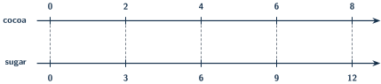
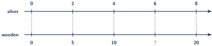

+++
order = 8
subject = "mathematics"
authoring_model = "claude-fable-5"
authoring_reasoning_effort = "high"
tags = ["quantitative-reasoning", "ratios", "rates", "proportions"]
prerequisites = ["chapter:07_decimals"]
provides = ["ratio", "equivalent-ratio", "rate", "unit-rate", "proportional-relationship"]
+++

# Ratios, rates, and proportions

## Two ways to compare

<!-- card-id: 9e21147e-4b15-4759-85a3-d2c1c77db9e8 -->
Q: Two quantities can be compared in two different ways. Subtraction
answers "how many more": with 12 markers and 4 erasers,
\(12 - 4 = 8\) more markers. Division answers "how many times as
many": \(12 \div 4 = 3\), so there are 3 times as many markers as
erasers. A shelf holds 15 books and 5 boxes. How many times as many
books as boxes is that?

A: 3 times as many — \(15 \div 5 = 3\). The difference
\(15 - 5 = 10\) answers the other question, "how many more books."

## Ratio notation

<!-- card-id: 94c0e0fa-df2d-45c9-a2e0-aa63a09db836 -->
Q: A **ratio** names a "for every" relationship between two
quantities: a drink mix that uses 2 spoonfuls of cocoa for every 3
spoonfuls of sugar has a cocoa-to-sugar ratio of 2 to 3, written with
a colon as \(2:3\). A bag holds 5 red counters for every 4 blue
counters. Write the ratio of red to blue in colon notation.

A: \(5:4\) — 5 red for every 4 blue.

<!-- card-id: efbdbac8-3718-4d9c-8768-76a66d6f3711 -->
Q: In a ratio, the numbers follow the order of the words: the
cocoa-to-sugar ratio of the 2-cocoa-for-every-3-sugar mix is \(2:3\),
while the sugar-to-cocoa ratio of the very same mix is \(3:2\). A
yard has 8 dogs and 3 cats. What is the ratio of cats to dogs?

A: \(3:8\). Cats are named first, so their count comes first —
\(8:3\) would be the dogs-to-cats ratio.

<!-- card-id: a2152dc2-cd2e-482f-ab05-4ac84425cbf7 -->
Q: The figure shows a collection of triangles and circles. What is
the ratio of triangles to circles?

A: \(4:6\). Counting gives 4 triangles and 6 circles, and triangles
are named first.

<!-- card-id: 983dabff-1c73-4a80-a0b2-f855401d5693 -->
Q: A ratio compares part to part; a fraction of the whole comes from
it by adding the parts. If a box holds red and blue counters in the
ratio \(2:3\), every group of \(2 + 3 = 5\) counters has 2 red ones,
so \(\frac{2}{5}\) of the box is red. In a box with a red-to-blue
ratio of \(3:4\), what fraction of all the counters is red?

A: \(\frac{3}{7}\) — every \(3 + 4 = 7\) counters hold 3 red. The
ratio \(3:4\) compares red to blue; it does not say \(\frac{3}{4}\)
of the box is red.

## Equivalent ratios

<!-- card-id: 041cd13e-c716-4bcf-a6e1-98c89195f41f -->
Q: Doubling a whole batch of the drink mix — \(2:3\) becoming
\(4:6\) — keeps the "for every" relationship, so \(4:6\) is an
**equivalent ratio** to \(2:3\). As with equivalent fractions,
multiplying both numbers by the same amount, called the **scale
factor**, produces an equivalent ratio: scaling \(2:3\) by 4 gives
\(8:12\). Scale the ratio \(3:5\) by 3.

A: \(9:15\) — \(3 \times 3 = 9\) and \(5 \times 3 = 15\). Both
numbers must be multiplied by the same scale factor.

<!-- card-id: e7af2536-2b10-4b4b-8937-ed8a0c89043d -->
Q: Dividing both numbers of a ratio by a factor they share also keeps
the relationship, and repeating until only 1 is shared leaves the
**simplest form**: \(12:18\) becomes \(2:3\) after dividing both by
6. Write \(10:15\) in simplest form.

A: \(2:3\) — divide both numbers by their shared factor 5. So
\(10:15\), \(12:18\), and \(2:3\) all describe the same mixture.

<!-- card-id: d392f7bf-3dd3-4b48-ac95-3c51a4fa34fb -->
Q: Mix A uses 2 spoonfuls of cocoa for every 3 of sugar; mix B uses 3
of cocoa for every 5 of sugar. Which mix tastes more strongly of
cocoa? Decide by scaling both ratios to the same amount of sugar.

A: Mix A. Scaling \(2:3\) by 5 gives \(10:15\); scaling \(3:5\) by 3
gives \(9:15\). For the same 15 spoonfuls of sugar, mix A carries 10
spoonfuls of cocoa and mix B only 9.

## Ratio tables and double number lines

<!-- card-id: 39589f46-812e-4973-9902-8faca9bde7fe -->
Q: A **ratio table** lists equivalent ratios side by side: each
column of the table below is the cocoa-to-sugar ratio \(2:3\) scaled
by a different factor.

| cocoa | 2 | 4 | 6 | 8 |
|---|---|---|---|---|
| sugar | 3 | 6 | 9 | ? |

What number belongs in place of the question mark?

A: **12**. The last column scales \(2:3\) by 4, since
\(2 \times 4 = 8\), so its sugar entry is \(3 \times 4 = 12\).

<!-- card-id: 742418dc-7dc5-4bfe-a054-4a7345b10304 -->
Q: A **double number line** shows equivalent ratios on two number
lines whose zeros are aligned. In the figure, the top line counts
spoonfuls of cocoa, the bottom line counts spoonfuls of sugar, and
the dashed guides pair off the aligned marks.

What does the guide pairing 4 with 6 say about the mixture?

A: A batch with 4 spoonfuls of cocoa needs 6 of sugar for the same
taste: \(4:6\) is \(2:3\) scaled by 2. Every aligned pair on a
double number line is an equivalent ratio.

<!-- card-id: 2a06ea67-1740-4cf3-bc7e-4796dc15ae42 -->
P: A bracelet design uses 2 silver beads for every 5 wooden beads.
The double number line shows silver counts on top and wooden counts
below, with one value missing. How many wooden beads pair with 6
silver beads?

S: 15 wooden beads.

IDENTIFY: An equivalent-ratio problem: the missing value must make
the pair with 6 silver beads equivalent to \(2:5\).

PLAN: Find the scale factor that turns 2 silver beads into 6, then
apply the same factor to the wooden count.

EXECUTE: \(6 \div 2 = 3\), so the pair is \(2:5\) scaled by 3, and
the wooden count is \(5 \times 3 = 15\).

EVALUATE: 15 sits between the neighboring wooden marks 10 and 20,
and dividing \(6:15\) through by 3 returns \(2:5\).

<!-- card-id: 50d3ea0f-1496-4733-a0db-a88df1e1cf5d -->
P: Each bag of a bead mix holds 4 glass beads for every 10 clay
beads. In the ratio table below, each column scales \(4:10\) by one
factor, and one entry is missing.

| glass | 4 | 8 | 12 |
|---|---|---|---|
| clay | 10 | ? | 30 |

The plan is already fixed: find the middle column's scale factor
from its glass entry, then apply that factor to its clay entry.
Carry the plan out.

S: **20**. The middle column's glass entry is \(8 = 4 \times 2\), so its
scale factor is 2, and the clay entry is \(10 \times 2 = 20\).

EVALUATE: Dividing \(8:20\) through by 4 gives \(2:5\), and dividing
\(4:10\) through by 2 gives \(2:5\) as well — the columns agree. The
last column checks too: \(12:30\) is \(4:10\) scaled by 3.

## Rates and unit rates

<!-- card-id: 0490f170-b9c5-47ff-9a61-970f01ccfb2c -->
Q: A **rate** is a ratio of two different kinds of quantities, such
as money and notebooks: paying \(\$12\) for 4 notebooks is the rate
\(12:4\) of dollars to notebooks. The **unit rate** restates a rate
as the amount **per** one — "per" means "for each one" — and comes
from division: \(12 \div 4 = 3\), so the price is \(\$3\) per
notebook. Five pens cost \(\$10\) in all. What is the price per pen?

A: \(\$2\) per pen — \(10 \div 5 = 2\).

<!-- card-id: 00e7d3e9-4ff6-4515-a2c8-e8efecc71803 -->
Q: Unit rates often come out as decimals. Three markers cost
\(\$4.50\) in all. What is the price per marker?

A: \(\$1.50\) per marker. \(4.50 \div 3\): 45 tenths shared into 3
groups is 15 tenths, so the quotient is 1.5. Check:
\(3 \times 1.50 = 4.50\).

<!-- card-id: d83029b3-7d17-4851-80cb-5aa8f99f8864 -->
P: The same pens are sold two ways: a pack of 5 for \(\$4.50\), or a
pack of 4 for \(\$3.80\). Which pack is the better buy — the lower
price per pen?

S: The pack of 5, at \(\$0.90\) per pen versus \(\$0.95\).

IDENTIFY: A comparison of two rates, decided by their unit rates.

PLAN: Divide each pack price by its pen count, then compare the two
prices per pen.

EXECUTE: \(4.50 \div 5\): 45 tenths shared into 5 groups is 9
tenths, so \(\$0.90\) per pen. \(3.80 \div 4\): 380 hundredths
shared into 4 groups is 95 hundredths, so \(\$0.95\) per pen. And
\(0.90 < 0.95\).

EVALUATE: Multiplying back returns both prices —
\(5 \times 0.90 = 4.50\) and \(4 \times 0.95 = 3.80\) — and the
5-pack's price per pen is the lower one.

## Proportional relationships

<!-- card-id: 44d90963-b934-4757-937c-6689c88b839c -->
Q: Two quantities are in a **proportional relationship** when every
matched pair of amounts forms the same ratio — equivalently, when
the amount of one per one of the other never changes. Stickers cost
\(\$3\) each. Is the total cost proportional to the number of
stickers bought, and what stays the same from purchase to purchase?

A: Yes. Every purchase pairs cost with count in the ratio \(3:1\):
2 stickers cost \(\$6\), 5 stickers cost \(\$15\), and the unit rate
of \(\$3\) per sticker never changes.

<!-- card-id: 8f6a7e7b-c25d-4019-a4f8-a1562c122cae -->
Q: Each table pairs packs bought with stickers received.

Table A:

| packs | 1 | 2 | 3 |
|---|---|---|---|
| stickers | 4 | 8 | 12 |

Table B:

| packs | 1 | 2 | 3 |
|---|---|---|---|
| stickers | 4 | 6 | 8 |

Which table shows a proportional relationship, and what test
decides it?

A: Table A: every column gives the same rate, 4 stickers per pack.
In Table B the per-pack rate changes — \(4 \div 1 = 4\) but
\(6 \div 2 = 3\) — so its columns are not equivalent ratios. The
test: check whether every pair gives the same amount per one.

<!-- card-id: 81394737-d6d4-42e3-a9ab-8d5addac186f -->
Q: Rosa's sticker count is always exactly 4 more than Ben's — a
constant difference. Is Rosa's count proportional to Ben's? Test two
pairs.

A: No. When Ben has 4, Rosa has 8 — the pair \(8:4\), 2 per 1. When
Ben has 20, Rosa has 24 — \(24 \div 20 = 1.2\) per 1. The ratio
changes, so "always 4 more" is not proportional. A proportional
pairing would also send 0 to 0, but when Ben has 0, Rosa still has 4.

## Mixed application

<!-- card-id: f2504ee5-3b39-4111-88e6-fcc14db42569 -->
P: A floor pattern uses 6 white tiles for every 4 gray tiles. A
larger floor uses the same pattern with 27 white tiles. How many
gray tiles does it use?

S: 18 gray tiles.

IDENTIFY: An equivalent-ratio problem: find the value that makes the
pair with 27 white tiles equivalent to \(6:4\).

PLAN: Find the scale factor from the white counts, then scale the
gray count by the same factor. A scale factor need not be a whole
number.

EXECUTE: \(27 \div 6 = \frac{27}{6} = \frac{9}{2} = 4.5\). Gray
tiles: \(4 \times 4.5 = 18\).

EVALUATE: Dividing \(27:18\) through by 9 gives \(3:2\), and
dividing \(6:4\) through by 2 gives \(3:2\) as well. Unit-rate
check: gray per white is \(\frac{4}{6} = \frac{2}{3}\), and
\(\frac{2}{3}\) of 27 is 18.

<!-- card-id: 24f2e454-40b3-4efe-a75f-e4b6223ff177 -->
P: Green paint is mixed from 4 drops of blue for every 6 drops of
yellow. Wanting a bigger batch, a student uses 8 drops of blue and
10 drops of yellow, reasoning "both numbers went up by 4, so it is
the same mix." Will the student's batch be the same green? If not,
give the correct yellow amount and diagnose the error.

S: No — 8 drops of blue need 12 drops of yellow for the same green.

IDENTIFY: Keeping a mixture the same means keeping an equivalent
ratio, so the new amounts must be \(4:6\) scaled by one factor. The
student made an additive change instead.

PLAN: Scale \(4:6\) by the factor that turns 4 drops of blue into 8;
then test the student's pair for equivalence.

EXECUTE: \(8 \div 4 = 2\), so the yellow amount is
\(6 \times 2 = 12\). The student's \(8:10\) simplifies to \(4:5\),
not the recipe's \(4:6\): only \(10 \div 8 = 1.25\) drops of yellow
per drop of blue instead of \(6 \div 4 = 1.5\), so the batch comes
out too blue.

EVALUATE: The scaled pair checks out — dividing \(8:12\) through by
2 returns \(4:6\). Adding the same number to two unequal parts
always changes their ratio; only a common scale factor keeps a
mixture the same.
