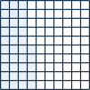

+++
order = 9
subject = "mathematics"
tags = ["quantitative-reasoning", "percent", "consumer-arithmetic", "percent-change"]
prerequisites = ["chapter:08_ratios_rates_and_proportions"]
provides = ["percent", "percent-conversion", "percent-of-quantity", "percent-change", "percentage-point"]
+++

# Percents

<!-- card-id: 09000000-0000-4000-8000-000000000001 -->
Q: **Percent** means “per hundred.” The grid has \(35\) of \(100\) squares shaded.

What percent is shaded?
A: \(35\%\). It is \(\frac{35}{100}=0.35\) of the grid.

<!-- card-id: 09000000-0000-4000-8000-000000000002 -->
Q: Convert \(62\%\) to a fraction and a decimal.
A: \(\frac{62}{100}=\frac{31}{50}\) and \(0.62\).

<!-- card-id: 09000000-0000-4000-8000-000000000003 -->
Q: Convert \(0.075\) to a percent.
A: \(7.5\%\). Multiplying the decimal by \(100\) expresses how many hundredths it represents.

<!-- card-id: 09000000-0000-4000-8000-000000000004 -->
Q: Convert \(\frac38\) to a percent.
A: \(\frac38=0.375=37.5\%\).

<!-- card-id: 09000000-0000-4000-8000-000000000005 -->
Q: In “\(30\%\) of \(80\) is \(24\),” identify the percent rate, whole, and part.
A: Rate \(30\%\), whole \(80\), part \(24\). The part is the rate applied to the whole.

<!-- card-id: 09000000-0000-4000-8000-000000000006 -->
Q: How do you find \(15\%\) of \(60\)?
A: Multiply the whole by the decimal rate: \(60\times0.15=9\).

<!-- card-id: 09000000-0000-4000-8000-000000000007 -->
Q: \(18\) is what percent of \(72\)?
A: \(25\%\). Compute part divided by whole: \(18\div72=0.25=25\%\).

<!-- card-id: 09000000-0000-4000-8000-000000000008 -->
Q: \(12\) is \(30\%\) of what whole?
A: \(40\). Divide the part by the decimal rate: \(12\div0.30=40\).

<!-- card-id: 09000000-0000-4000-8000-000000000009 -->
Q: A **discount** reduces an original price by a stated percent of that original price. What is a \(20\%\) discount on \(\$50\)?
A: \(\$10\). The new price is \(\$50-\$10=\$40\).

<!-- card-id: 09000000-0000-4000-8000-000000000010 -->
Q: The diagram separates original price, discount, and sale price.

Which two amounts add back to the original price?
A: Discount plus sale price: \(\$10+\$40=\$50\).

<!-- card-id: 09000000-0000-4000-8000-000000000011 -->
Q: A **sales tax** is an added percent of a pre-tax price. A **tip** is an added amount commonly computed from a stated bill amount. Why must the baseline be identified?
A: The percent is multiplied by its baseline. Using the wrong price or bill changes the added amount.

<!-- card-id: 09000000-0000-4000-8000-000000000012 -->
Q: **Percent change** compares the change with the original amount. What is the percent increase from \(50\) to \(65\)?
A: The increase is \(15\), and \(15\div50=0.30\), so the increase is \(30\%\).

<!-- card-id: 09000000-0000-4000-8000-000000000013 -->
Q: Why is the percent decrease from \(80\) to \(60\) different from the percent increase from \(60\) to \(80\)?
A: The baselines differ. \(20\div80=25\%\) decrease, while \(20\div60=33\frac13\%\) increase.

<!-- card-id: 09000000-0000-4000-8000-000000000014 -->
Q: A value rises by \(10\%\) and then falls by \(10\%\). Why does it not return to the original?
A: The decrease uses the larger, changed baseline. Starting at \(100\): rise to \(110\), then lose \(11\), ending at \(99\).

<!-- card-id: 09000000-0000-4000-8000-000000000015 -->
Q: A rate changes from \(40\%\) to \(55\%\). What is the change in **percentage points**, and what is the percent increase relative to \(40\%\)?
A: \(15\) percentage points. Relative increase is \(15\div40=37.5\%\); the two descriptions use different baselines.

<!-- card-id: 09000000-0000-4000-8000-000000000016 -->
Q: The bars compare an original value of \(80\) with a new value of \(100\).

Which amount is the baseline for percent change?
A: The original \(80\). The percent increase is \(20\div80=25\%\).

<!-- card-id: 09000000-0000-4000-8000-000000000017 -->
P: Find \(18\%\) of \(250\) and check by splitting the rate.
S: \(250\times0.18=45\). Check: \(10\%\) is \(25\), \(8\%\) is \(20\), and \(25+20=45\).

<!-- card-id: 09000000-0000-4000-8000-000000000018 -->
P: An item priced at \(\$80\) has a \(25\%\) discount. Find the sale price.
S: Discount: \(80\times0.25=\$20\). Sale price: \(80-20=\$60\). Check: \(\$20\) is one fourth of \(\$80\).

<!-- card-id: 09000000-0000-4000-8000-000000000019 -->
P: A pre-tax price is \(\$45\) and the sales-tax rate is \(8\%\). Find the tax and total.
S: Tax: \(45\times0.08=\$3.60\). Total: \(45+3.60=\$48.60\). The total exceeds the price by exactly the computed tax.

<!-- card-id: 09000000-0000-4000-8000-000000000020 -->
P: A quantity falls from \(240\) to \(198\). Find the percent decrease.
S: Decrease: \(240-198=42\). Relative to the original: \(42\div240=0.175=17.5\%\). Check: \(17.5\%\) of \(240\) is \(42\).

<!-- card-id: 09000000-0000-4000-8000-000000000021 -->
P: A price increases \(20\%\) and then receives a \(20\%\) discount. Starting from \(\$100\), find the final price and diagnose the claim “the changes cancel.”
S: Increase: \(\$100\to\$120\). Discount: \(20\%\) of \(\$120\) is \(\$24\), so the final price is \(\$96\). The rates use different baselines, so equal percent changes do not cancel.
