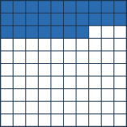
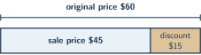

+++
order = 9
subject = "mathematics"
authoring_model = "claude-fable-5"
authoring_reasoning_effort = "high"
tags = ["quantitative-reasoning", "percent", "consumer-arithmetic", "percent-change"]
prerequisites = ["chapter:08_ratios_rates_and_proportions"]
provides = ["percent", "percent-conversion", "percent-of-quantity", "percent-change", "percentage-point"]
+++

# Percents

## Percent as per hundred

<!-- card-id: 0c887e92-e3b7-4619-8a81-b96c27ad7ab7 -->
Q: A **percent** compares a quantity to 100: "per cent" means "for
every hundred," and the symbol \(\%\) written after a number names
that comparison, so \(43\%\) means 43 out of every 100. In a town
survey, 61 of every 100 households have a pet. Write that as a
percent.

A: \(61\%\) — 61 out of every 100 is 61 percent.

<!-- card-id: a2ecf3d8-1e65-46af-ab1f-946b9eb2a831 -->
Q: The large square below is cut into 100 equal small squares, so
each small square is \(1\%\) of the large square. What percent of
the large square is shaded?

A: \(27\%\) — two full rows of 10 plus 7 more make 27 shaded
squares, and each one is \(1\%\) of the whole.

## Converting among forms

<!-- card-id: 3cd57b9d-0332-4ae0-8490-1a9caad4d168 -->
Q: Because a percent counts hundredths —
\(43\% = \frac{43}{100} = 0.43\) — writing a percent as a decimal
means writing that many hundredths. Write \(6\%\) as a decimal.

A: \(0.06\) — 6 hundredths. Not \(0.6\): that is 6 tenths, which
would be \(60\%\).

<!-- card-id: 2bb0a1db-398d-4247-b0cc-1c268a3c6fec -->
Q: A decimal becomes a percent by naming its hundredths:
\(0.35 = \frac{35}{100} = 35\%\). A tenths-only decimal is renamed
to hundredths first: \(0.7 = 0.70 = 70\%\). Write \(0.4\) as a
percent.

A: \(40\%\) — \(0.4 = 0.40 = \frac{40}{100}\). Writing \(4\%\)
would name 4 hundredths, which is \(0.04\).

<!-- card-id: a8cfd180-5f6d-4e66-b60e-f4ac2b388bf2 -->
Q: A percent is already a fraction with denominator 100, and that
fraction often simplifies: \(40\% = \frac{40}{100} = \frac{2}{5}\)
after dividing both numbers by 20. Write \(85\%\) as a fraction in
simplest form.

A: \(\frac{17}{20}\) — \(85\% = \frac{85}{100}\), and dividing both
numbers by their shared factor 5 gives \(\frac{17}{20}\).

<!-- card-id: 1b0ef704-6a91-4d66-844b-a0462c135db6 -->
Q: A fraction becomes a percent through an equivalent fraction with
denominator 100: \(\frac{3}{5} = \frac{60}{100} = 60\%\) after
scaling both numbers by 20. Write \(\frac{7}{20}\) as a percent.

A: \(35\%\) — scaling both numbers of \(\frac{7}{20}\) by 5 gives
\(\frac{35}{100}\).

<!-- card-id: 94e7e05e-8bd0-434b-a766-a2731092231a -->
Q: Which is larger: \(\frac{3}{4}\) of a class or \(70\%\) of the
same class? Decide by writing both amounts in the same form.

A: \(\frac{3}{4}\) — it equals \(\frac{75}{100} = 75\%\), which is
more than \(70\%\). To compare across forms, convert one amount so
both are percents, both fractions, or both decimals.

<!-- card-id: 1eb2fbd0-d2c3-4dba-a105-5c4c2add40c5 -->
Q: \(100\%\) means \(\frac{100}{100}\) — the whole amount, all of
it — so a percent above 100 describes more than one whole:
\(150\% = 1.5\), one and a half times the whole. This year's ticket
sales are \(125\%\) of last year's. Are they more or less than last
year's, and how many times last year's are they?

A: More — \(125\% = \frac{125}{100} = 1.25\), so this year's sales
are 1.25 times last year's.

## Part, whole, and rate

<!-- card-id: b95e8dee-ecbe-4d4f-ba88-ab179343473d -->
Q: Finding a percent **of** a quantity works exactly like finding a
fraction of it: write the percent as a decimal or a fraction, then
multiply. \(20\%\) of 60 is \(0.20 \times 60 = 12\) — the same 12
as \(\frac{1}{5}\) of 60. Find \(30\%\) of 80.

A: 24 — \(0.30 \times 80 = 24\), or \(\frac{3}{10}\) of 80.

<!-- card-id: a68ad0a8-1e97-4037-94ac-ec0ae884b8c8 -->
Q: Because \(10\% = \frac{10}{100} = \frac{1}{10}\), taking \(10\%\)
of a quantity just divides it by 10 — a fast mental anchor: \(10\%\)
of 80 is 8, and halving or doubling that gives \(5\%\) or \(20\%\).
Find \(10\%\) of 250.

A: 25 — \(250 \div 10 = 25\). From that anchor, \(5\%\) of 250 is
12.5 and \(20\%\) is 50.

<!-- card-id: 459d68df-5070-465b-a07e-33bb031fd3a4 -->
Q: Every percent statement links three values: the **whole** (the
full amount), the **part** (the piece being described), and the
**percent rate** (how much of the whole per hundred — like a unit
rate, but per hundred instead of per one). In "\(15\%\) of the 40
tickets — 6 tickets — are winners," the rate is \(15\%\), the whole
is 40, and the part is 6. In "12 of the 48 club members, that is
\(25\%\), walked to the meeting," name the part, the whole, and the
rate.

A: Part 12, whole 48, rate \(25\%\). The whole follows "of the";
the part is the piece being counted; the rate carries the \(\%\)
sign.

<!-- card-id: 43516fe1-a72c-4799-8d5d-08bc6a53ae14 -->
Q: To find what percent one quantity is of another, write part over
whole as a fraction, then convert it to a percent: 18 of 24 seats
filled is \(\frac{18}{24} = \frac{3}{4} = 75\%\). What percent of
20 is 13?

A: \(65\%\) — \(\frac{13}{20} = \frac{65}{100}\) after scaling both
numbers by 5.

<!-- card-id: 62db9cd4-fb47-4268-9a2a-aa5557793969 -->
Q: When the part and the rate are known, the whole can be rebuilt by
scaling down to \(10\%\) and back up to \(100\%\), just like
completing a ratio table: if \(30\%\) of a bag is 12 marbles, then
\(10\%\) is \(12 \div 3 = 4\), so \(100\%\) is \(4 \times 10 = 40\)
marbles. If \(60\%\) of a box is 42 crayons, how many crayons fill
the whole box?

A: 70 — \(60\%\) is 42, so \(10\%\) is \(42 \div 6 = 7\) and
\(100\%\) is \(7 \times 10 = 70\). Check:
\(0.60 \times 70 = 42\).

<!-- card-id: 17a422e6-c20c-45c0-a458-675c9ca80bf8 -->
P: A school food drive collected 300 cans, and \(45\%\) of them came
from one class. How many cans did that class bring?

S: 135 cans.

IDENTIFY: A find-the-part percent problem: the rate is \(45\%\), the
whole is 300, and the part is unknown.

PLAN: Write the rate as a decimal and multiply it by the whole,
since a percent of a quantity means that many hundredths of it.

EXECUTE: \(45\% = 0.45\), and \(0.45 \times 300 = 135\).

EVALUATE: \(45\%\) is a little less than half, and half of 300 is
150 — 135 is a little less, as expected. The \(10\%\) anchor
agrees: \(10\%\) of 300 is 30, so \(40\%\) is 120 and \(5\%\) is
15, and \(120 + 15 = 135\).

<!-- card-id: c02e9a59-6e69-4f0a-8afc-802f97c9f618 -->
P: In a marching band, \(25\%\) of the members — 14 people — play
drums. The plan is already fixed: use the fraction form of \(25\%\)
to rebuild the whole from the part. Carry it out: how many members
does the band have?

S: 56 — \(25\% = \frac{25}{100} = \frac{1}{4}\), so the 14 drummers
are one quarter of the band, and the whole is \(4 \times 14 = 56\).

EVALUATE: Checking forward, \(25\%\) of 56 is
\(0.25 \times 56 = 14\), the given part.

<!-- card-id: 94baf286-92ac-48ff-b182-ef09c636934e -->
P: Of the 80 seeds a class planted, 60 sprouted. What percent of the
seeds sprouted?

S: \(75\%\).

IDENTIFY: A find-the-rate problem: the part is 60, the whole is 80,
and the rate is unknown.

PLAN: Write part over whole and convert the fraction to a percent.

EXECUTE: \(\frac{60}{80} = \frac{3}{4} = \frac{75}{100} = 75\%\).

EVALUATE: 60 is more than half of 80 (which is 40) but less than all
of it, and \(75\%\) sits between \(50\%\) and \(100\%\). Forward
check: \(0.75 \times 80 = 60\).

## Discounts, tax, and tips

<!-- card-id: 5204e0e0-fbb4-42d5-b2dc-592ae978dd39 -->
Q: A **discount** is an amount taken off a price, and a percent
discount is that percent *of the original price*: "\(20\%\) off" a
\(\$50\) game means the discount is \(0.20 \times 50 = \$10\), so
the **sale price** — what is actually paid — is \(50 - 10 = \$40\).
A \(\$30\) puzzle is \(10\%\) off. What is its sale price?

A: \(\$27\) — the discount is \(0.10 \times 30 = \$3\), and
\(30 - 3 = 27\).

<!-- card-id: 09bdb0d0-7796-4074-a693-844cbbf22012 -->
Q: Some percents are *added on* instead of taken off: a **sales
tax** is a percent of the price added when paying, and a **tip** is
a percent of a restaurant bill added to thank the server — each
computed on the amount before the addition. A \(\$40\) meal gets a
\(15\%\) tip. What total is paid?

A: \(\$46\) — the tip is \(0.15 \times 40 = \$6\), and
\(40 + 6 = 46\).

<!-- card-id: 6b42ef73-7289-446d-85d2-43172061b383 -->
Q: The bar below shows a \(\$60\) original price split into the sale
price paid and the discount taken off. What percent discount was
given?

A: \(25\%\) — the discount is the part and the original price is
the whole: \(\frac{15}{60} = \frac{1}{4} = 25\%\).

<!-- card-id: ea4a3904-dfad-48ee-b524-9e8b39f4a2db -->
Q: An \(\$80\) jacket is \(25\%\) off. A shopper computes
\(80 - 25 = 55\) and expects a \(\$55\) sale price. What went wrong,
and what is the correct sale price?

A: The shopper subtracted the rate's number as if it were dollars.
A percent is not an amount until it is taken of the whole: the
discount is \(0.25 \times 80 = \$20\), so the sale price is
\(\$60\).

<!-- card-id: 1884fe9a-a0ef-4163-8842-0970ecbb63f2 -->
P: A \(\$36\) board game is on sale at \(15\%\) off. What is the
sale price?

S: \(\$30.60\).

IDENTIFY: A discount problem: the discount is \(15\%\) of the
original \(\$36\), and the sale price is what remains after
subtracting it.

PLAN: Build \(15\%\) of 36 from the \(10\%\) anchor, then subtract
the discount from the original price.

EXECUTE: \(10\%\) of 36 is 3.60, and \(5\%\) is half of that, 1.80,
so the discount is \(3.60 + 1.80 = \$5.40\). The sale price is
\(36 - 5.40 = \$30.60\).

EVALUATE: The two pieces rebuild the original price:
\(5.40 + 30.60 = 36.00\). And the discount lands between \(10\%\)
(\(\$3.60\)) and \(20\%\) (\(\$7.20\)) of the price, as a \(15\%\)
discount should.

<!-- card-id: 39180f72-b411-413a-99d9-b03791993340 -->
P: A family's restaurant bill is \(\$45\), and they leave an
\(18\%\) tip. How much do they pay in all?

S: \(\$53.10\).

IDENTIFY: An add-on percent problem: the tip is \(18\%\) of the
\(\$45\) bill and is added to it.

PLAN: Write the rate as a decimal, multiply it by the bill, and add
the result to the bill.

EXECUTE: \(0.18 \times 45 = 8.10\), so the total is
\(45 + 8.10 = \$53.10\).

EVALUATE: \(10\%\) of 45 is 4.50, so \(20\%\) is 9.00; an \(18\%\)
tip of \(\$8.10\) sits just below \(\$9.00\), as it should.

## Percent change and percentage points

<!-- card-id: 570d7ee2-5245-412f-9307-b100f1a2f117 -->
Q: **Percent change** measures a change against the *starting*
amount: divide the increase or decrease by the starting amount, then
write that fraction as a percent. The bars below show a club's
membership before and after a sign-up drive. By what percent did
membership increase?

A: \(25\%\) — the increase is \(50 - 40 = 10\), and
\(\frac{10}{40} = \frac{1}{4} = 25\%\). The starting amount 40, not
the new amount, is the whole.

<!-- card-id: c020f3c2-89c0-434c-92fd-98a487fab166 -->
Q: Growing from 40 to 50 is a \(25\%\) increase, because the change
of 10 is compared with the start, 40. Shrinking from 50 back to 40
is the same change of 10 — but *not* a \(25\%\) decrease, because
the start is now 50. A game's price falls from \(\$25\) to \(\$20\).
What is the percent decrease?

A: \(20\%\) — the decrease is 5 and the start is 25:
\(\frac{5}{25} = \frac{1}{5} = 20\%\). (From 50 to 40 is likewise
\(\frac{10}{50} = 20\%\): a different start makes a different
percent.)

<!-- card-id: 5844538b-236c-4750-9cfc-fd84cb37e6f8 -->
Q: When the two values being compared are themselves percents, their
direct difference is measured in **percentage points**: a recycling
rate that rises from \(30\%\) to \(36\%\) is up
\(36 - 30 = 6\) percentage points, while its *percent change* is
\(\frac{6}{30} = 20\%\). A team's win rate rises from \(40\%\) to
\(50\%\). How many percentage points is the rise, and what is the
percent change?

A: 10 percentage points — \(50 - 40 = 10\) — and a \(25\%\)
increase, since \(\frac{10}{40} = \frac{1}{4}\). Points subtract
the two percents directly; percent change compares the rise with
the starting rate.

<!-- card-id: dda62e21-aecc-4f39-9282-1463af4dd6c4 -->
Q: A \(\$100\) poster's price is raised by \(10\%\), and a month
later the *new* price is lowered by \(10\%\). Is the final price
back to \(\$100\)? Compute it.

A: No — \(\$99\). The raise adds \(0.10 \times 100 = \$10\), giving
\(\$110\); the cut takes \(0.10 \times 110 = \$11\), giving
\(\$99\). Each percent acts on its own current starting amount, so
equal up-and-down percents do not cancel.

<!-- card-id: 08dc6d1b-f626-4dd9-932b-2ce42bd77ec7 -->
P: A team's win rate improved from \(20\%\) of its games last season
to \(30\%\) this season. A headline calls that "a 10% improvement."
State the rise in percentage points and the percent change, and say
which one the headline confused.

S: The rise is 10 percentage points, but the percent change is
\(50\%\) — the headline used the point difference as if it were the
percent change.

IDENTIFY: Two percents are compared, so both measures apply: the
direct difference in percentage points, and the percent change
measured against the starting rate.

PLAN: Subtract the two rates to get percentage points; divide the
rise by the starting rate to get the percent change.

EXECUTE: \(30 - 20 = 10\) percentage points. Percent change:
\(\frac{10}{20} = \frac{1}{2} = 50\%\).

EVALUATE: Working forward from the start checks it: a \(50\%\)
increase of the starting rate \(20\%\) adds half of it, 10 points,
landing exactly on \(30\%\).
