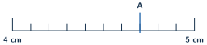
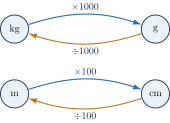

+++
order = 10
subject = "mathematics"
tags = ["quantitative-reasoning", "measurement", "units", "estimation"]
prerequisites = ["chapter:09_percents"]
provides = ["measurement", "measurement-unit", "unit-conversion", "measurement-precision", "rounded-value-interval", "quantitative-reasonableness"]
+++

# Measurement, estimation, and decisions

<!-- card-id: 10000000-0000-4000-8000-000000000001 -->
Q: A count reports how many complete items there are. A **measurement** compares a quantity with a chosen **unit**. Which is a measurement: \(12\) books or \(12\) centimeters of length?
A: \(12\) centimeters is a measurement because it includes a unit of length. \(12\) books is an exact count of items.

<!-- card-id: 10000000-0000-4000-8000-000000000002 -->
Q: Why is the unit part of a measurement's meaning?
A: The number tells how many units; the unit tells what size and kind of quantity each count represents. \(5\) centimeters and \(5\) meters are not the same length.

<!-- card-id: 10000000-0000-4000-8000-000000000003 -->
Q: A **centimeter** (cm) is a small length unit and a **meter** (m) is \(100\) centimeters. Which unit is more sensible for the length of a pencil?
A: Centimeters. A pencil is much shorter than a meter, so centimeters give a practical numerical value.

<!-- card-id: 10000000-0000-4000-8000-000000000004 -->
Q: A **gram** (g) and **kilogram** (kg) measure mass; \(1\text{ kg}=1000\text{ g}\). Which is more sensible for the mass of a paper clip?
A: Grams. A kilogram is far too large a unit for one paper clip.

<!-- card-id: 10000000-0000-4000-8000-000000000005 -->
Q: A **liter** (L) measures liquid amount, and \(1\text{ L}=1000\text{ mL}\), where mL means milliliter. Convert \(2.4\text{ L}\) to milliliters.
A: \(2400\text{ mL}\). Multiply by \(1000\) because each liter contains \(1000\) milliliters.

<!-- card-id: 10000000-0000-4000-8000-000000000006 -->
Q: The instrument scale has numbered centimeters and ten equal smaller divisions per centimeter.

What measurement is at A?
A: \(4.7\text{ cm}\). Each small division is one tenth of a centimeter.

<!-- card-id: 10000000-0000-4000-8000-000000000007 -->
Q: A measuring instrument's smallest marked division limits what can be read directly. Why would reporting \(4.700000\text{ cm}\) from a scale marked only in tenths be false precision?
A: The extra digits claim detail the instrument did not show. A result should not imply much finer precision than the measurement supports.

<!-- card-id: 10000000-0000-4000-8000-000000000008 -->
Q: Time uses the exact identities \(60\) seconds \(=1\) minute and \(60\) minutes \(=1\) hour. Convert \(2.5\) hours to minutes.
A: \(150\) minutes, because \(2.5\times60=150\).

<!-- card-id: 10000000-0000-4000-8000-000000000009 -->
Q: The map shows exact metric conversion factors.

Which operation converts \(3500\text{ g}\) to kilograms?
A: Divide by \(1000\): \(3500\text{ g}=3.5\text{ kg}\).

<!-- card-id: 10000000-0000-4000-8000-000000000010 -->
Q: Why may only compatible units be added directly?
A: Addition combines quantities of the same kind and unit scale. Convert first: \(2\text{ m}+30\text{ cm}=2\text{ m}+0.30\text{ m}=2.30\text{ m}\).

<!-- card-id: 10000000-0000-4000-8000-000000000011 -->
Q: A **conversion factor** is a ratio equal to \(1\), such as \(\frac{100\text{ cm}}{1\text{ m}}\). Why does multiplying by it change units but not the physical length?
A: The numerator and denominator name the same length, so the ratio equals \(1\). Multiplication rewrites the numerical value in a different unit.

<!-- card-id: 10000000-0000-4000-8000-000000000012 -->
Q: A length rounded to the nearest centimeter is reported as \(12\text{ cm}\).

What range of original values could round to \(12\text{ cm}\) under this deck's halfway-up convention?
A: From \(11.5\text{ cm}\) up to, but not including, \(12.5\text{ cm}\). The lower halfway value rounds up to \(12\); the upper halfway value rounds up to \(13\).

<!-- card-id: 10000000-0000-4000-8000-000000000013 -->
Q: A board measured as \(80\text{ cm}\) to the nearest centimeter is not known to be exactly \(80\text{ cm}\). What does the report communicate?
A: The measured length is close enough to \(80\text{ cm}\) to round there at that precision. It is an approximate measurement, not an exact count.

<!-- card-id: 10000000-0000-4000-8000-000000000014 -->
Q: Why is \(3\text{ m}+40\text{ kg}\) not a meaningful total?
A: Meters measure length and kilograms measure mass. The units describe incompatible kinds of quantity, so they cannot be combined by ordinary addition.

<!-- card-id: 10000000-0000-4000-8000-000000000015 -->
Q: A trip is \(298\) kilometers long, where a kilometer is a large length unit. Which estimate is more useful for a quick plan: \(30\), \(300\), or \(3000\) kilometers?
A: About \(300\) kilometers. It is close in scale to \(298\); the other choices are ten times too small or too large.

<!-- card-id: 10000000-0000-4000-8000-000000000016 -->
Q: A calculation claims that \(4\) containers holding \(2.5\) liters each hold \(100\) liters total. What simple check exposes the error?
A: Estimate \(4\times2.5=10\), so \(100\) is ten times too large. The unit should remain liters.

<!-- card-id: 10000000-0000-4000-8000-000000000017 -->
P: Convert \(3.75\text{ m}\) to centimeters and verify the direction of scaling.
S: **IDENTIFY:** Convert meters to the smaller centimeter unit.

**EXECUTE:** \(3.75\times100=375\text{ cm}\).

**EVALUATE:** A smaller unit requires a larger numerical count, so \(375>3.75\) is the correct direction.

<!-- card-id: 10000000-0000-4000-8000-000000000018 -->
P: A \(2.4\)-kilogram package and a \(650\)-gram package are combined. Find the total mass in kilograms.
S: Convert \(650\text{ g}=0.650\text{ kg}\). Then \(2.4+0.650=3.050\text{ kg}=3.05\text{ kg}\). Check: the total is greater than \(2.4\) but less than \(3.4\) kilograms.

<!-- card-id: 10000000-0000-4000-8000-000000000019 -->
P: A machine fills \(18\) bottles with \(0.75\) liter each. Estimate, then calculate the total liquid amount.
S: Estimate \(18\times0.75\) as about \(20\times0.75=15\) liters. Exact calculation: \(18\times0.75=13.5\) liters. The exact total is reasonably below the estimate because \(18<20\).

<!-- card-id: 10000000-0000-4000-8000-000000000020 -->
P: A route is \(12\) kilometers, but a report says it takes \(4\) hours. Can the travel rate be found? If so, find it; if not, state what is missing.
S: Yes. Both distance and time are given, so the average rate is \(12\div4=3\) kilometers per hour. Multiplying \(3\) kilometers per hour by \(4\) hours returns \(12\) kilometers.

<!-- card-id: 10000000-0000-4000-8000-000000000021 -->
P: A sign says “Use \(25\%\) less material,” but it gives no original amount. Can the new amount be calculated numerically?
S: No. The percent change is known, but the original baseline is missing. One can say the new amount is \(75\%\) of the original, but not give a numerical quantity.
